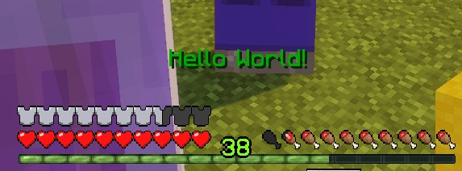
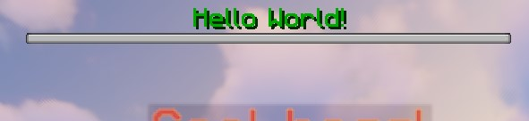
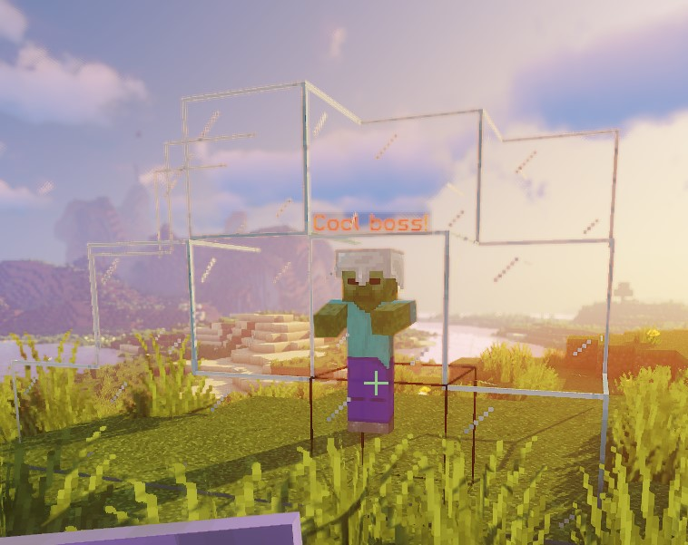
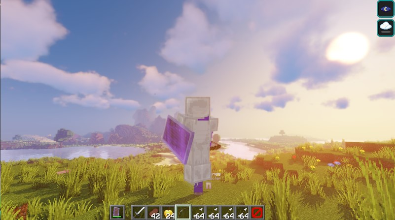

好的，这是将输入的文本翻译成简体中文并保留 Markdown 格式的结果：

# 精英脚本动作

动作是脚本的核心。它们决定了脚本做什么，并允许你设置自定义间隔。

动作总是以你将要执行的动作类型开始。不同的动作类型有不同的功能。此外，所有动作都有一个或多个目标。动作还可以有一个等待计时器，以确保事情以可自定义的延迟发生。最后，动作还可以有几个特定于动作类型的其他字段。

## 共享属性

| 值             |                                                                                 详情                                                                                  | 特殊 |
|--------------------|:------------------------------------------------------------------------------------------------------------------------------------------------------------------------:| :-: |
| `Target`           |                                                      [更多信息]($language$/elitemobs/elitescript_targets.md)                                                       | ❌ |
| `wait`             |                                                      设置在运行动作前等待的时间量（刻）                                                      | ❌ |
| `repeatEvery`      |        设置动作每隔设定的刻数重复一次。任何设置了此项但未使用 `times` 的脚本将在怪物死亡时终止，以避免卡顿。你可以使用 `~` 来随机化此值，例如：`1~5`。         | ❌ |
| `times`            |                                                            设置动作将发生的次数。你可以使用 `~` 来随机化此值，例如：`1~5`。                                                            | 需要 `repeatEvery` |
| `scripts`          |                                                         设置将在动作结束时运行的脚本                                                          | ❌ |
| `onlyRunOneScript` |                                                       随机选择一个 `scripts` 并只运行该脚本。                                                       | ❌ |
| `offset`           | 此选项位于 `Target` 下。允许你偏移目标位置。偏移不适用于目标区域为 `ZONE_FULL` 或 `ZONE_BORDER` 的动作。 | ❌ |
| `debug`           | 此选项位于脚本的动作部分下。设置为 true 时，它将在动作所在的区域显示屏障图标。 | ❌ |

## 动作类型

### ACTION_BAR_MESSAGE

为目标设置动作栏消息。

| 值 |                            详情                            | 必需 | 特殊 |
| --- |:-------------------------------------------------------------:| :-: | :-: |
| `Target` | [更多信息]($language$/elitemobs/elitescript_targets.md) | ✅ | 可以使用 `&` 进行 [颜色代码](#color_codes) |
| `sValue` |                            消息                            | ✅ |  |

<div align="center">

<details>

<summary><b>示例</b></summary>

<div align="left">

```yaml
eliteScript:
  Example:
    Events:
    - EliteMobDamagedByPlayerEvent
    Actions:
    - action: ACTION_BAR_MESSAGE
      Target:
        targetType: NEARBY_PLAYERS
        range: 10
      sValue: "&2Hello World!"
```

<div align="center">



</div>

将为距离 Boss 10 格范围内的所有玩家设置动作栏消息为 "Hello World"。

</div>

</details>

</div>

---

### BOSS_BAR_MESSAGE

为目标添加 Boss 血条。

| 值 |                            详情                            | 必需 |                   特殊                    |
| --- |:-------------------------------------------------------------:| :-: |:--------------------------------------------:|
| `Target` | [更多信息]($language$/elitemobs/elitescript_targets.md) | ✅ |                      ❌                       |
| `sValue` |                            消息                            | ✅ | 可以使用 `&` 进行 [颜色代码](#color_codes) |
| `duration` |               Boss 血条的持续时间（刻）               | ✅ |                      ❌                       |

<div align="center">

<details>

<summary><b>示例</b></summary>

<div align="left">

```yaml
eliteScript:
  Example:
    Events:
    - EliteMobDamagedByPlayerEvent
    Actions:
    - action: BOSS_BAR_MESSAGE
      Target:
        targetType: NEARBY_PLAYERS
        range: 10
      duration: 120
      sValue: "&2Hello World!"
```

<div align="center">



</div>

将为距离 Boss 10 格范围内的所有玩家设置一个持续 1 秒的 Boss 血条，显示 "Hello World"。

</div>

</details>

</div>

---

### DAMAGE

这是你如何以其他实体身份对实体造成伤害。

_注意：这原生使用了 EliteMobs 伤害系统！这意味着你将看到攻击造成的正常精英护甲减免。更多信息请参阅乘数部分。_

| 值 |                            详情                            | 必需 |
| --- |:-------------------------------------------------------------:| :-: |
| `Target` | [更多信息]($language$/elitemobs/elitescript_targets.md) | ✅ |
| `multiplier` |                       伤害乘数                       | ✅ |

<div align="center">

<details>

<summary><b>示例</b></summary>

<div align="left">

```yaml
eliteScript:
  Example:
    Events:
    - EliteMobDamagedByPlayerEvent
    Actions:
    - action: DAMAGE
      Target:
        targetType: NEARBY_PLAYERS
        range: 10
      multiplier: 0.5
```

设置伤害为 Boss 对玩家造成的基础伤害的一半，同时考虑伤害减免。

</div>

</details>

</div>

#### 乘数

设置 Boss 对效果的伤害乘数。

**重要提示**：为了使能力易于自动缩放，伤害是通过让 Boss 攻击玩家一次，然后将 Boss 的基础伤害乘以乘数来应用的。

这意味着乘数为 1.0 等同于 Boss 的一次普通攻击。2.0 是正常强度的 2 倍攻击，而 0.5 是 50% 的强度。

---

### MAKE_INVULNERABLE

使目标无敌。

| 值 |                            详情                            | 必需 |
| --- |:-------------------------------------------------------------:| :-: |
| `Target` | [更多信息]($language$/elitemobs/elitescript_targets.md) | ✅ |
| `invulnerable` |               设置 Boss 是否无敌                | ✅ |
| `duration` |       设置无敌的持续时间（刻）        | ❌ |

<div align="center">

<details>

<summary><b>示例</b></summary>

<div align="left">

```yaml
eliteScript:
  Example:
    Events:
    - EliteMobDamagedByPlayerEvent
    Actions:
    - action: MAKE_INVULNERABLE
      Target:
        targetType: SELF
      invulnerable: true
      duration: 60
```

使 Boss 无敌 60 刻（3 秒）。

</div>

</details>

</div>

---

### MODIFY_DAMAGE

修改对 Boss 造成的伤害或 Boss 对玩家造成的伤害。这是一个特殊的动作，有一些特殊要求。

| 值 | 详情 | 必需 |
| --- | :-: | :-: |
| `multiplier` | 伤害乘数。 | ✅ |

这个动作很特殊，必须在一个监听伤害事件的脚本中。以下是有效的伤害事件：`EliteMobDamagedByEliteMobEvent`、`EliteMobDamagedByPlayerEvent`、`EliteMobDamagedEvent` 用于减少对 Boss 造成的伤害的事件，以及 `PlayerDamagedByEliteMobEvent` 用于减少 Boss 对玩家造成的伤害的事件。强烈建议你学习 `hasTag` 条件的工作原理，以便最好地使用此动作。正确使用时，可以使 Boss 暂时抵抗或更容易受到伤害，这可以与玩家增益、Boss 位置或许多其他因素相关联。

<div align="center">

<details>

<summary><b>示例</b></summary>

<div align="left">

```yaml
eliteScript:
  Example:
    Events:
    - EliteMobDamagedByPlayerEvent
    Actions:
    - action: MODIFY_DAMAGE
      multiplier: 2.0
      Conditions:
        hasTags:
        - "CoolPlayer"
        Target:
          targetType: DIRECT_TARGET
```

将玩家对 Boss 造成的伤害提高 2 倍，但仅当玩家拥有名为 "CoolPlayer" 的标签时。

</div>

</details>

</div>

---

### MESSAGE

向目标发送消息。

| 值 |                            详情                            | 必需 | 特殊 |
| --- |:-------------------------------------------------------------:| :-: | :-: |
| `Target` | [更多信息]($language$/elitemobs/elitescript_targets.md) | ✅ | 可以使用 `&` 进行 [颜色代码](#color_codes) |
| `sValue` |                            消息                            | ✅ | ❌ |

<div align="center">

<details>

<summary><b>示例</b></summary>

<div align="left">

```yaml
eliteScript:
  Example:
    Events:
    - EliteMobDamagedByPlayerEvent
    Actions:
    - action: MESSAGE
      Target:
        targetType: NEARBY_PLAYERS
        range: 10
      sValue: "&2Hello World!"
```

<div align="center">


</div>

将向距离 Boss 10 格范围内的所有玩家发送一条聊天消息。

</div>

</details>

</div>

---

### NAVIGATE

使 Boss 导航（行走）到指定目标。

| 值 |                            详情                            | 必需 | 特殊 |
| --- |:-------------------------------------------------------------:| :-: | :-: |
| `Target` | [更多信息]($language$/elitemobs/elitescript_targets.md) | ✅ | ❌ |
| `FinalTarget` | [更多信息]($language$/elitemobs/elitescript_targets.md) | ✅ | ❌ |
| `velocity` | 设置 Boss 的导航速度。`1.0` 是配置中设置的 Boss 值。 | ❌ | ❌ |
| `bValue` | 设置如果导航失败，Boss 是否应被强制传送到 `FinalTarget`。 | ❌ | ❌ |
| `duration` | Boss 在放弃前应尝试导航多久。以刻为单位设置。默认值为 100 刻。 | ✅ | ❌ |

<div align="center">

<details>

<summary><b>示例</b></summary>

<div align="left">

```yaml
eliteScript:
  Example:
    Events:
    - EliteMobDamagedByPlayerEvent
    Actions:
    - action: NAVIGATE
      Target:
        targetType: SELF
      FinalTarget:
        targetType: NEARBY_PLAYERS
        range: 50
      velocity: 1.0
      bValue: true
      duration: 100
```

将使 Boss 导航到玩家击中 Boss 时所站的位置。

</div>

</details>

</div>

---

### PLACE_BLOCK

在目标位置放置方块，持续一段时间。

| 值 |                                                         详情                                                         | 必需 |
| --- |:-----------------------------------------------------------------------------------------------------------------------:| :-: |
| `Target` |                              [更多信息]($language$/elitemobs/elitescript_targets.md)                              | ✅ |
| `material` | 方块的 [材质](#material)，[完整列表在此](https://hub.spigotmc.org/javadocs/spigot/org/bukkit/Material.html) | ✅ |
| `duration` |                                              效果持续时间，以刻为单位                                               | ❌ |

<div align="center">

<details>

<summary><b>示例</b></summary>

<div align="left">

```yaml
eliteScript:
  Example:
    Events:
    - EliteMobDamagedByPlayerEvent
    Zone:
      shape: DOME
      radius: 3
      Target:
        targetType: SELF
    Actions:
    - action: PLACE_BLOCK
      Target:
        targetType: ZONE_FULL
      duration: 120
      material: GLASS
```

<div align="center">



</div>

在 Boss 周围放置一个玻璃穹顶，持续 6 秒。

_注意：如果未定义持续时间，则方块放置是永久性的。_

</div>

</details>

</div>

---

### PLAY_ANIMATION

使用 Model Engine 为自定义模型播放指定的动画。要求目标上安装了 Model Engine 和有效的自定义模型，才能运行动画。

| 值 |                            详情                            | 必需 |
| --- |:-------------------------------------------------------------:| :-: |
| `Target` | [更多信息]($language$/elitemobs/elitescript_targets.md) | ✅ |
| `sValue` |                设置动画的名称                 | ✅ |

<div align="center">

<details>

<summary><b>示例</b></summary>

<div align="left">

```yaml
eliteScript:
  Example:
    Events:
    - EliteMobDamagedByPlayerEvent
    Actions:
    - action: PLAY_ANIMATION
      Target:
        targetType: SELF
      sValue: "fortnite_dance"
```

设置 Boss 播放 fortnite_dance 动画。要求服务器安装 Model Engine，Boss 拥有自定义伪装，并且该自定义伪装拥有名为 "fortnite\_dance" 的动画。

</div>

</details>

</div>

---

### PLAY_SOUND

播放游戏内声音。

| 值   |                            详情                            | 必需 |
|----------|:-------------------------------------------------------------:|:---------:|
| `Target` | [更多信息]($language$/elitemobs/elitescript_targets.md) |     ✅     |
| `sValue` |            设置要播放的声音名称            |     ✅     |
| `pitch`  |           设置要播放声音的音高            |     ❌     |
| `volume` |           设置要播放声音的音量           |     ❌     |

[这里有一个方便的 Minecraft 声音列表！](https://www.digminecraft.com/lists/sound_list_pc.php) 请记住，这也可以播放资源包中的自定义声音。当动作目标是一个区域时，动作将为该区域中的每个方块播放声音。这会使声音比正常情况下响亮得多，因此如果目标是区域，请考虑降低音量。

<div align="center">

<details>

<summary><b>示例</b></summary>

<div align="left">

```yaml
eliteScript:
  Example:
    Events:
    - EliteMobDamagedByPlayerEvent
    Actions:
    - action: PLAY_SOUND
      Target:
        targeType: SELF
      sValue: minecraft:block.bell.resonate
```

在 Boss 位置播放 Minecraft 钟声的共鸣声音。

</div>

</details>

</div>

---

### POTION_EFFECT

对目标应用特定的药水效果。

| 值 |                                                       详情                                                       | 必需 |
| --- |:-------------------------------------------------------------------------------------------------------------------:| :-: |
| `Target` |                            [更多信息]($language$/elitemobs/elitescript_targets.md)                            | ✅ |
| `potionEffectType` | 效果类型，[有效列表在此](https://hub.spigotmc.org/javadocs/spigot/org/bukkit/potion/PotionEffectType.html) | ✅ |
| `amplifier` |                                          药水效果等级（从 0 开始）                                          | ✅ |
| `duration` |                                           效果持续时间（刻）                                            | ✅ |

<div align="center">

<details>

<summary><b>示例</b></summary>

<div align="left">

```yaml
eliteScript:
  Example:
    Events:
    - EliteMobDamagedByPlayerEvent
    Actions:
    - action: POTION_EFFECT
      Target:
        targetType: NEARBY_PLAYERS
        range: 10
      potionEffectType: LEVITATION
      amplifier: 1
      duration: 40
```

<div align="center">



</div>

这将使距离 Boss 10 格范围内的所有玩家悬浮 2 秒（40 刻）。

</div>

</details>

</div>

---

### PUSH

按设定的向量推动目标。

| 值 |                            详情                            | 必需 |
| --- |:-------------------------------------------------------------:| :-: |
| `Target` | [更多信息]($language$/elitemobs/elitescript_targets.md) | ✅ |
| `vValue` |       设置将应用的向量速度        | ✅ |

*注意：此动作也接受相对向量。在此处了解如何使用它们 [更多信息]($language$/elitemobs/elitescript_relative_vectors.md)。*

<div align="center">

<details>

<summary><b>示例</b></summary>

<div align="left">

```yaml
eliteScript:
  Example:
    Events:
    - EliteMobDamagedByPlayerEvent
    Actions:
    - action: PUSH
      wait: 3
      Target:
        targetType: NEARBY_PLAYERS
        range: 10
      vValue: 0,0.3,0
      times: 10
      repeatEvery: 10
```

<div align="center">


</div>

这将使用 0.3 的力将距离 Boss 10 格范围内的所有玩家推向空中。此动作将每 0.5 秒（10 刻）重复 10 次。换句话说，这将使此效果持续 5 秒（10 次 x 10 刻 = 100 刻）。

这将使玩家看起来像在跳跃。

</div>

</details>

</div>

#### 向量

向量由 `vValue: x,y,z` 定义。例如，如果你想让目标向上推动，可以使用 `vValue: 0,0.3,0`。

---

### RUN_COMMAND_AS_CONSOLE

以控制台身份运行命令。

| 值 |                             详情                             | 必需 |
| --- |:---------------------------------------------------------------:| :-: |
| `Target` |  [更多信息]($language$/elitemobs/elitescript_targets.md)  | ✅ |
| `sValue` |                    将运行的命令                     | ✅ |

**注意：有可用的占位符！请查看 RUN_COMMAND_AS_PLAYER，它们是相同的**

<div align="center">

<details>

<summary><b>示例</b></summary>

<div align="left">

```yaml
eliteScript:
  Example:
    Events:
    - EliteMobDamagedByPlayerEvent
    Actions:
    - action: RUN_COMMAND_AS_CONSOLE
      Target:
        targetType: NEARBY_PLAYERS
        range: 10
      sValue: say Hello $bossName my name is $playerName. What is your level? $bossName my level is $bossLevel.
```

<div align="center">


</div>

使控制台广播消息 "Hello $bossName my name is $playerName. What is your level? $bossName my level is $bossLevel."

</div>

</details>

</div>

---

### RUN_COMMAND_AS_PLAYER

以玩家身份运行命令。要求目标是玩家。

| 值 |                            详情                            | 必需 |
| --- |:-------------------------------------------------------------:| :-: |
| `target` | [更多信息]($language$/elitemobs/elitescript_targets.md) | ✅ |
| `sValue` |                   将运行的命令                    | ✅ |Please specify the language you would like the text translated into.Okay, I can help with that. Please provide the target language you would like the text translated into.

The text contains links with `$language$` placeholders (e.g., `[$language$/elitemobs/...]`). Once you provide the target language, I can replace these placeholders with the appropriate language code if you wish.