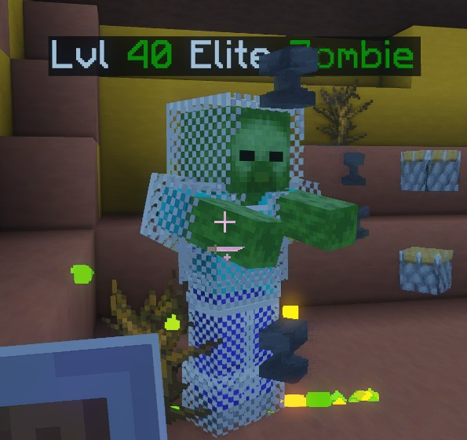
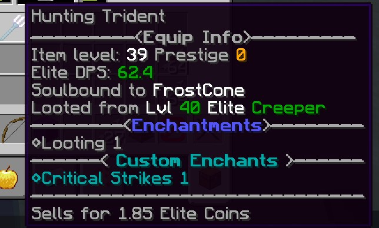
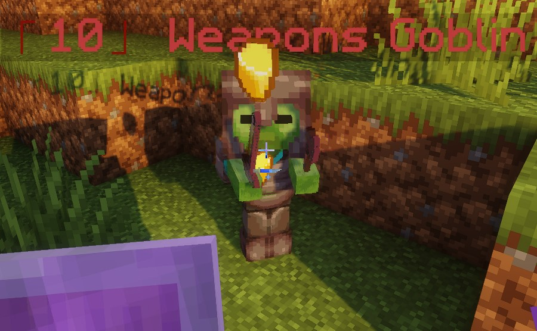
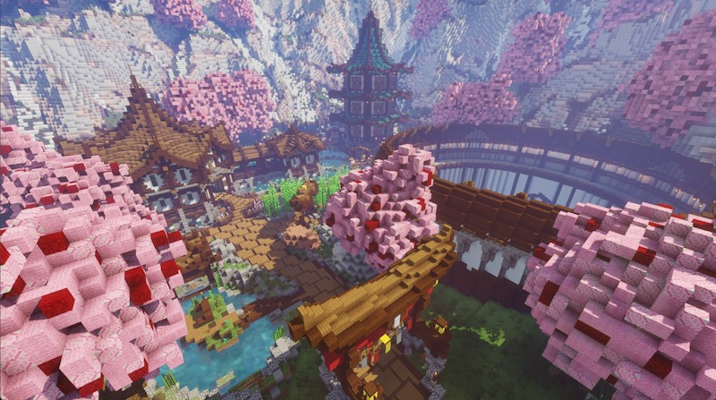
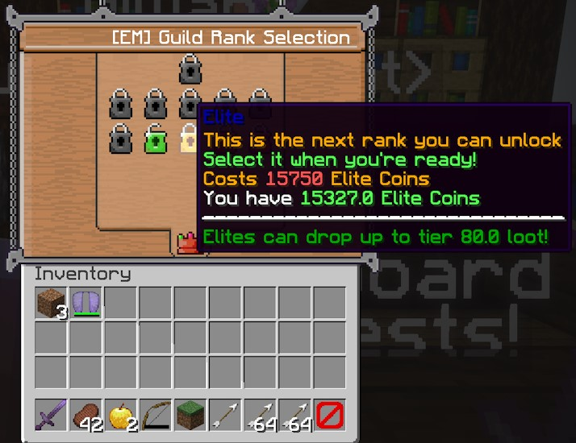
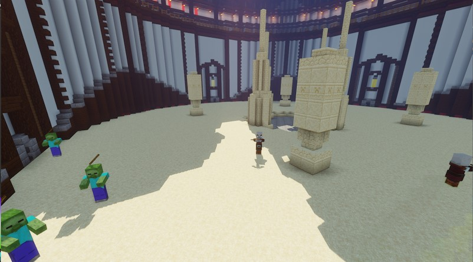
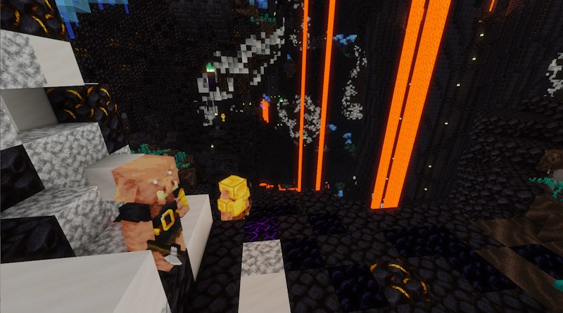
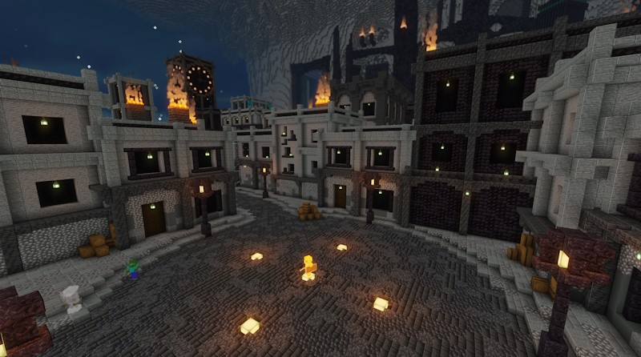
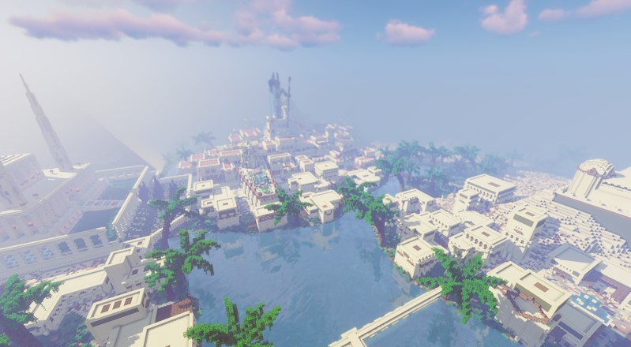
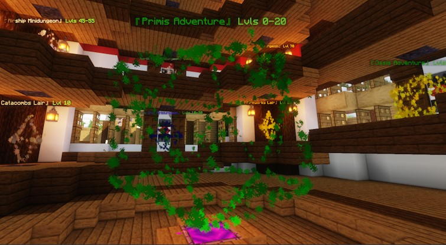

欢迎来到 EliteMobs Wiki！

# 许可证

EliteMobs 源代码采用 [GPLV3](https://choosealicense.com/licenses/gpl-3.0/) 许可证，本 wiki
采用 [CC0 许可证](https://choosealicense.com/licenses/cc0-1.0/)。

欢迎自由分发和修改本 wiki 中的信息。

# 版本

从 EliteMobs 版本 9.0.0 开始，唯一支持的 Minecraft 版本是 1.21 及以上。

对于那些寻求与旧版本 Minecraft（1.19.4 - 1.20.4）兼容的用户，请使用 EliteMobs 版本 8。

**注意：任何版本的 EliteMobs 都不支持 Minecraft 版本 1.20.5 和 1.20.6。**

# EliteMobs 的用途是什么？

EliteMobs 旨在通过实现各种与 Boss 相关的内容来扩展 Minecraft 的终局。

这意味着：

- 动态 Boss（等级怪物）
- 自定义 Boss
- 事件
- 竞技场
- 基于世界的地下城
- 实例化的地下城
- 开放世界随机地下城（与 BetterStructures 集成）
- 自定义物品（精英物品/战利品）
- ... 还有更多！

该插件的目的不是取代原版 Minecraft 内容，而是对其进行补充，允许玩家选择退出 EliteMobs 内容（如果需要）。EliteMobs 物品通常不会影响
PvP 或原版 Minecraft 战斗，因为它们的伤害和防御加成仅在与 EliteMobs 战斗时生效。

# EliteMobs 功能概述

在本节中，我们将了解 EliteMobs 提供的一些**主要**
功能、它们是什么以及如何禁用它们。有关完整的功能列表，请参阅 [此页面]($language$/elitemobs/feature_list.md&section=feature-list)。

您还可以查看 [此页面]($language$/elitemobs/understanding_the_basics_of_elitemobs.md) 以了解玩家应该如何与 EliteMobs
进行交互。

## 动态 Boss

动态 Boss 是 EliteMobs 的主要功能之一。它将一定比例的原版 Minecraft 生物刷新替换为精英生物刷新。

精英是更强大的生物，旨在挑战玩家，并在被击败后奖励他们可能的战利品掉落。精英的等级由玩家装备的盔甲和装备的质量决定。原版
Minecraft 装备的等级由材料质量决定，如 [此处]($language$/elitemobs/spawning_tiers_loot.md&section=material-levels)
所述。然而，随着玩家击败精英并获得更好的战利品，他们最终将开始获得具有设定等级的精英物品，从而更容易预测将要刷新的精英的等级。

这意味着玩家等级由他们穿戴的装备决定，而精英等级由玩家的等级决定。EliteMobs 中没有经验系统，所有玩家等级提升都取决于装备。

您可以通过修改 *MobCombatSettings.yml* 中的 `damageToEliteMobMultiplierV2` 和 `damageToPlayerMultiplierV2`
值来调整精英的难度。有关此方面的更多信息，请参见 [此处]($language$/elitemobs/elitemobs_config_settings.md&section=mobcombatsettings.yml)。

如果您希望完全禁用此功能，您可以通过将 `doNaturalEliteMobSpawning` 值设置为 `false` 来实现。

 

<b>视觉示例</b>

## 精英物品/战利品

EliteMobs 具有随机生成的物品，可以在商店中找到或由精英掉落。还有一些自定义物品，通常在地下城和其他精英内容中找到。

精英物品与原版物品类似，只是它们通常配备了额外的奖励，并且比您在原版 MineCraft 中找到的任何物品都更强大。一些精英物品将具有称为
**精英锋利度**和**精英防御**的属性，这些属性仅在玩家与精英战斗时才适用，并且不会影响原版怪物。

精英物品还可以具有附魔、[自定义附魔]($language$/elitemobs/custom_enchantments_list.md) 和药水效果。

您可以通过打开 *ItemSettings.yml* 并将 `doEliteMobsLoot` 值设置为 `false` 来禁用精英物品。（不推荐，这会使 MMORPG
等级提升变得不可能。）

 

<b>视觉示例</b>

## 事件

事件是 EliteMobs 中独特的遭遇，可以基于计时器或特定玩家操作（例如，挖掘方块或砍伐树木）随机触发。

这些遭遇具有自定义的、独特的精英，这些精英会带来更大的挑战，并在被击败后提供有价值的战利品。

当事件发生时，玩家会在聊天中收到通知，并可以选择通过可点击的链接来跟踪精英的生命值和位置。如果在一定的时间范围内没有击败精英，则事件结束，精英消失。

您可以通过打开 events.yml 并将 `actionEventsEnabled` 和 `timedEventsEnabled` 值设置为 `false` 来禁用所有事件。

如果您想禁用单个事件，您可以转到 *~plugins\EliteMobs\customevents*
。在那里，您会找到每个事件的配置，并且您可以通过打开其配置并将值 `isEnabled` 设置为 `false` 来禁用任何事件。

 

<b>视觉示例</b>

## 冒险者公会

冒险者公会是一个额外的中心世界，您可以安装它，它也是玩家可以使用的一组命令。

如果未安装中心世界，则玩家将必须使用命令，否则，在安装中心世界的情况下运行命令会将玩家传送到中心世界，在那里他们可以与 NPC
互动，而不必键入命令。

有哪些命令？EliteMobs
有几个命令，玩家可以使用这些命令来出售和购买物品、修理物品、附魔物品等等。了解更多关于玩家可以使用哪些命令的信息，请参见 [此处]($language$/elitemobs/permissions_and_commands.md&section=npc-commands)。

有关冒险者公会以及如何安装中心世界的更多信息，请查看 [此页面]($language$/elitemobs/adventurers_guild_world.md)。

您可以通过打开 *AdventurersGuild.yml* 并将 `guildHubIsEnabledv2` 设置为 `false` 来禁用中心世界。

 

<b>视觉示例</b>

## 公会等级/阶级

随着玩家的进步并获得更好的物品，他们最终将达到极限，怪物将停止掉落更高等级的物品，这称为公会等级战利品限制器。

公会等级战利品限制器根据玩家的公会等级限制玩家可以获得最高战利品，并应用从 1 级到 10
级物品的默认限制，以及相应的怪物等级。声望等级解锁更高的等级，允许玩家获得更好的战利品和更强大的怪物，从而确保游戏玩法的平衡。

此系统与灵魂绑定附魔相结合，可缓解等级提升问题，保持服务器平衡，并培养玩家对他们获得的战利品的依恋。您可以在 [此处]($language$/elitemobs/guild_tier_loot_limiter.md)
阅读有关公会等级的更多信息。

公会等级的所有设置都可以调整，并且位于 *AdventurersGuild.yml* 中。

 

<b>视觉示例</b>

## 竞技场

竞技场是基于波次的挑战，玩家可以在其中进行战斗。一个或多个玩家可以加入一个竞技场，并面对越来越困难的敌人波次，随着挑战的进展，奖励也会提高。

安装冒险者公会中心世界后，玩家可以访问木质联盟竞技场，这是一个可以通过与中心世界的 NPC 互动或通过 */em* 菜单访问的免费竞技场。

您可以通过访问：[Itch.io](https://magmaguy.itch.io/) 或在 [Patreon](https://www.patreon.com/magmaguy) 上订阅来获得其他竞技场。

您可以通过转到 *~plugins\EliteMobs\customarenas* 然后打开竞技场配置，例如 *wood_league.yml*，然后找到值 `isEnabled`
并将其设置为 `false` 来禁用竞技场。

 

<b>视觉示例</b>

## 世界地下城

世界地下城是您可以为 EliteMobs 下载的额外自定义内容。地下城通常具有自定义的精英 Boss、自定义世界、自定义战利品和自定义 Boss
能力。

所有世界地下城都是位于它们自己的世界中的地下城，这意味着当玩家访问它们时，他们会被传送到一个除了该地下城之外没有任何内容的世界。

世界地下城有几种类型，要了解更多关于类型的信息，请点击 [此处]($language$/elitemobs/dungeon_packager.md&section=dungeonsizecategory)。

所有世界地下城都有一个设定的等级，任何尝试地下城的玩家都应该在那个等级左右才能获得最佳体验。

您可以通过访问：[Itch.io](https://magmaguy.itch.io/) 或在 [Patreon](https://www.patreon.com/magmaguy)
上订阅来获得地下城。您可以从 [此处](https://magmaguy.itch.io/em-free-content) 下载几个免费地下城。

您可以通过转到 *~plugins\EliteMobs\content_packages* 并打开您希望禁用的地下城的地下城配置，然后将 `isEnabled`
值设置为 `false` 来禁用单个地下城。

 

<b>视觉示例</b>

## 实例化的地下城

实例化的地下城在几个方面与世界地下城不同。它们是实例化的，这意味着一个新世界是从蓝图动态创建的，为玩家和他们的朋友提供了类似于
MMO 中找到的私人地下城体验。

实例化的地下城提供各种难度，随着难度的增加，具有独特的 Boss
能力、更高的生命值和更好的战利品。它们还引入了角色，允许玩家根据他们装备的装备（特定于角色的装备是实例化的地下城独有的）来采用坦克或
DPS 角色。阅读有关难度如何工作的更多信息，请参见 [此处]($language$/elitemobs/instanced_dungeon_difficulty.md)。

此外，玩家可以在实例化的地下城中互相复活，如果他们行动足够快，就可以迅速恢复战斗。

您可以通过访问：[Itch.io](https://magmaguy.itch.io/) 或在 [Patreon](https://www.patreon.com/magmaguy)
上订阅来获得实例化的地下城。您可以从 [此处](https://magmaguy.itch.io/em-free-content) 下载免费的实例化的地下城。

您可以通过转到 *~plugins\EliteMobs\dungeonpackages* 并打开您希望禁用的地下城的地下城配置，然后将 `isEnabled`
值设置为 `false` 来禁用单个地下城。

 

<b>视觉示例</b>

## 冒险

冒险代表了 EliteMobs 提供的最广泛的附加内容，拥有一个广阔的世界，其中包含引人入胜的故事情节和大量供玩家开始的任务。

冒险具有数百个自定义 Boss、能力和物品，可提供身临其境的游戏体验。冒险中的任务功能与传统 MMO 中的任务类似，要求玩家完成诸如击败怪物、定位物品、与
NPC 互动或其任何组合的目标。

冒险规模如此之大，以至于其中甚至还有其他子地下城或子竞技场。

虽然冒险通常会为玩家推荐一个设定的等级范围，但建议玩家以较低的等级比例开始他们的冒险，以获得最佳的享受。

您可以通过访问：[Itch.io](https://magmaguy.itch.io/) 或在 [Patreon](https://www.patreon.com/magmaguy) 上订阅来获得冒险。

您可以通过转到 *~plugins\EliteMobs\dungeonpackages* 并打开您希望禁用的冒险的配置，然后将 `isEnabled` 值设置为 `false`
来禁用单个冒险。冒险可能附带额外的子地下城和子竞技场，因此如果您要禁用冒险，请确保也禁用这些。

 

<b>视觉示例</b>

## 虫洞传送

EliteMobs 还具有简单的从 A 到 B 的传送器，称为虫洞。您会看到这些主要用于冒险者公会中心世界，作为将玩家从那里传送到地下城或返回服务器出生点的一种方式。

它们通常是六边形、立方体或菱形的形状，由粒子构成。这些粒子有时会导致基岩客户端出现延迟，因此您可能需要通过打开
*Wormholes.yml* 并将 `noParticlesMode` 设置为 `true` 来禁用粒子效果。

您可以制作自己的虫洞并以任何您想要的方式使用它们。点击 [此处]($language$/elitemobs/creating_wormholes.md) 了解如何操作。

 

<b>视觉示例</b>

## 自定义内容

EliteMobs
还为您提供了创建您自己的内容的机会，包括 [Boss]($language$/elitemobs/creating_bosses.md)、[地下城]($language$/elitemobs/dungeon_packager.md)、[能力]($language$/elitemobs/creating_powers.md)、[NPC]($language$/elitemobs/creating_npcs.md)、[任务]($language$/elitemobs/creating_quests.md)、[竞技场]($language$/elitemobs/creating_arenas.md)
等等！您可以在 wiki 的侧边栏菜单中找到创建除上面列出的内容类型之外的其他类型内容的指南。

为了获得最简单、最高效的内容创建体验，我们建议使用 WebApp。此工具使您能够生成即用型配置文件，而无需广泛浏览 wiki
来确保正确性，特别是如果您正在考虑创建 EliteScript Boss
能力。请在此处访问 [WebApp](https://magmaguy.com/webapp/webapp.html)。

# 给管理员和服务器所有者

此插件专为生存和类生存服务器（如空岛、空战和重度修改的生存变体）而设计。

该插件旨在通过简单地将插件 jar 文件拖放到服务器中即可轻松使用。默认设置是我在自己的服务器上使用的设置，并且可能会随着时间的推移而更改。

**但是！** 自定义性一直是 EliteMobs 开发过程中的重中之重。插件的几乎所有方面都可以被翻译、自定义、禁用或修改。

# 给其他开发者

尽管此项目具有 GPLV3 和开源性质，但我目前既不寻找也不会接受任何代码添加或更改。我欢迎对插件进行
fork，并且很高兴看到您可能对它们做什么；然而，这是我的第一个大型编程项目，因此也是一个学习经验。

**但是！** 不要认为我声称自己不受任何批评或不会听取反馈 - 恰恰相反，我喜欢人们指出我插件中完成事情的更好方法。我希望这个项目成为我从头到尾编写的东西，没有我不了解或不理解的代码片段。
