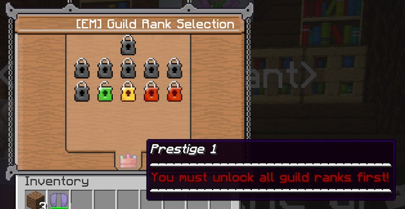

# 什么是声望系统？

声望系统会奖励重置 EliteMobs 等级、物品和货币（简而言之，就是重置所有进度）的玩家，奖励包括两个好处：**固定的巨额加成**和**炫耀**。

玩家可以将自己的等级作为聊天前缀，这可以通过使用 Placeholder API 和任何与 Placeholder API 兼容的聊天插件来实现，并且这是被鼓励的。

这样做的一个目的是让玩家可以清楚地表明他们不仅已经通关了 EliteMobs 的所有进度，而且可能已经多次通关，从而确立他们作为非常酷的精英玩家的地位。

## 玩家如何解锁声望系统？

一旦玩家达到最高公会等级，他们可以选择重置进度并进入声望。这可以通过公会等级菜单或与冒险者公会的公会服务员 NPC 对话来完成。

## 声望系统的代价是什么？

**一切。** 至少，是与 EliteMobs 相关的一切。玩家当前的公会等级将重置为 1，货币将被清空，**所有物品将失去与玩家的绑定**，这意味着当玩家试图装备它时，它会掉落并且他们将无法将其捡起。

当一个全副武装的玩家在装备所有装备的情况下激活声望时，看到这一切同时发生会非常有趣，这看起来像是他们获得了新生。

## 声望系统的固定巨额加成是什么？

激活声望系统将根据声望等级和公会等级解锁以下不同数量的加成：

- 最大生命值（从声望 1 开始）
- 暴击几率（从声望 2 开始）
- 闪避几率（从声望 3 开始）

此外，玩家每提高一个声望等级，每次击杀获得的金钱也会增加，但等级花费也会相应增加。 这是为了奖励玩家升级，但也为了降低玩家可能试图在高等级刷钱，然后找到一种方法用这些钱快速通过下一个声望等级的激励。

一个完全升级的玩家可以获得 100 点最大生命值（相比原版的 20 点）、10% 的基础闪避几率、10% 的基础暴击几率和 15 倍的货币掉落倍率。这是假设默认设置。***还需要注意的是，这是针对最高声望等级 10 级 20 的，这需要专注的玩家花费数年才能获得。*** 大多数人在刷到足以达到这个等级之前就会停止玩 Minecraft。

## 声望系统奖励概述
以下是冒险者公会配置中**默认**设置的奖励及其解锁时间的列表：

| 声望      | 奖励     | 数值 |
| :--------: | :------: | :---: |
| 声望 1    | 生命值 1   |  2  |
| 声望 2    | 暴击 1   |  3   | 实际上是 3
| 声望 3    | 闪避 1    |  3   | 实际上是 4
| 声望 4    | 生命值 2   | 2.5  |
| 声望 5    | 暴击 2   |  6   |
| 声望 6    | 闪避 2    |  6   |
| 声望 7    | 生命值 3   |  3   |
| 声望 8    | 暴击 3   | 10   |
| 声望 9    | 闪避 3    | 10   |
| 声望 10   | 生命值 4   |  4   |

这些数值会相互覆盖，表明例如，在声望 1 时，玩家每级将获得 2 点生命值加成。然而，在达到声望 4 时，此加成会增加到每级 2.5 点。
 闪避和暴击加成数值设置了该声望等级最大等级的加成值。这意味着如果玩家在声望等级 6 时将所有等级升到最高，他们将获得 6% 的闪避和暴击加成。
