[](https://magmaguy.com/webapp/webapp.html)

# Creating arenas

<div align="center">

### isEnabled

Sets if the arena is enabled.

| Key       |      Values       | Default |
|-----------|:-----------------:|:-------:|
|`isEnabled`| [Boolean](#boolean) | `true`    |

<details> 

<summary><b>Example</b></summary>

<div align="left">

```yml
isEnabled: true
```

</div>

</details>

***

### arenaName


Sets the name of the arena.

| Key       |      Values       | Default |
|-----------|:-----------------:|:-------:|
|`arenaName`| [String](#string) | none    |

<details> 

<summary><b>Example</b></summary>

<div align="left">

```yml
arenaName: Bedrock Arena
```

<div align="center">

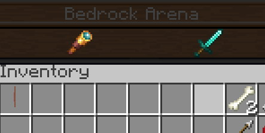

</div>

</div>

</details>

***

### corner1

Sets the first corner of the arena.

| Key       |      Values       | Default |
|-----------|:-----------------:|:-------:|
|`corner1`| [Location](#serialized_location) | none    |

<details> 

<summary><b>Example</b></summary>

<div align="left">

```yml
corner1: my_arena_world,10,50,-10,0,0
```

<div align="center">

In this image `corner1` is represented by *green wool* and `corner2` is represented by *red wool*. This configuration designates the area between them as the arena, represented by *yellow wool*.

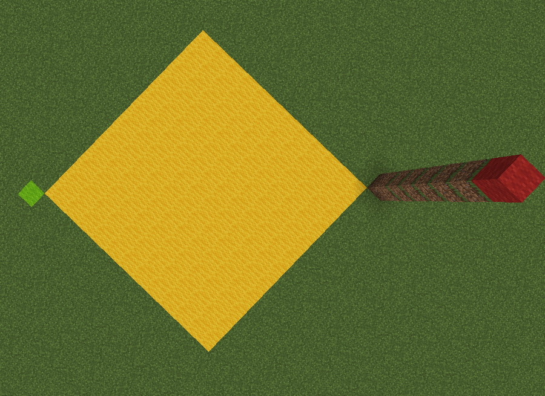

</div>

</div>

</details>

***

### corner2

Sets the second corner of the arena, must be diametrically opposed from `corner1`.

| Key       |      Values       | Default |
|-----------|:-----------------:|:-------:|
| `corner2` | [Location](#serialized_location) | none    |

<details> 

<summary><b>Example</b></summary>

<div align="left">

```yml
corner2: my_arena_world,-10,50,10,0,0
```

<div align="center">

In this image `corner1` is represented by *green wool* and `corner2` is represented by *red wool*. This configuration designates the area between them as the arena, represented by *yellow wool*.


</div>

</div>

</details>

***

### startLocation

Sets the start location of the arena.

| Key       |      Values       | Default |
|-----------|:-----------------:|:-------:|
| `startLocation` | [Location](#serialized_location) | none    |

<details> 

<summary><b>Example</b></summary>

<div align="left">

```yml
startLocation: my_arena_world,1,50,1,0,0
```

</div>

</details>

***

### exitLocation

Sets the exit location of the arena.

| Key       |      Values       | Default |
|-----------|:-----------------:|:-------:|
| `exitLocation` | [Location](#serialized_location) | none    |

<details> 

<summary><b>Example</b></summary>

<div align="left">

```yml
exitLocation: my_world,1,50,1,0,0
```

</div>

</details>

***

### waveCount

Sets the amounts of waves the arena has.

| Key       |      Values       | Default |
|-----------|:-----------------:|:-------:|
| `waveCount` | [Integer](#integer) | none    |

<details> 

<summary><b>Example</b></summary>

<div align="left">

```yml
waveCount: 10
```

</div>

</details>

***

### delayBetweenWaves

Sets the delay, in seconds, between waves.

| Key       |      Values       | Default |
|-----------|:-----------------:|:-------:|
| `delayBetweenWaves` | [Integer](#integer) | `0`    |

<details> 

<summary><b>Example</b></summary>

<div align="left">

```yml
delayBetweenWaves: 5
```

</div>

</details>

***

### rawIntermissionWaves

Doubles the delay between waves for the specified waves in the list.
Useful if you want to give players a short breather between specific waves.

| Key       |      Values       | Default |
|-----------|:-----------------:|:-------:|
| `rawIntermissionWaves` | [Integer List](#integer_list) | none  |

<details> 

<summary><b>Example</b></summary>

<div align="left">

```yml
rawIntermissionWaves:
- '5'
- '10'
- '15'
```

</div>

</details>

***

### spawnPoints

Sets the spawn locations for the arena bosses.

| Key       |      Values       | Default |
|-----------|:-----------------:|:-------:|
| `spawnPoints` | [String List](#string_list) [1] |  none   |

<details> 

<summary><b>Example</b></summary>

<div align="left">

```yml
spawnPoints:
- name=north:location=my_arena_world,219.5,71,273.5
- name=south:location=my_arena_world,219.5,71,316.5
- name=west:location=my_arena_world,197.5,71,295.5
- name=east:location=my_arena_world,240.5,71,295.5
- name=center:location=my_arena_world,219.5,71,295.5
```

</div>

</details>

***

### bossList

Sets the list of bosses that appear during the arena waves. EliteMobs Arenas do support Mythic Mobs spawning in the arenas.

| Key       |      Values       | Default |
|-----------|:-----------------:|:-------:|
| `bossList` | [String List](#string_list) [2] |  none   |

<details> 

<summary><b>Example</b></summary>

<div align="left">

```yml
bossList:
- wave=1:spawnPoint=north:boss=my_boss_wave_1.yml
- wave=1:spawnPoint=south:boss=my_boss_wave_1.yml
- wave=2:spawnPoint=center:boss=my_mythicmobs_boss:mythicmob=true:level=10
```

In this example, wave 1 will spawn one boss at the north spawn point and one boss at the south spawn point. Then, on wave 2, a mythic boss will spawn, at level 10, in the center point.

Note that you can also force a level for the EliteMobs bosses, but it is recommended you set their level in their configuration file.

</div>

</details>

***

### rawArenaReward

Sets the rewards given at the end of waves.

| Key       |      Values       | Default |
|-----------|:-----------------:|:-------:|
| `rawArenaReward` | [Universal EliteMobs loot table]($language$/elitemobs/loot_tables.md) |  none   |

<details> 

<summary><b>Example</b></summary>

<div align="left">

```yml
rawArenaReward:
- filename=enchanted_book_damage_all.yml:wave=5:chance=0.25
- filename=elite_scrap_tiny.yml:wave=1:chance=0.5:amount=5
- currencyAmount=3:wave=3
- level=5:filename=summon_merchant_scroll.yml:wave=5
- filename=magmaguys_toothpick.yml:itemlevel=10:wave=10:chance=0.95
```

</div>

</details>

***

### minimumPlayerCount

Sets the minimum amount of players an arena must have before starting.

| Key       |      Values       | Default |
|-----------|:-----------------:|:-------:|
| `minimumPlayerCount` | [Integer](#integer) |   `1`   |

<details> 

<summary><b>Example</b></summary>

<div align="left">

```yml
minimumPlayerCount: 1
```

</div>

</details>

***

### maximumPlayerCount

Sets the maximum amount of players an arena can have.

| Key       |      Values       | Default |
|-----------|:-----------------:|:-------:|
| `maximumPlayerCount` | [Integer](#integer) |  `100`  |

<details> 

<summary><b>Example</b></summary>

<div align="left">

```yml
maximumPlayerCount: 100
```

</div>

</details>

***

### arenaMessages

Sets the messages that run between waves.

| Key       |      Values       | Default |
|-----------|:-----------------:|:-------:|
| `arenaMessages` | Special [3] |  none   |

<details> 

<summary><b>Example</b></summary>

<div align="left">

```yml
arenaMessages:
- wave=1:message="&a[Arena Announcer] &fTime for wave one!"
- wave=2:message="&a[Arena Announcer] &fWow, wave two already."
```

<div align="center">

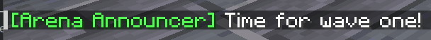

</div>

</div>

</details>

***

### cylindricalArena

Sets if the arena uses a cylindrical shape (default is cuboid).

| Key       |      Values       | Default |
|-----------|:-----------------:|:-------:|
| `cylindricalArena` | [Boolean](#boolean) |  `false`   |

<details> 

<summary><b>Example</b></summary>

<div align="left">

```yml
cylindricalArena: false
```

</div>

</details>

***

### permission

Sets the permission required to use the arena.

| Key       |      Values       | Default |
|-----------|:-----------------:|:-------:|
| `permission` | [String](#integer) |  none   |

<details> 

<summary><b>Example</b></summary>

<div align="left">

```yml
permission: mypermission.arena
```

</div>

</details>

***

</div>


## Special [1] 
Spawn points: Uses the following format: `name=pointName:location=world_name,x,y,z`.

## Special [2] 
Boss list: Uses the following format: `wave=x:spawnPoint=Y:boss=bossfilename.yml`.

## Special [3] 
Arena messages: Uses the following format: `wave=X:message=your message here`.

<details> 

<summary align="center"><b>Arena Config Example</b></summary>

<div align="left">

```yml
isEnabled: true
arenaName: Example Arena
corner1: my_arena_world,0,0,0,0,0
corner2: my_arena_world,50,50,50,0,0
startLocation: my_arena_world,25,0,25,0,0
exitLocation: my_minecraft_world,234,44,245,0,0
waveCount: 5
delayBetweenWaves: 5
spawnPoints:
  - name=north:location=my_arena_world,40.5,0,0
  - name=south:location=my_arena_world,10.5,0,0
  - name=west:location=my_arena_world,0,0,40.5
  - name=east:location=my_arena_world,0,0,10.5
  - name=center:location=my_arena_world,25.5,0,25.5
bossList:
  - wave=1:spawnPoint=north:boss=example_arena_wave_1_mob.yml
  - wave=1:spawnPoint=center:boss=example_arena_wave_1_mob.yml
  - wave=1:spawnPoint=south:boss=example_arena_wave_1_mob.yml
  - wave=2:spawnPoint=center:boss=example_arena_wave_2_mob.yml
  - wave=3:spawnPoint=east:boss=example_arena_wave_3_mob.yml
  - wave=3:spawnPoint=west:boss=example_arena_wave_3_mob.yml
  - wave=4:spawnPoint=center:boss=example_arena_wave_4_mob.yml
  - wave=4:spawnPoint=center:boss=example_arena_wave_4_mob.yml
  - wave=5:spawnPoint=center:boss=example_arena_wave_5_mob.yml
  - wave=5:spawnPoint=south:boss=example_arena_wave_5_mob.yml
  - wave=5:spawnPoint=west:boss=example_arena_wave_5_mob.yml
rawArenaReward:
  - currencyAmount=5:wave=1
  - currencyAmount=10:wave=2
  - currencyAmount=15:wave=3
  - currencyAmount=20:wave=4
  - currencyAmount=25:wave=5
  - filename=magmaguys_toothpick.yml:itemlevel=5:wave=5:chance=0.5
minimumPlayerCount: 1
maximumPlayerCount: 3
arenaMessages:
  - wave=1:message=&d[Arena NPC] &fWow! Wave 1!
  - wave=2:message=&d[Arena NPC] &fAmazing it is wave 2!
  - wave=3:message=&d[Arena NPC] &fWave 3 is now on!
  - wave=4:message=&d[Arena NPC] &fWave 4 already!
  - wave=5:message=&d[Arena NPC] &fWell it is all over after this one.
cylindricalArena: false
permission: arena.mypermission
```
</div>

</details>

<details> 

<summary align="center"><b>Breakdown of the example</b></summary>

<div align="left">

Let us go over this example from the top and explain what this arena configuration does.

First the arena is enabled with `isEnabled`, and we can see that it is called Example Arena using the `arenaName` setting. The name will be shown when you interact with the arena NPC (we talk about how to make an arena NPC further down) that will allow players to join the arena. corner1 and corner2 define the arena size. These corners should be at the opposite sides of each other in the area that you plan to use for the arena.

`startLocation` is where the players will spawn in when joining the arena, in the example that would be in the center of the arena in the world my_arena_world. `exitLocation` is where the players will be teleported after they fail or finish the arena. In this case it would be the world my_minecraft_world and the coordinates in the example.

`waveCount` simply sets the amount of waves that the arena will last for. In this case that would be 5 waves. If they players manage to survive all 5 waves they have managed to survive the arena. `delayBetweenWaves` will set the amount of seconds before the next wave starts. In our example players would have 5 seconds to prepare before the next wave starts.

`spawnPoints` set the locations where we can have our mobs spawn. We can make as many as we want and name them as we want. In the example we have decided to make 5 spawn points and name them north, south, center, east and west.

`bossList` is where we define which boss should spawn at what wave and at which location. In the example wave 1 will have 3 bosses spawning from the spawn locations that we named north, center and south. All three are set to use the same boss file but we could have used different boss files for each one.

`rawArenaReward` sets the rewards that will be handed out after a player manages to survive/beat a wave. As we can see in the example beating wave 1 will reward the player with 5 elite coins. If they manage to survive the rest of the waves and then beat wave 5, they will be rewarded with 25 elite coins and a 50% chance to get a level 5 MagmaGuy's Toothpick.

`minimumPlayerCount` sets the minimum required amount of players needed before the arena will start. In our example this setting is set to 1, so only one player is needed for the arena to starts. `maximumPlayerCount` sets the maximum amount of players that can participate in the arena. In our example this setting is set to 3, meaning that if more than 3 players try to participate in the arena then the arena will not start until there are 3 players or less.

`arenaMessages` lets you add some flavor text that will be displayed in the chat at the start of the defined waves. In our example we have decided to display a short message at the start of each wave. We have also decided to include the NPC name at the start of each message giving the illusion that the text is spoken dialogue by the announcer (arena master).

`cylindricalArena` this setting will let us toggle if the defined area that we have set with `corner1` and `corner2` should be a cylindrical shape instead of a cuboid one. In our example we have set this to `false` meaning that the example arena is a cuboid shape.

`permission` lets us set a permission that the players will need to have to be able to join/start the arena. In our example the players will need the `arena.mypermission` permission to be able to use the arena.

</div>

</details>

## Creating the Arena NPC

<div align="center">

### isEnabled

Sets if the NPC is enabled.

| Key       |      Values       | Default |
|-----------|:-----------------:|:-------:|
| `isEnabled` | [Boolean](#boolean) | `true`  |

<details> 

<summary><b>Example</b></summary>

<div align="left">

```yml
isEnabled: true
```

</div>

</details>

***

### name

Sets the display name of the NPC.

| Key       |      Values       | Default |
|-----------|:-----------------:|:-------:|
| `name` | [String](#string) |  none   |

<details> 

<summary><b>Example</b></summary>

<div align="left">

```yml
name: "&aGladius"
```

<div align="center">

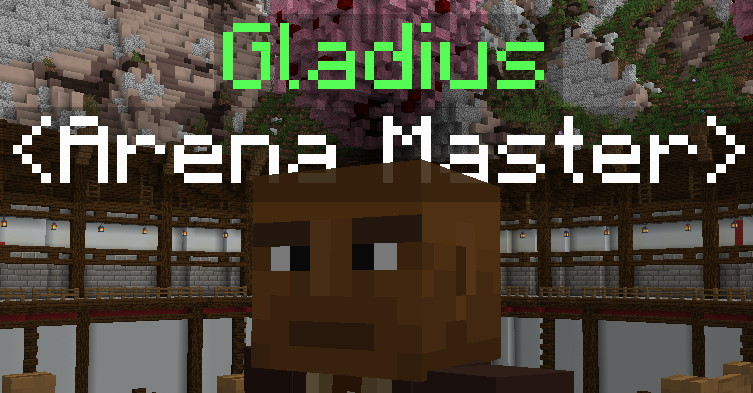

</div>

</div>

</details>

***

### role

Sets role display under the NPC name.

| Key       |      Values       | Default |
|-----------|:-----------------:|:-------:|
| `role` | [String](#string) |  none   |

<details> 

<summary><b>Example</b></summary>

<div align="left">

```yml
role: "&c<Arena Master>"
```
<div align="center">

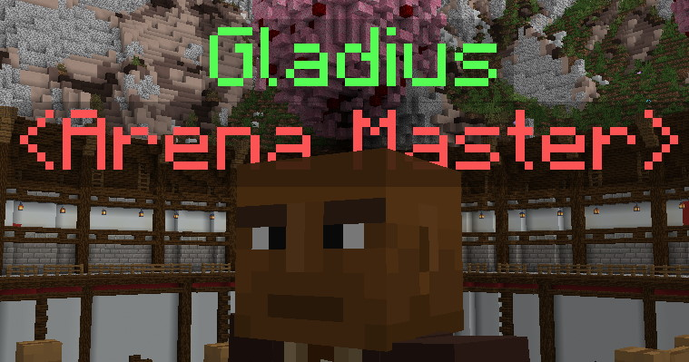

</div>

</div>

</details>

***

### profession

Sets the MineCraft profession of the NPC.

| Key       |      Values       | Default |
|-----------|:-----------------:|:-------:|
| `profession` | [Profession](https://hub.spigotmc.org/javadocs/spigot/org/bukkit/entity/Villager.Profession.html) |  none   |

<details> 

<summary><b>Example</b></summary>

<div align="left">

```yml
profession: ARMORER
```

<div align="center">


*Will be overridden if a `diguise` is used.*

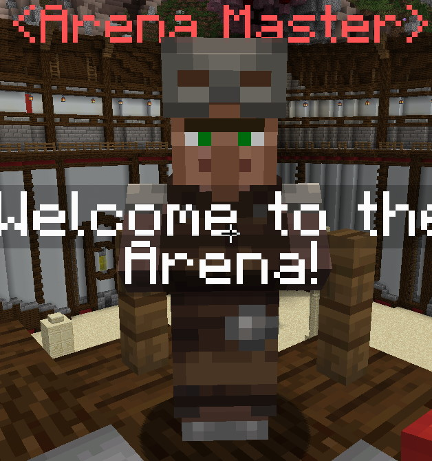

</div>

</div>

</details>

***

### spawnLocation

Sets the spawn location of the NPC.

| Key       |      Values       | Default |
|-----------|:-----------------:|:-------:|
| `spawnLocation` | [Location](#serialized_location) |  none   |

<details> 

<summary><b>Example</b></summary>

<div align="left">

```yml
spawnLocation: my_world,1.5,50,1.5,-108,0
```

</div>

</details>

***

### greetings

Sets greeting dialog for the NPC.

| Key       |      Values       | Default |
|-----------|:-----------------:|:-------:|
| `greetings` | [String List](#string_list) |  none   |

<details> 

<summary><b>Example</b></summary>

<div align="left">

```yml
greetings:
- Welcome to the Arena!
- The Arena welcomes you!
```

<div align="center">

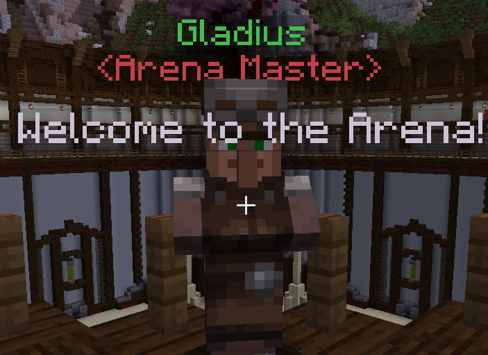

</div>

</div>

</details>

***

### dialog

Sets dialog when the players interact with the NPC.

| Key       |      Values       | Default |
|-----------|:-----------------:|:-------:|
| `dialog` | [String List](#string_list) |  none   |

<details> 

<summary><b>Example</b></summary>

<div align="left">

```yml
dialog:
- Ready for a challenge?
- Face the Arena?
```

<div align="center">

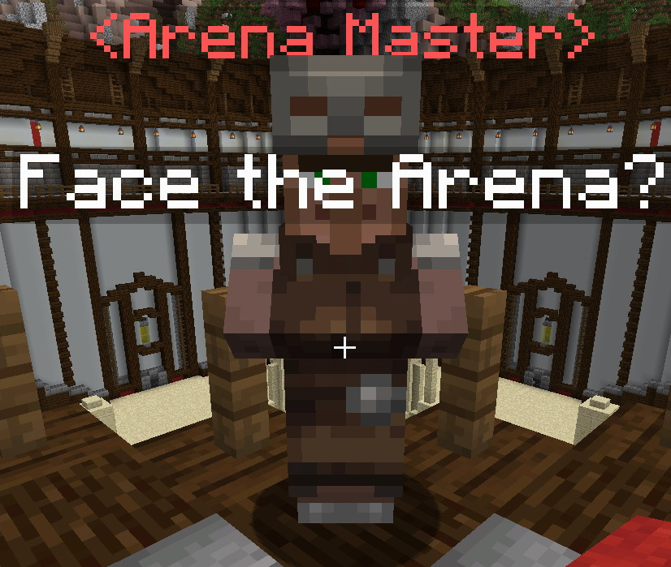

</div>

</div>

</details>

***

### farewell

Sets the goodbye dialog for the NPC.

| Key       |           Values            | Default |
|-----------|:---------------------------:|:-------:|
| `farewell` | [String List](#string_list) |  none   |

<details> 

<summary><b>Example</b></summary>

<div align="left">

```yml
farewell:
- Bye.
- Return with your shield, or on it!
```

<div align="center">

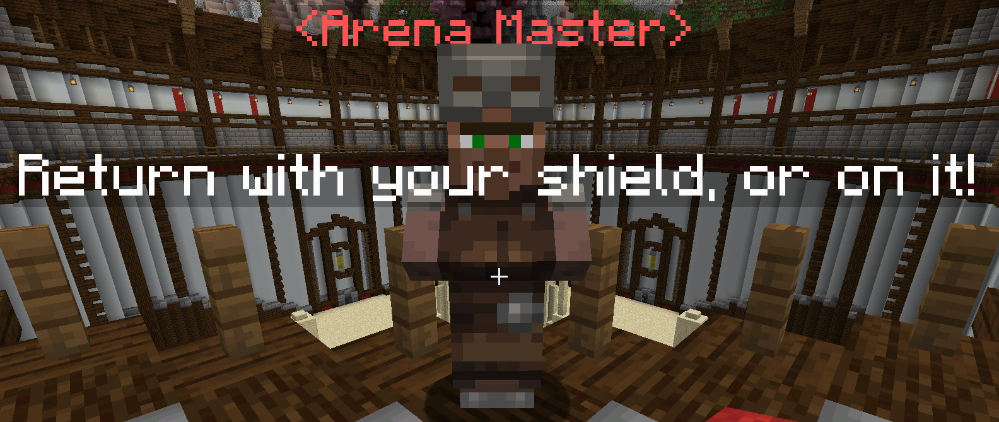

<div align="center">

*If a string is too long you can use \n to separate the string into multiples lines.*

<div align="left">

```yml
farewell:
- Bye.
- Return with your\nshield, or on it!
```
</div>

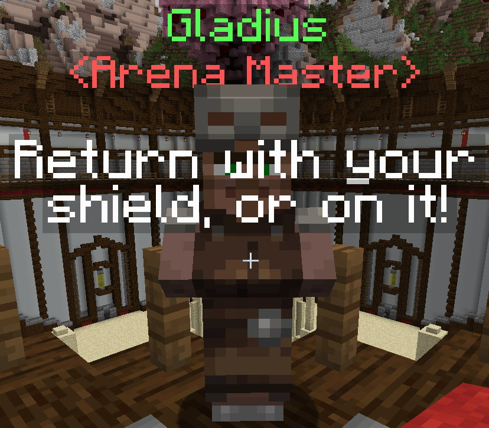

</div>

</div>

</div>

</details>

***

### canTalk

Sets the goodbye dialog for the NPC.

| Key       |           Values            | Default |
|-----------|:---------------------------:|:-------:|
| `canTalk` | [Boolean](#boolean) | `true`  |

<details> 

<summary><b>Example</b></summary>

<div align="left">

```yml
canTalk: true
```

</div>

</details>

***

### activationRadius

Sets the radius when the NPC should start talking.

| Key       |           Values            | Default |
|-----------|:---------------------------:|:-------:|
| `activationRadius` | [Double](#double) |  `3.0`  |

<details> 

<summary><b>Example</b></summary>

<div align="left">

```yml
activationRadius: 3.0
```

</div>

</details>

***

### interactionType

Sets the type of interaction the NPC will do.

| Key       |           Values            | Default |
|-----------|:---------------------------:|:-------:|
| `interactionType` | Special [4] |  `ARENA_MASTER`  |

<details> 

<summary><b>Example</b></summary>

<div align="left">

```yml
interactionType: ARENA_MASTER
```

</div>

</details>

***

### disguise

Sets the custom NPC disguise.

| Key       |           Values            | Default |
|-----------|:---------------------------:|:-------:|
| `disguise` | [Disguise]($language$/elitemobs/libsdisguises.md) |  none   |

<details> 

<summary><b>Example</b></summary>

<div align="left">

```yml
disguise: ZOMBIE
```

<div align="center">

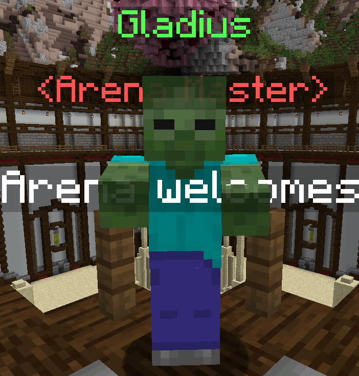

<div align="center">

</div>

</details>

***

### arena

Sets which arena the players will be teleported to.

| Key       |           Values            | Default |
|-----------|:---------------------------:|:-------:|
| `arena` | [Filename](#filename) |  none   |

<details> 

<summary><b>Example</b></summary>

<div align="left">

```yml
arena: my_arena.yml
```

</div>

</details>

***

### teleportLocation

Sets where the players should be teleported after interacting with the NPC. This setting is usually used to teleport players to a dedicated lobby type area of the arena where they can start the arena challenge or wait for other players to finish going through the arena. 

| Key       |        Values         | Default |
|-----------|:---------------------:|:-------:|
| `teleportLocation` | [Location](#location) |  none   |

<details> 

<summary><b>Example</b></summary>

<div align="left">

```yml
teleportLocation: my_arena_world,10,50,10,0,0
```

</div>

</details>

</div>

***

<details>

<summary align="center"><b>Arena Config Example</b></summary>

<div align="left">

```yml
isEnabled: true
name: Example NPC
role: <Arena Master>
profession: ARMORER
spawnLocation: my_minecraft_world,233,44,245,0,0
greetings:
  - Welcome to the Arena!
dialog:
  - Ready to enter the Arena?
farewell:
  - Bye!
canTalk: true
activationRadius: 3.0
interactionType: ARENA_MASTER
disguise: ZOMBIE
arena: example_arena.yml
```
This example shows a basic Arena NPC that will spawn in my_minecraft_world with a zombie disguise. Players can interact with this NPC to challenge the Example Arena.

</div>

</details>

## Special [4] 
The following is the list of valid NPC interaction types:

| Type | Description |
| --- | :-: |
| `GUILD_GREETER` | Open the adventurer's guild menu |
| `CHAT` | Right-clicking cycles through the `dialog` |
| `CUSTOM_SHOP` | Opens the custom shop menu |
| `PROCEDURALLY_GENERATED_SHOP` | Opens the procedurally generated shop |
| `BAR` | Opens the bar menu |
| `ARENA` | Opens the arena menu |
| `QUEST_GIVER` | Opens the procedurally generated quests menu |
| `CUSTOM_QUEST_GIVER` | Opens the quest menu for a specific quest set in `questFilenames` |
| `NONE` | No interactions |
| `SELL` | Opens the sell menu |
| `TELEPORT_BACK` | Teleports players back to the last non-elitemobs world location they were |
| `SCRAPPER` | Opens the scrap menu |
| `SMELTER` | Opens the smelt menu |
| `REPAIRMAN` | Opens the repair menu |
| `ENHANCER` | Opens the item enhancements menu |
| `REFINER` | Opens the refiner menu |
| `UNBINDER` | Opens the unbind menu |
| `ARENA_MASTER` | Opens the arena menu for the arena set in `arenaFilename` |
| `COMMAND` | Runs the command set in `command` |