[](https://magmaguy.com/webapp/webapp.html)

# Creating custom bosses

# Before you begin

## Where do boss files go?

Boss files go into the configuration folder `~/plugins/EliteMobs/custombosses`.

It is possible to create subfolders, such as `~/plugins/EliteMobs/custombosses/mybosses`. This is recommended to keep things organized.

One file defines one boss, though it is possible to spawn the same boss several times and even set several spawn locations for the same boss file.

It is possible to use the [webapp](https://magmaguy.com/webapp/webapp.html) to quickly and easily create custom bosses and more.

## Smallest possible configuration

**The smallest possible configuration file for a Custom Boss is:**
```yml
```

Note how this is just an empty file. This will still spawn a zombie custom boss with a custom name, as those are the defaults. **Everything in this page is optional!**

## Example boss

<div align="center">

Let's take a look at an example of what a boss file looks like.

<details> 
<summary><b>Example</b></summary>

<div align="left">

```yml
isEnabled: true
entityType: ZOMBIE
name: '&eTest boss'
level: dynamic
timeout: 10
isPersistent: false
healthMultiplier: 2.0
damageMultiplier: 0.5
helmet: GOLDEN_HELMET
chestplate: IRON_CHESTPLATE
leggings: LEATHER_LEGGINGS
boots: CHAINMAIL_BOOTS
mainHand: GOLDEN_AXE
offHand: SHIELD
isBaby: false
powers:
- invulnerability_knockback.yml
spawnMessage: A test boss has been spawned!
deathMessage: A test boss has been slain by $players!
escapeMessage: A test boss entity has escaped!
locationMessage: 'Test entity: $location'
uniqueLootList:
- magmaguys_toothpick.yml:1
dropsEliteMobsLoot: true
dropsVanillaLoot: true
trails:
- BARRIER
onDamageMessages:
- "I've hit you!"
onDamagedMessages:
- "I've been hit!"
```

</div>

</details>

</div>


## Basic settings

<div align="center">

### isEnabled

Sets if the boss is enabled.

| Key | Values | Default |
|-|:-:|-|
| `isEnabled` | `true` / `false` | `true` |

<details> 

<summary><b>Example</b></summary>

<div align="left">

```yml
isEnabled: true
```

</div>

</details>

***

### entityType

Sets the entity type of the boss.

| Key |                                                                                   Values                                                                                    | Default |
|-|:---------------------------------------------------------------------------------------------------------------------------------------------------------------------------:|-|
| `entityType` | [Pick from here](https://hub.spigotmc.org/javadocs/spigot/org/bukkit/entity/EntityType.html). <br> Value must also be present in folder `~plugins/EliteMobs/mobproperties`. | `ZOMBIE`|

<details> 

<summary><b>Example</b></summary>

<div align="left">

```yml
entityType: ZOMBIE
```

</div>

</details>

***

### name

Sets the name of the boss.

| Key | Values | Default |
|-|:-:|-|
| `name` | [String](#string), accepts [color codes](#color_codes) and the placeholders listed below | "Default Name" |

<details> 

<summary><b>Example</b></summary>

<div align="left">

```yml
name: "$normalLevel &cCool boss!"
```
<div align="center">

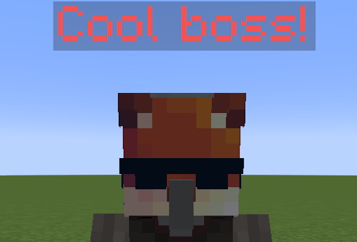

</div>


</div>

</details>

If you wish to include the boss level in their name field, simply use one of the following placeholders.

| Placeholder | Description | Example |Output (for a level 10 boss) |
|-|:-:|:-:|-|
| `$level` | Replaces with the level | "$level Cool boss" | `10 Cool boss` |
| `$normalLevel` | Replaces with the level, made for normal mobs | `"$normalLevel Cool boss"` | `[10] Cool boss` |
| `$minibossLevel` | Replaces with the level, made for minibosses | `"$minibossLevel Cool boss"` | `〖10〗 Cool boss` |
| `$bossLevel` | Replaces with the level, made for bosses | `"$bossLevel Cool boss"` | `『10』 Cool boss` |
| `$reinforcementLevel` | Replaces with the level, made for reinforcements | `"$reinforcementLevel Cool boss"` | `〔10〕 Cool Boss` |
| `$eventBossLevel` | Replaces with the level, made for event bosses | `"$eventBossLevel Cool boss"` | `「10」 Cool boss` |

<details> 

<summary><b>Example</b></summary>

<div align="left">

```yml
name: "$normalLevel &cCool boss!"
```

<div align="center">

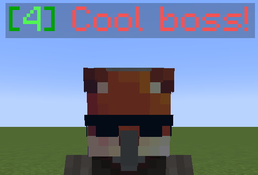

</div>

</div>

</details>

***

### level

Sets the level of the boss.

| Key | Values | Default |
|-|:-:|-|
| `entityType` | Positive [integer](#integer) numbers or `dynamic` | `dynamic` |

`dynamic` is used for events and adjusts to the level of nearby players at the time of the boss spawn.
It is not recommended for regional bosses.

<details> 

<summary><b>Example</b></summary>

<div align="left">

```yml
level: 1
```

</div>

</details>

***

### healthMultiplier

Sets the health of the boss.

| Key | Values | Default |
|-|:-:|-|
| `healthMultiplier` | [Multiplier](#multiplier) | `1.0` |

<details> 

<summary><b>Example</b></summary>

<div align="left">

```yml
healthMultiplier: 1.5
```

</div>

</details>

***

### damageMultiplier

Sets the damage multiplier of the boss.

| Key | Values | Default |
|-|:-:|-|
| `damageMultiplier` | [Multiplier](#multiplier) | `1.0` |

<details> 

<summary><b>Example</b></summary>

<div align="left">

```yml
damageMultiplier: 1.5
```

</div>

</details>

***

### isBaby

Sets if the boss uses the baby variant of the mob. Can only be applied to mobs with baby variants.
If you would like to [disguise]($language$/elitemobs/libsdisguises.md) the boss but would like it to also remain a baby while in disguise (make sure the disguise entity also supports the baby variant) you can use this setting:
<div align="left">

```yaml
disguise: HOGLIN:baby
```
</div>

| Key | Values | Default |
|-|:-:|-|
| `isBaby` | `true` / `false` | `false` |

<details> 

<summary><b>Example</b></summary>

<div align="left">

```yml
isBaby: true
```

</div>

</details>


***

### helmet/chestplate/leggings/boots/mainhand/offhand

Sets the armor of the boss. Not all minecraft models are able to show armor. Boss armor is purely cosmetic and does not affect gameplay.

| Key |                                    Values                                     | Default |
|-|:-----------------------------------------------------------------------------:|-|
| `helmet` |           [Material](#material), [UUID](https://minecraftuuid.com/)           | none |
| `chestplate` | [Material](#material) | none |
| `leggings` | [Material](#material) | none |
| `boots` | [Material](#material) | none |
| `mainHand` | [Material](#material) | none |
| `offHand` | [Material](#material) | none |

**Note:** This field also lets you set custom models for items. To set the custom model ID, add the ID after the material type following this format: `ITEM_MATERIAL:ID`. Example: `DIAMOND_SWORD:1` sets the boss to wear a diamond sword with the custom model #1 in your texture pack.

**Note 2:** This field also lets you set custom leather colors with the format `ITEM_MATERIAL:CODE` where the code is the hexadecimal representation of the color. Example: `LEATHER_LEGGINGS:ffa500` would create orange leggings. You can use hex codes, just remove the `#` from the hex code. You can get hex codes from [here](https://www.w3schools.com/colors/colors_hexadecimal.asp).

**Note 3:** The helmet field also lets you set mob helmets to be player heads. Simply get the UUID of the player head you would like to use and type it into the helmet field. *The player needs to be online for this to work or the head will default to a generic MineCraft head.* You can get player UUID's from [here](https://minecraftuuid.com/).

<details> 

<summary><b>Example</b></summary>

<div align="left">

```yml
helmet: 198c4123-cafc-45df-ba79-02a421eb8ce7
chestplate: DIAMOND_CHESTPLATE:1
leggings: LEATHER_LEGGINGS:ffa500
boots: NETHERITE_BOOTS
mainHand: DIAMOND_SWORD
offHand: SHIELD
```

<div align="center">


</div>

</div>

</details>

***

### powers

Sets the powers the boss has.

| Key | Values | Default |
|-|:-:|-|
| `powers` | Refer to the list below | none |

<details> 

<summary><b>Example</b></summary>

<div align="left">

```yml
powers:
- hyper_loot.yml
- attack_arrow.yml
```

</div>

</details>

*Note: You can check out [this page]($language$/elitemobs/premade_powers.md) if you want to see a list of premade powers that you can use.*

***

### Intermediate configuration - Spawning reinforcements

Reinforcements also go into the powers category, using the following settings:

<details> 

<summary><b>Reinforcement settings</b></summary>

| Key | Description |                                                                                                             Values                                                                                                             | Default |
|-|:-:|:------------------------------------------------------------------------------------------------------------------------------------------------------------------------------------------------------------------------------:|-|
| `summonType` | What triggers the reinforcement spawn. Mandatory. |                                                                                                    Refer to the list below                                                                                                     | none |
| `filename` | Filename of the boss to spawn as a reinforcement. Mandatory. |                                                                                                       [String](#string)                                                                                                        | none |
| `chance` | Chance of the reinforcement spawning. Optional. |                                                                                                       [Double](#double)                                                                                                        | `1.0` |
| `amount` | Sets the amount of reinforcements to spawn. Optional. |                                                                                                      [Integer](#integer)                                                                                                       | `1` |
| `inheritAggro` | Makes the reinforcement inherit the aggro from the boss. Optional. |                                                                                                        `true` / `false`                                                                                                        | `false` |
| `spawnNearby` | Makes the reinforcements spawn in a 30 block radius from the boss. Optional. |                                                                                                        `true` / `false`                                                                                                        | `false` |
| `inheritLevel` | Makes the reinforcement inherit the level of the boss. Optional |                                                                                                        `true` / `false`                                                                                                        | `false` |
| `customSpawn` | Makes the reinforcement spawn using the [custom spawn system]($language$/elitemobs/creating_spawns.md). Only used for `summonType: GLOBAL`
| `location` | Spawn location. Optional. | `world_name,x,y,z` or `x,y,z` for a location relative to the boss. The offset is relative to the spawn location for regional bosses. You can also use `same_as_boss` to make reinforcements spawn in the same world as the boss. | none |
| `lightningRod` | Special setting for `summonType: ON_COMBAT_ENTER_PLACE_CRYSTAL`. Makes end crystals spawn lightning around them. Optional. |                                                                                                        `true` / `false`                                                                                                        | none |

</details>

Summon types set the conditions for the reinforcements spawning. The following is a list of the valid summon types:

<details> 

<summary><b>Summon types</b></summary>

| Value |                                                                         Description                                                                         |
|-|:-----------------------------------------------------------------------------------------------------------------------------------------------------------:|
| `ONCE` |                                          Only spawns the reinforcements once, the first time the boss is damaged.                                           |
| `ON_HIT`  |                                                              Spawns the reinforcements on hit.                                                              |
| `ON_COMBAT_ENTER` |                                                   Spawns the reinforcements when the boss enters combat.                                                    |
| `GLOBAL` | Spawns a reinforcement for every online player. Requires the `customSpawn` key to have a valid [custom spawn]($language$/elitemobs/creating_spawns.md) set. |
| `ON_COMBAT_ENTER_PLACE_CRYSTAL` |                                 Places end crystal reinforcements on combat enter, only for use with custom dragon fights.                                  |

</details>

Note that it is also possible to spawn reinforcements through [Elite Scripts]($language$/elitemobs/creating_powers.md), so there are more customizable ways of spawning reinforcements.

<details> 

<summary><b>Example</b></summary>

<div align="left">

```yml
powers:
- summonType: ON_COMBAT_ENTER
  filename: test_boss.yml
  chance: 0.5
  amount: 5
  inheritAggro: true
  spawnNearby: true
  inheritLevel: true
  customSpawn: false
  location: same_as_boss,10,20,30
  lightningRod: false
```

</div>

</details>

### Expert configuration - Creating your own powers

It is possible to create your own powers, either on the boss file itself or as a new configuration file in the powers folder. You can learn more about that [here]($language$/elitemobs/creating_powers.md).

### Limiting powers based on instanced dungeon difficulty

[Instanced dungeons]($language$/elitemobs/dungeons.md&section=instanced-dungeons) can have difficulty settings, and it is possible to make it so a specific power is only enabled for specific difficulties.

<details> 

<summary><b>Limiting power options</b></summary>

<div align="left">

| Key | Description | Values | Default |
|-|:-:|:-:|-|
| `filename` | Filename of the power. | [String](#string) | none |
| `difficultyID` | Difficulty name, matching the name of the difficulty in the dungeon package. | [String](#string) | none |

</div>

</details>

This will only apply to instanced dungeons.

<details> 

<summary><b>Example</b></summary>

<div align="left">

```yml
powers:
- filename: movement_speed.yml
  difficultyID:
  - myDifficultyName1
  - myDifficultyName2
  - myDifficultyName3
```

</div>

</details>

***

### spawnMessage

Sets the message to send when the boss spawns. Requires setting up the [announcementPriority](#announcementPriority).

| Key | Values | Default |
|-|:-:|-|
| `spawnMessage` | [Strings](#string) and [color codes](#color_codes) | none |

<details> 

<summary><b>Example</b></summary>

<div align="left">

```yml
announcementPriority: 3
spawnMessage: I rise once more!
```

<div align="center">


</div>

</div>

</details>

***

### deathMessages

Sets the list of messages to send when the boss dies. Requires setting up the [announcementPriority](#announcementPriority).

| Key | Values | Default |
|-|:-:|-|
| `deathMessages` | [Strings](#string), [color codes](#color_codes) and the placeholders below | none |

<details> 

<summary><b>Example</b></summary>

<div align="left">

```yml
announcementPriority: 3
deathMessages:
- '&e&l---------------------------------------------'
- '&4The Test Boss has been killed!'
- '&c&l    1st Damager: $damager1name &cwith $damager1damage damage!'
- '&6&l    2nd Damager: $damager2name &6with $damager2damage damage!'
- '&e&l    3rd Damager: $damager3name &ewith $damager3damage damage!'
- '&4Slayers: $players'
- '&e&l---------------------------------------------'
```

<div align="center">

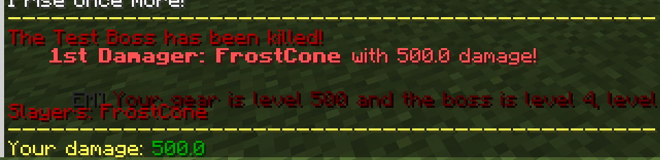

</div>

</div>

</details>

Death messages use the following placeholders:

<details> 

<summary><b>Placeholders</b></summary>

| Value | Description |
|-|:-:|
| `$damager1name` | The name of the top damager |
| `$damager2name` | The name of the second top damager |
| `$damager3name` | The name of the third top damager |
| `$damager1damage` | The damage amount of the top damager |
| `$damager2damage` | The damage amount of second top damager |
| `$damager3damage` | The damage amount of the third top damager |
| `$players` | Displays a list of all damagers |

</details>

### onKillMessage

Sets the message to send when the boss kills a player. Requires setting up the [announcementPriority](#announcementPriority).

| Key | Values | Default |
|-|:-:|-|
| `onKillMessage` | [Strings](#string) and [color codes](#color_codes) | none |

<details> 

<summary><b>Example</b></summary>

<div align="left">

```yml
announcementPriority: 3
onKillMessage: I win, you lose!
```

<div align="center">


</div>

</div>

</details>

***

### slimeSize

<div align="center">

Sets the size of the slime boss, but only works for Slimes and Magmacubes.

</div>

| Key | Values | Default |
|-|:-:|-|
| `slimeSize` | [Integer](#integer) | `4` |

<details>

<summary><b>Example</b></summary>

<div align="left">

```yml
slimeSize: 5
```

</div>

</details>

***

### neutral

<div align="center">

Sets if the boss will spawn as neutral or not. This only applies to entity types that can be neutral such as Wolves or Iron Golems.

</div>

| Key | Values | Default |
|-|:-:|-|
| `neutral` | [Boolean](#boolean) | `false` |

<details>

<summary><b>Example</b></summary>

<div align="left">

```yml
neutral: true
```

</div>

</details>

## Advanced settings

<div align="center">

### timeout

Sets the amount of time, in minutes, before the Custom Boss despawns.

| Key | Values | Default |
|-|:-:|-|
| `timeout` | Time (in minutes) [Integer](#integer) | `0` |

<details> 

<summary><b>Example</b></summary>

<div align="left">

```yml
timeout: 20
```
Sets the boss to escape after 20 minutes.

</div>

</details>

***

### isPersistent

Sets if the boss can survive a chunk unload. Only recommended for event bosses.

| Key | Values | Default |
|-|:-:|-|
| `isPersistent` | `true` / `false` | `false` |

<details> 

<summary><b>Example</b></summary>

<div align="left">

Example:

```yml
isPersistent: true
```

</div>

</details>

***

### damageModifiers

Sets weapons that bosses can be strong or weak against.

| Key |        Values         | Default |
|-|:---------------------:|-|
| `damageModifiers` | [Material](#material) | none |

<details> 

<summary><b>Example</b></summary>

<div align="left">

```yml
damageModifiers:
- material:DIAMOND_SWORD,multiplier:0.8
- material:TRIDENT,multiplier:2.0
```

</div>

In this example, bosses will only take 80% damage from diamond swords (or 20% less), but will take 200% damage from tridents (or 2x more).

</details>

***

### normalizedCombat

Modifies the boss' damage and max health to match the values of the normalized entity in `~/plugins/EliteMobs/mobproperties`. This is the default for regional bosses to guarantee a smooth difficulty curve.

| Key | Values | Default |
|-|:-:|-|
| `normalizedCombat` | `true` / `false` | `false` |

<details> 

<summary><b>Example</b></summary>

<div align="left">

Example:
```yml
normalizedCombat: true
```

</div>

</details>

***

### escapeMessage

Sets the message that gets broadcasted to players when the boss escapes through the [timeout](#timeout) mechanic. Requires [announcementPriority](#announcementPriority) to be configured.

| Key | Values | Default |
|-|:-:|-|
| `escapeMessage` | [String](#string) | none |


<details> 

<summary><b>Example</b></summary>

<div align="left">

```yml
announcementPriority: 3
timeout: 60
escapeMessage: "Sayonara!"
```

<div align="center">

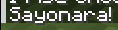

</div>

</div>

</details>

***

### locationMessage

Sets the message show in the boss bar. This is used to track both Custom Boss health and its location in the server. Requires the [annoucementPriority](#annoucementPriority) to be configured.

| Key |                                      Values                                      | Default |
|-|:--------------------------------------------------------------------------------:|-|
| `locationMessage` | [String](#string), [Color codes](#color_codes) and the placeholders listed below | none |

Placeholders:

| Value | Description |
|-|:-:|
| `$distance` | Gets replaced with the distance the player is from the Custom Boss. This is the preferable option. |
| `$location` | Gets replaced with the x y z location coordinates of the Custom Boss |


<details>


<summary><b>Example</b></summary>

<div align="left">

```yml
announcementPriority: 3
locationMessage: "&4Cool boss: At $location only $distance blocks away!"
```

<div align="center">


</div>

</div>

This would show something like `Cool boss: At 414,55,347 only 10 blocks away!`

</details>

***

### uniqueLootList

Sets the [Custom Items]($language$/elitemobs/creating_items.md) that drop from the boss.

| Key |        Values        | Default |
|-|:--------------------:|-|
| `uniqueLootList` | [List](#string_list) | none |

Loot entries in the Custom Loot follow the Loot Table format. [Info about that here!]($language$/elitemobs/loot_tables.md) Take note that some older files might be using outdated loot tables that look different than the example.

<details> 

<summary><b>Example</b></summary>

<div align="left">

```yml
uniqueLootList:
  - filename: magmaguys_toothpick.yml
    chance: 0.02
  - minecraft:type=DIAMOND:amount=1:chance=0.9
  - SCRAP:level=5-10:amount=10-20:ignorePlayerLevel=false:chance=0.5
  - UPGRADE_ITEM:level=5-10:amount=1-2:ignorePlayerLevel=false:chance=0.1
  - magmaguys_toothpick.yml:0.5:elitemobs.*
```

</div>

</details>

***

### dropsEliteMobsLoot

Sets if the boss will drop EliteMobs loot, excluding items in [`uniqueLootList`](#uniqueLootList). Includes coins.

| Key | Values | Default |
|-|:-:|-|
| `dropsEliteMobsLoot` | `true` /  `false` | `true` |

Recommended to set to false for reinforcement mobs.

<details> 

<summary><b>Example</b></summary>

<div align="left">


```yml
dropsEliteMobsLoot: true
```

</div>

</details>

***

### dropsVanillaLoot

Sets whether the Custom Boss will drop the vanilla loot usually associated to its vanilla mob type.

| Key | Values | Default |
|-|:-:|-|
| `dropsVanillaLoot` | `true` /  `false` | `true` |

<details> 

<summary><b>Example</b></summary>

<div align="left">

```yml
dropsVanillaLoot: true
```

</div>

</details>

***

### dropsRandomLoot

Sets whether the Custom Boss will drop procedurally generated loot from EliteMobs. Does not include elite coins.

| Key | Values | Default |
|-|:-:|-|
| `dropsRandomLoot` | `true` /  `false` | `true` |

<details> 

<summary><b>Example</b></summary>

<div align="left">

```yml
dropsRandomLoot: true
```

</div>

</details>

***

### trails

Sets the trail that the boss leaves behind when moving.

| Key | Values | Default |
|-|:-:|-|
| `trails` | [Particles](https://hub.spigotmc.org/javadocs/spigot/org/bukkit/Particle.html) or [item materials](https://hub.spigotmc.org/javadocs/spigot/org/bukkit/Material.html) | none |

<details> 

<summary><b>Example</b></summary>

<div align="left">

```yml
trails:
- CLOUD
```

</div>

</details>

***

### onDamageMessages

Sets the message that the Boss Mob displays when they hit a player. This is a list, and the one used is randomized from the list.

| Key |        Values        | Default |
|-|:--------------------:|-|
| `onDamageMessages` | [List](#string_list) | none |

<details> 

<summary><b>Example</b></summary>

<div align="left">

```yml
onDamageMessages:
- "I hit you!"
- "Haha I hit you!"
```
<div align="center">

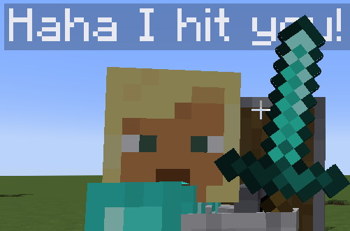

</div>

</div>

</details>

***

### onDamagedMessages

Sets the message that the Boss Mob displays when damaged by a player. This is a list, and the one used is randomized from the list.

| Key |        Values        | Default |
|-|:--------------------:|-|
| `onDamagedMessages` | [List](#string_list) | none |

<details> 

<summary><b>Example</b></summary>

<div align="left">

```yml
onDamagedMessages:
- "You hit me!"
- "I've been hit!"
```
<div align="center">

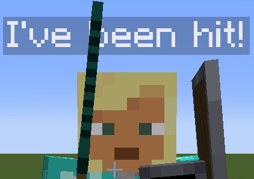

</div>

</div>

</details>

***

### mountedEntity

Sets the entity that the boss will mount and ride.

| Key | Values | Default |
|-|:-:|-|
| `onDamagedMessages` | [Filename of the boss to mount](#filename) or [entity type](https://hub.spigotmc.org/javadocs/spigot/org/bukkit/entity/EntityType.html) | none |

Don't try to make the boss mount itself.

<details> 

<summary><b>Example</b></summary>

<div align="left">

```yml
mountedEntity: wild_wolf.yml
```

<div align="center">

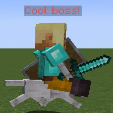

</div>

</div>

</details>

Note: Regional bosses will share their leash with the entity they're mounting, meaning they'll both be dragged back to the spawn location if they exceed the distance allowed by their leash.

***

### announcementPriority

Sets the priority level for announcements. Lower priorities mean no announcements are made, higher priorities can announce not only on chat but also on discord if configured.

| Key | Values | Default |
|-|:-:|-|
| `announcementPriority` | [Integer](#integer) | `1` |

Here is a list of what the priorities do:

| Value |                                                                            Description                                                                            |
|-|:-----------------------------------------------------------------------------------------------------------------------------------------------------------------:|
| `0` |                                                   The boss will be fully silent, with no announcement messages.                                                   |
| `1` |                                This is the default. Bosses can send chat messages, on spawn message, on death and escape messages.                                |
| `2` |                               On top of the things in `1`, the boss will be set to be trackable by players through the `/em` menu.                                |
| `3` | On top of the things in `2`, broadcast messages will be mirrored on Discord if configured. [Discord configuration info here.]($language$/elitemobs/discordsrv.md) |

Here's an example of a boss that is trackable, is able to send spawn/death/escape messages on chat and on Discord:

<details> 

<summary><b>Example</b></summary>

<div align="left">

```yml
announcementPriority: 3
```

</div>

</details>

**Note**: You will have to configure the spawnMessage, deathMessage/deathMessages, escapeMessage for chat and discord announcements and the locationMessage for the tracking feature if you wish to use the corresponding Announcement Priority level.

***

### followDistance

Set the distance at which bosses aggro and enter combat.

| Key | Values | Default |
|-|:-:|-|
| `followDistance` | [Double](#double) | none, uses defaults from Minecraft |

Note 1: Regional bosses have half the `followDistance` when out of combat. This is so they don't aggro from too far away, which can cause annoying combat issues due to leash constraints.

Note 2: The higher the `followDistance`, the more intensive on the server CPU the boss becomes. Use carefully and responsibly!

<details> 

<summary><b>Example</b></summary>

<div align="left">

```yml
followDistance: 30
```

</div>

Sets a range of 30 blocks where if a player gets within that distance near the boss it will start chasing/attacking the player.

</details>

***

### onDeathCommands

Sets the list of commands to run on custom boss death.

| Key |        Values        | Default |
|-|:--------------------:|-|
| `onDeathCommands` | [List](#string_list) | none |

The list supports the following placeholders:

| Value | Description |
|-|:-:|
| `$level` | Placeholder for the boss level. |
| `$name` | Placeholder for the boss name. |
| `$chance=x$` | Makes a command have a chance to run. |
| `$players` | Makes the command run once for every player in the damagers list and replaces each time with the username of a different player on that list. |
| `$locationX` | X coordinate of the boss at the time of death. |
| `$locationY` | Y coordinate of the boss at the time of death. |
| `$locationZ` | Z coordinate of the boss at the time of death. |
| `$damager1name` | Username of the top damager |
| `$damager2name` | Username of the second top damager |
| `$damager3name` | Username of the third top damager |

Take a look at the example below to get a better understanding of how these work.

<details> 

<summary><b>Example</b></summary>

<div align="left">

```yml
onDeathCommands:
- "say $players has killed $name! That was level $level!"
- "$chance=0.5$ say What a kill!"
```

<div align="center">

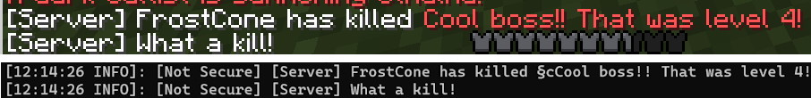

</div>

</div>

If Player1, Player2 and Player3 all damaged the boss before killing it, this is what the command output will be from console:

<div align="left">

```
say Player1 has killed CustomBossName! That was level X!
say Player2 has killed CustomBossName! That was level X!
say Player3 has killed CustomBossName! That was level X!
```

</div>

Additionally, there is a 50% chance that the following will also be output:

<div align="left">

```
say What a kill!
```

</div>

</details> 

***

### onSpawnCommands

Sets the list of commands that will run on boss spawn.

| Key |        Values        | Default |
|-|:--------------------:|-|
| `onSpawnCommands` | [List](#string_list) | none |

**This uses the same placeholders as [onDeathCommands](#onDeathCommands)!** Damager placeholders won't apply as there won't be any damagers at this time.

<details> 

<summary><b>Example</b></summary>

<div align="left">

```yml
onSpawnCommands:
- say Boss has spawned!
```

<div align="center">

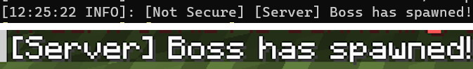

</div>

</div>

</details>

***

### onCombatEnterCommands

Sets the list of commands that will run when the boss enters combat.

| Key | Values | Default |
|-|:-:|-|
| `onCombatEnterCommands` | [List](#string_list) | none |

**This uses the same placeholders as [onDeathCommands](#onDeathCommands)!** Damager placeholders won't apply as there won't be any damagers at this time.

<details> 

<summary><b>Example</b></summary>

<div align="left">

```yml
onCombatEnterCommands:
- say Boss has entered combat!
```

<div align="center">

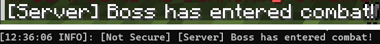

</div>

</div>

</details>

***

### onCombatLeaveCommands

Sets the list of commands to run when the boss leaves combat.

| Key | Values | Default |
|-|:-:|-|
| `onCombatLeaveCommands` | [List](#string_list) | none |

**This uses the same placeholders as [onDeathCommands](#onDeathCommands)!**

<details> 

<summary><b>Example</b></summary>

<div align="left">

```yml
onCombatLeaveCommands:
- say Boss has left combat!
```

<div align="center">

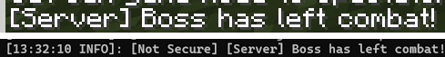

</div>

</div>

</details>

***

### disguise

Sets the LibsDisguises disguise if that plugin is enabled. [More info here.]($language$/elitemobs/libsdisguises.md)

| Key | Values | Default |
|-|:-:|-|
| `disguise` | [String](#string) | none |
| `customDisguiseData` | [String](#string) | none |

<details> 

<summary><b>Example disguise</b></summary>

<div align="left">

```yml
disguise: CHICKEN
```

<div align="center">

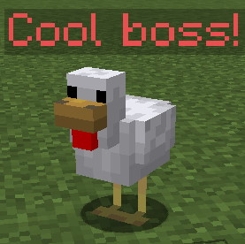

</div>

</div>

</details>

<details> 

<summary><b>Example custom disguise</b></summary>

<div align="left">

```yml
disguise: custom:the_beast_sanctuary_beast
customDisguiseData: player the_beast_sanctuary_beast setskin {"id":"44e6d42b-bd8d-4e48-873b-fae7afed36e4","name":"Unknown","properties":[{"name":"textures","value":"ewogICJ0aW1lc3RhbXAiIDogMTY2NjcwNjYwODA1MCwKICAicHJvZmlsZUlkIiA6ICI3MmY5MTdjNWQyNDU0OTk0YjlmYzQ1YjVhM2YyMjIzMCIsCiAgInByb2ZpbGVOYW1lIiA6ICJUaGF0X0d1eV9Jc19NZSIsCiAgInNpZ25hdHVyZVJlcXVpcmVkIiA6IHRydWUsCiAgInRleHR1cmVzIiA6IHsKICAgICJTS0lOIiA6IHsKICAgICAgInVybCIgOiAiaHR0cDovL3RleHR1cmVzLm1pbmVjcmFmdC5uZXQvdGV4dHVyZS82YmYyMTY4NmM1MGQ1ODhmZmExMDZhZDdjNmViZTk1ZWZiMjE2NDU5ODRjZDFjZWYwODkzNDc4NzMzNmI2YTI3IiwKICAgICAgIm1ldGFkYXRhIiA6IHsKICAgICAgICAibW9kZWwiIDogInNsaW0iCiAgICAgIH0KICAgIH0KICB9Cn0=","signature":"jSsQvpUeWVtyqjtnydPadormkrZLVihetiX4dFQb3+BF/1x6wOgsNKRnnwj6J1mfu2im79LYEJbL+fQ9p1SJIW1uZ6hV7vPSAGUopyXGHNibNXorfV/dGjM77S0t86Jls50XWgJAnLn5RdhQcHahDAHHZ8to6K0HW5gvKKSalR5X/myaiV0E5ujJ+LUFWIiuDmtsmyxTX1zsohyYrVMo/4sD0DpBN+as95wO476gLb5fDTDV569QwExlDOt60W8qSzPw6ncYsOKJIiRE3EddspUm3/NrfDiKApUh8UbzVtwu1XlVAxWNgYN3PkqhWKuE4kvORQuoSJzOgSHkiqdXsQOED2HXfOKdfsnpZUwjepIU5A+/mu0gc3mPQPToKSss2bC1nXn//0bOZZSuQRgTS6PkKDHIQ1nClSZQZlJIsiLmaaN2k1tIHTIlDquKN6G1Ta9c3t6G5kugjqRo78ebbt7l3e0Z3BcdOkuO2WbvBjIg5Uiqyf+cYDZedJ+OEOqL/U6VVlsmbw0rd5deHrbnPn9cRzmWGjrXnxIlAszl+0Uqabj/BrkWcbBCwZJEPaV1hHpC4nJX1m5xvKZHB2Bw0AYWaQ3f3tRBbCA/xqwCS0Px1QohzV0nvtiMbjB38ziT1M5DgLtAVLcHPio7THZMxXAi4IjEIMac9ODbh5OxthA="}],"legacy":false}
```

<div align="center">

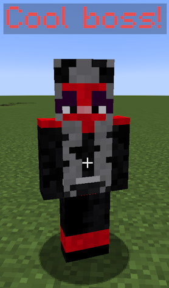

</div>

</div>

Sets a custom disguise from skindex. [Check this page]($language$/elitemobs/libsdisguises.md) to learn how to correctly format this data.

</details>

***

### customModel

Sets the custom model to use, if you have a custom model and ModelEngine. [More info here.]($language$/elitemobs/custom_models.md)

| Key | Values | Default |
|-|:-:|-|
| `customModel` | [String](#string) | none |

<details> 

<summary><b>Example</b></summary>

<div align="left">

```yml
customModel: your_model
```

</div>

</details>

***

### frozen

Sets if the boss can move. Frozen bosses can still attack.
</br>*Note: this might not work on some entities.*

| Key | Values | Default |
|-|:-:|-|
| `frozen` | `true` / `false` | `false` |

<details> 

<summary><b>Example</b></summary>

<div align="left">

```yml
frozen: true
```

</div>

</details>

***

### song

Sets the music a boss will play, starting when it spawns. Requires the .ogg file for the song to be in the resource pack.

| Key | Values | Default |
|-|:-:|-|
| `song` | [String](#string) | none |

**Note: The `song` setting requires `followDistance` to be set, as `followDistance` determines the range at which the song starts playing.**

<details> 

<summary><b>Example</b></summary>

There are two ways to set up songs. Here is the first one:

<div align="left">

```yml
song: name=elitemobs:ice_queen.idle length=76370
```

</div>

This will play the song ice_queen.idle for 76370 ticks and then loop it. Note that the location of the song is determined by the resource pack.

Here is the second way of setting up songs:

<div align="left">

```yml
song: name=elitemobs:ice_queen.end_transition length=14328->name=elitemobs:ice_queen.end_loop length=28657
```

This will play the song ice_queen.end_transition for 14328 ticks and then transition to ice_queen.end_loop for 28657 ticks and loop the end_loop.

This allows bosses to have an "intro" or "transition" song and then a main track that loops.

</div>

</details>

***

### cullReinforcements

Sets if the reinforcements of the boss will be removed when the boss dies.

| Key | Values | Default |
|-|:-:|-|
| `cullReinforcements` | `true` / `false` | `true` |

<details>

<summary><b>Example</b></summary>

<div align="left">

```yml
cullReinforcements: true
```

</div>

</details>

***

### movementSpeedAttribute

Sets the movement speed of the boss.
</br>*Note: anything beyond 0.36 might be too fast.*

| Key | Values | Default |
|-|:-:|-|
| `movementSpeedAttribute` | [Double](#double) | none |

<details>

<summary><b>Example</b></summary>

<div align="left">

```yml
movementSpeedAttribute: 0.3
```

</div>

</details>

## Boss phases

<div align="center">

Bosses can have phases that change when the boss reaches a certain percentage of health. When this happens, the boss starts using a different configuration file, meaning that everything about the boss can change, including things like the entity type.
</br>To learn more about boss phases click [here]($language$/elitemobs/creating_boss_phases.md).


| Key | Description | Values | Default |
|-|:-:|-|-|
| `phases` | Sets the phases that the boss will have. Mandatory | [List](#string_list) | none |
| `phaseSpawnLocation` | Sets where the phase boss spawns. Optional | [String](#string) | none |


<details> 

<summary><b>Example</b></summary>

<div align="left">

For this example, we are going to show three different configuration files.

First boss configuration file: phase_1_boss.yml

```yml
name: "Phase 1"
entityType: ZOMBIE
phases:
- phase_2_boss.yml:0.60
- phase_3_boss.yml:0.30
```

Second boss configuration file: phase_2_boss.yml

```yml
name: "Phase 2"
entityType: SKELETON
```

Third boss configuration file: phase_3_boss.yml

```yml
name: "Phase 3"
phaseSpawnLocation: same_as_boss,10,64,100,0,0
entityType: RAVAGER
```

</div>

This boss would change to the configuration file `phase_2_boss.yml` at 60% health, and to the configuration file `phase_3_boss.yml` at 30% health in the same world as phase 2 and at coordinates x=10, y=64 and z=100. The entity type and name of the boss would also change.

The format for an entry is `filename:healthPercentage`.

phaseSpawnLocation is optional, if it is not set the boss will change phases where it's standing.

</details>

The following things are important to know when designing a phase boss:

<div align="left">

- The configuration file for the first phase sets all phases of the boss.
- Threat / damage counted is kept between phases for players.
- Switching phases is based on the percentage of health lost, which is preserved when switching to a different phase. This means increasing or decreasing the healthMultiplier between phases will not heal or damage the boss, it will still switch with the same percentage, but will have more or less health for that phase.
- Phase bosses revert to phase 1 if they go out of combat.
- Phase bosses which are also regional bosses share the same leash radius and timeout mechanic across all phases, and will respawn as the phase 1 boss when the timer is finished.
- The configuration file for the last phase sets the loot for the boss.
- Phases can not be skipped - overkill damage will still make the boss switch phases at the percentage defined.
- Phase bosses that have mounts cease to be mounted when switching phases.

</div>

</div>

</div>

***

## Regional bosses

<div align="center">

Regional bosses are a specific type of Custom Bosses that spawn at a specific configured location and are able to respawn at that location after a delay. Additionally, they can have leashes that make sure they stay in a specific zone, among other features.

These are used for all of the dungeon content. To learn more about regional bosses click [here]($language$/elitemobs/creating_world_bosses.md).

| Key | Description | Values | Default |
|-|:-:|:-:|-|
| `isRegionalBoss` | Sets if the boss is regional. Should be true if you want a regional boss.  | `true` /  `false` | `false` |
| `spawnLocation` | Sets the spawn locations of the boss.  | Add these through the `/em addSpawnLocation [filename.yml]` command! | none |
| `spawnCooldown` | Sets the respawn cooldown of the boss, in <b>minutes</b>. | [Integer](#integer) | `0` |
| `leashRadius` | Sets the distance the boss can go from its spawn point before getting pulled back. | [Double](#double) | none |
| `onSpawnBlockStates` | Sets the blocks the boss will modify when it spawns. | Check commands below | none |
| `onRemoveBlockStates` | Sets the blocks the boss will modify when it despawns. | Check commands below | none |

As indicated, Regional Bosses can have `onSpawnBlockStates` and `onRemoveBlockStates`.

This is a very useful feature for modifying combat arenas during combat, especially when combined with phase switches, as it becomes possible to open and close combat arenas through changing block states.

The format for these is too complex to write manually, so a few commands exist to help you set them up:

| Command | Description |
|-|:-:|
| /em registerblocks [regional_boss_file.yml] [on_spawn/on_remove] | Starts registering manual block selections for on spawn or on remove block states. |
| /em registerblocksedit [regional_boss_file.yml] [on_spawn/on_remove] | Edits the on spawn or on remove block states. |
| /em registerblocksarea [regional_boss_file.yml] [on_spawn/on_remove] | Allows admins to select large areas of blocks to save as states. |
| /em registerblocksareaedit [regional_boss_file.yml] [on_spawn/on_remove] | Allows admins to edit large areas of blocks to save as states. |

<details> 

<summary><b>Example use:</b></summary>

<div align="left">

Let's say you want to make a fight where a boss spawns in an arena that has an open door, and you want to make it so the door closes when the fight starts and reopens when the fight is over.

To do this, you will need two boss phases and to register three different sets of block states. For this example, I will name these phases phase_1_boss.yml and phase_2_boss.yml respectively.

1) Use `/em registerblocks phase_1_boss.yml on_spawn` or `/em registerblocksedit phase_1_boss.yml on_spawn` to register the door blocks in their open state.

This means registering the air blocks. Area selection is recommended here.

This is necessary to make sure that the door is open when the boss spawns so players are guaranteed to have a way in.

2) Use `/em registerblocks phase_2_boss.yml on_spawn` or `/em registerblocksedit phase_2_boss.yml on_spawn` to register the door blocks in their closed state.

This means registering the solid blocks of the door that would prevent the player from leaving.

This is necessary to change the door to be solid when the boss enters phase 2, preventing players from leaving.

3) Use `/em registerblocks phase_2_boss.yml on_remove` or `/em registerblocksedit phase_2_boss.yml on_remove` to register the door blocks in their open state.

This means registering the same blocks from the first step again (the air blocks).

This is necessary to open the door when the boss dies, allowing players to leave the arena.

</div>

</details>

</div>

***

### alert

<div align="center">

Sets whether the boss is alert. By default, Regional Bosses are slowed and have a shorter aggro distance when they are out of combat. This setting prevents Regional Bosses from being slowed and having a shorter aggro distance while outside of combat, so they will always behave the same way in or out of combat.

</div>

| Key | Values | Default |
|-|:-:|-|
| `alert` | [Boolean](#boolean) | `true` |

<details>

<summary><b>Example</b></summary>

<div align="left">

```yml
alert: true
```

</div>

</details>

***

### removeAfterDeath

<div align="center">

Sets whether the Regional Boss will be permanently deleted after being killed. This is what BetterStructures uses for Shrines, where the Regional Boss is only designed to be fought against once and then never again at that location. 

</div>

| Key | Values | Default |
|-|:-:|-|
| `removeAfterDeath` | [Boolean](#boolean) | `false` |

<details>

<summary><b>Example</b></summary>

<div align="left">

```yml
removeAfterDeath: true
```

</div>

</details>

***

## Instanced bosses

<div align="center">

Instanced bosses are a subtype of Regional Bosses used in Instanced Dungeons.

| Key | Description | Values | Default |
|-|:-:|-|-|
| `instanced` | Makes the custom boss instanced. Mandatory. | `true` / `false` | `false` |


Setting bosses to instanced is mandatory for instanced dungeons to work correctly. We also recommend removing leashes for any instanced bosses.

<details> 

<summary><b>Example</b></summary>

<div align="left">

```yml
instanced: true
```

</div>

</details>

</div>
