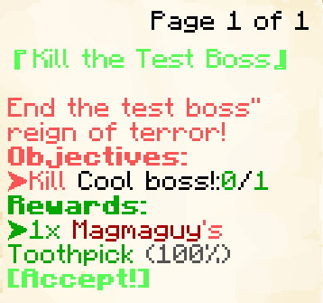
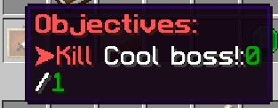
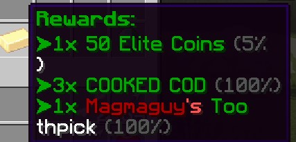
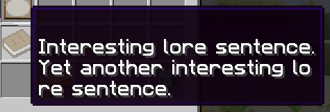
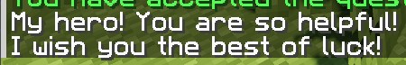
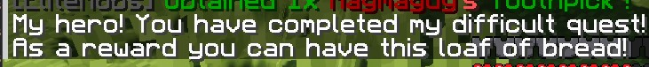
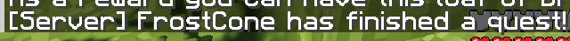

[](https://magmaguy.com/webapp/webapp.html)

# Example Quest

EliteMobs comes prepackaged with a `test_quest.yml`, which will be analyzed here as a simple quest format to follow.

_Custom Quests are in the `~plugins/EliteMobs/customquests` folder!_

`test_quest.yml`

```yaml
isEnabled: true
customObjectives:
  Objective1:
    amount: '1'
    filename: test_boss.yml
    objectiveType: KILL_CUSTOM
customRewards:
- filename=magmaguys_toothpick.yml:amount=1:chance=1
name: "&aKill the Test Boss"
questLore: 
- "&cEnd the test boss'' reign of terror!"
```

<div align="center">



</div>

*If your quest UI does not look like this you can change it to match using `/em alt`.*

This example quest will give players the task of slaying 1 test_boss.yml. (The actual name of the boss displayed in the quest tracker will be the `name:` set in test_boss.yml.) And as a reward for completing the quest they will be rewarded with 1 Magmaguy's Toothpick.

## Creating Custom Quests

<div align="center">

### customObjectives

Sets the quest objectives.

| Key       |   Values    | Default |
|-----------|:-----------:|:-------:|
| `customObjectives` | Special [1] |  none   |

*Note: If you are using a multiphase boss as your objective then the objective should be using the first phase as the target.*

<details> 

<summary><b>Examples</b></summary>

<div align="left">

`KILL_CUSTOM`:

```yml
customObjectives:
  Objective1:
    amount: '1'
    filename: my_cool_boss.yml
    objectiveType: KILL_CUSTOM
```

`DIALOG`:

```yml
customObjectives:
  Objective1:
    dialog:
    - "&a[Dialog NPC] &fCome here often?"
    - "&7&oI should eat more apples."
    filename: dialog_npc.yml
    npcName: Dialog NPC
    location: at dialog location.
    objectiveType: DIALOG
```

`FETCH_ITEM`:

```yml
customObjectives:
  Objective1:
    amount: '99'
    itemName: Red Apples
    filename: my_quest_item_red_apples.yml
    objectiveType: FETCH_ITEM
```

<div align="center">



</div>

</div>

</details>

**Special [1]**

<details>

<summary><b>Expand Table</b></summary>

<div align="center">

Custom Objectives are constructed using the following values:

| Key                                     | Description |
|-----------------------------------------|-------------|
| `KILL_CUSTOM` / `FETCH_ITEM` / `DIALOG` | Used to set the type of objective this represents. `KILL_CUSTOM` indicates the quest involves killing a specific Custom Boss, `FETCH_ITEM` indicates that the quest involves getting a specific Custom Item and `DIALOG` indicates that the quest involves talking to an NPC.            |
| `filename`                                    | Used to set the file name of the Custom Boss, the Custom Item that the player has to kill / obtain or the NPC they have to talk to.            |
| `amount`                                      | Used to set the amount of Custom Bosses that must be killed or items that must be obtained.            |
| `dialog`                                      | Used to set the dialog of the NPC the player talks to.            |
| `name`                                        | Used to set the name of the quest objective, be it an NPC or a custom item. For visual purposes only.            |

_Please note that every Custom Objective field is separated with a `:` !_

</div>

</details>

***

### customRewards

Sets the quest rewards.

| Key       |                                Values                                 | Default |
|-----------|:---------------------------------------------------------------------:|:-------:|
| `customRewards` | [Universal EliteMobs loot format]($language$elitemobs/loot_tables.md) |  none   |

<details> 

<summary><b>Example</b></summary>

<div align="left">

```yml
customRewards:
- currencyAmount=50:amount=1:chance=0.05
- material=COOKED_COD:amount=3:chance=1.0
- filename=magmaguys_toothpick.yml:amount=1:chance=1.0
```

<div align="center">



</div>

</div>

</details>

***

### questAcceptPermission

Sets the permission the player must have in order to accept the quest.

| Key       |      Values       | Default |
|-----------|:-----------------:|:-------:|
| `questAcceptPermission` | [String](#string) |  none   |

<details> 

<summary><b>Example</b></summary>

<div align="left">

```yml
questAcceptPermission: elitequest.my_permission
```

</div>

</details>

***

### questAcceptPermissions

Sets the permissions the player must have in order to accept the quest.

| Key       |   Values    | Default |
|-----------|:-----------:|:-------:|
| `questAcceptPermissions` | [String List](#string_list) |  none   |

<details> 

<summary><b>Example</b></summary>

<div align="left">

```yml
questAcceptPermissions: 
- elitequest.my_previous_quest_one.yml
- elitequest.my_previous_quest_two.yml
```

</div>

</details>

***

### questLockoutPermission

Sets the permission that the player will get upon completing the quest which will lock them out from doing the quest again (Usually the [Filename](#fielname) of the quest you are editing).

| Key       |      Values       | Default |
|-----------|:-----------------:|:-------:|
| `questLockoutPermission` | [String](#string) |  none   |

<details> 

<summary><b>Example</b></summary>

<div align="left">

```yml
questLockoutPermission: elitequest.my_quest.yml
```

</div>

</details>

***

### questLockoutMinutes

Sets how long, in minutes, the player will have to wait before being able to do the quest again (works by removing the quest lockout permission).

| Key       |      Values       | Default |
|-----------|:-----------------:|:-------:|
| `questLockoutMinutes` | [Integer](#integer) |  `-1`(will never repeat)   |

<details> 

<summary><b>Example</b></summary>

<div align="left">

```yml
questLockoutMinutes: 60
```

</div>

</details>

***

### name

Sets the quest name. Accepts [Color Codes](#color_codes).

| Key    |      Values       | Default |
|--------|:-----------------:|:-------:|
| `name` | [String](#string) |  none   |

<details> 

<summary><b>Example</b></summary>

<div align="left">

```yml
name: "&aMy Great Quest Name"
```

</div>

</details>

***

### questLore

Sets the lore of the quest that will appear in the in-game quest menu.

| Key    |      Values       | Default |
|--------|:-----------------:|:-------:|
| `questLore` | [String List](#string_list) |  none   |

<details> 

<summary><b>Example</b></summary>

<div align="left">

```yml
questLore:
- "Interesting lore sentence."
- "Yet another interesting lore sentence."
```

<div align="center">



</div>

</div>

</details>

***

### temporaryPermissions

Sets the permissions assigned to the player until they turn the quest in.

If you're using this setting to ensure that an item only drops when players have a specific quest active, you'll also need to configure the [Same Permission]($language$/elitemobs/creating_items.md&section=permission%permission) in the item's configuration file.

| Key    |      Values       | Default |
|--------|:-----------------:|:-------:|
| `temporaryPermissions` | [String List](#string_list) |  none   |

<details> 

<summary><b>Example</b></summary>

<div align="left">

```yml
temporaryPermissions:
- elitequest.item_that_should_drop_only_during_quest.yml
```

</div>

</details>

***

### questAcceptDialog

Sets the dialog that appears in chat upon quest acceptance.

| Key    |      Values       | Default |
|--------|:-----------------:|:-------:|
| `questAcceptDialog` | [String List](#string_list) |  none   |

<details> 

<summary><b>Example</b></summary>

<div align="left">

```yml
questAcceptDialog:
- "My hero! You are so helpful!"
- "I wish you the best of luck!"
```

<div align="center">



</div>

</div>

</details>

***

### questCompleteMessage

Sets the dialog that appears in chat upon quest completion.

| Key    |      Values       | Default |
|--------|:-----------------:|:-------:|
| `questCompleteMessage` | [String List](#string_list) |  none   |

<details> 

<summary><b>Example</b></summary>

<div align="left">

```yml
questCompleteMessage:
- "My hero! You have completed my difficult quest!"
- "As a reward you can have this loaf of bread!"
```

<div align="center">



</div>

</div>

</details>

***

### questCompleteCommands

Sets the commands that will run upon quest completion.

| Key    |      Values       | Default |
|--------|:-----------------:|:-------:|
| `questCompleteCommands` | [String List](#string_list) |  none   |

<details> 

<summary><b>Example</b></summary>

<div align="left">

```yml
questCompleteCommands:
- say $player has finished a quest!
```

<div align="center">



</div>

</div>

</details>

***

### turnInNPC

Sets the filename of the NPC that the players need to talk to/interact with to complete the quest. This does **not** have to be the same NPC that handed out the quest.

| Key    |      Values       | Default |
|--------|:-----------------:|:-------:|
| `turnInNPC` | [Filename](#filename) |  none   |

<details> 

<summary><b>Example</b></summary>

<div align="left">

```yml
turnInNPC: my_cool_quest_npc.yml
```

</div>

</details>

***

### trackable

Sets if the quest will use the quest tracker.

| Key    |      Values       | Default |
|--------|:-----------------:|:-------:|
| `trackable` | [Boolean](#boolean) | `true`  |

<details> 

<summary><b>Example</b></summary>

<div align="left">

```yml
trackable: true
```

</div>

</details>

***

### questLevel

Sets the level of the quest. This is only a visual guide so the players can tell how challenging the quest will be. This does **not** in any way modify boss, item or other levels.

| Key    |      Values       | Default |
|--------|:-----------------:|:-------:|
| `questLevel` | [Integer](#integer) | `0`  |

<details> 

<summary><b>Example</b></summary>

<div align="left">

```yml
questLevel: 10
```

<div align="center">


</div>

</div>

</details>

</div>

### Permissions

As mentioned in the tables above, permissions are usually [Strings](#string) or [String Lists](#string_list). But let us go into more detail how you will be using these to lock and unlock quests. 

Let us say that you are making quest_3 in a series of quests that you have planned and you do not want players to be able to take quest_3 before they finish quest_2. We would configure the quest file like this:

```yml
questAcceptPermission: elitequest.quest_2.yml
questLockoutPermission: elitequest.quest_3.yml
```
By setting the `questAcceptPermissions` to `elitequest.quest_2.yml` we have now prevented players from taking quest_3.yml before they finish quest_2.yml. </br> By setting `questLockoutPermission` to `elitequest.quest_3.yml` we have prevented players from being able to receive that quest as long as they already have that quest in their tracker or if they already finished that quest. This stops players from being able to repeat the quest.

Should you want to make a quest that only becomes available after the players have completed a series of quests, then you would configure the quest file like this:

```yml
questAcceptPermissions: 
- elitequest.quest_2.yml
- elitequest.quest_3.yml
- elitequest.quest_4.yml
```

If you want players to only be able to loot certain items when they have the correct quest active, then we can do that by using `temporaryPermissions`. We would make a permission in the quest file using `temporaryPermissions` then make a matching [permission]($language$/elitemobs/creating_items.md&section=permission%permission) in the item file using `permission`.

For example we would open up our quest file and add the following:

```yml
temporaryPermissions: 
- elitequest.my_cool_item.yml
```
Then we would open up the item file, in our case *my_cool_item.yml* and then add the following:

```yml
permission: elitequest.my_cool_item.yml
```
Both files have now matching permissions which should now make our item only drop when the players have the correct quest active.