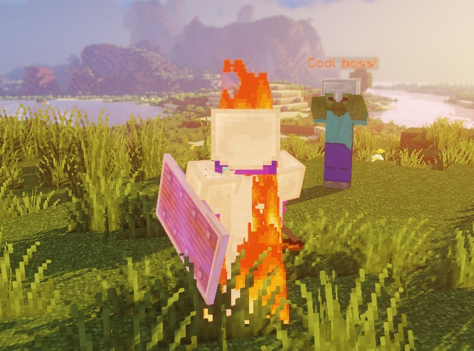
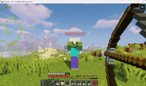
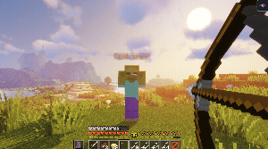
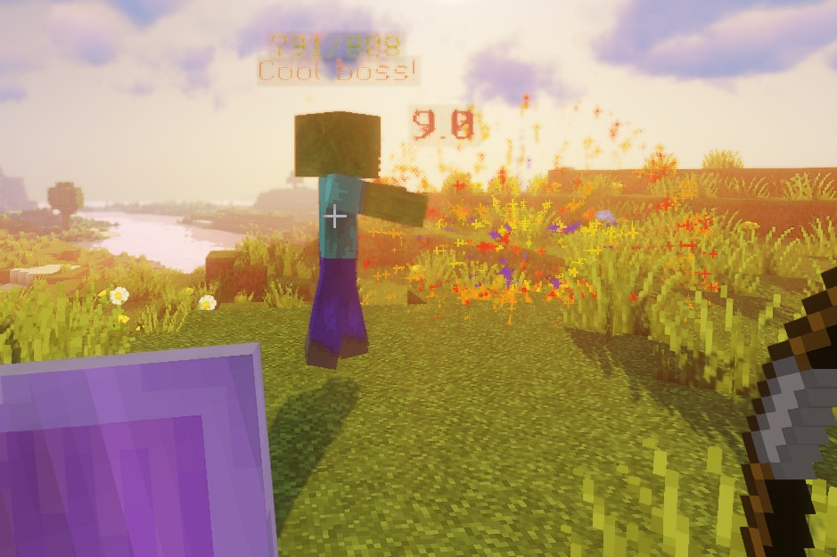
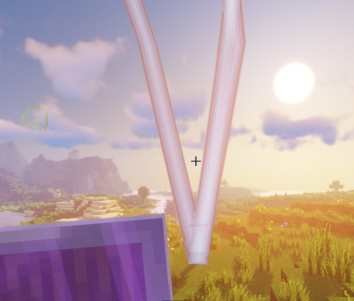
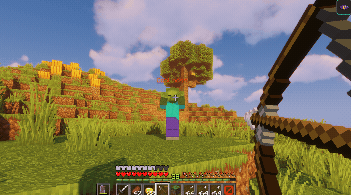
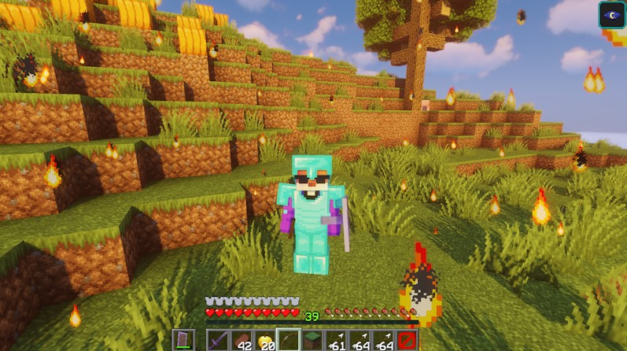
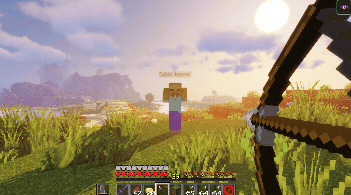
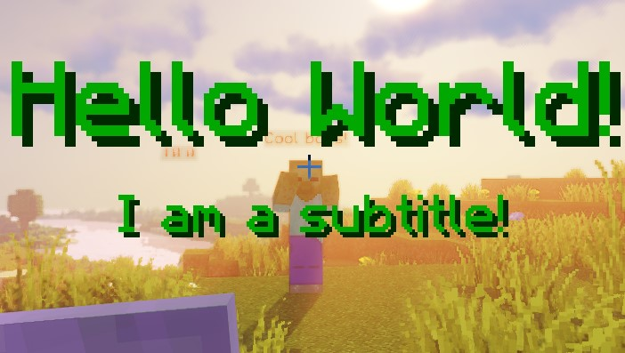

# Elite Script Actions

Actions are at the core of the script. These determine what the script does and allows you to set custom intervals.

Actions always start with the type of action you are going to do. Different action types serve different functions. Additionally, all actions have a target or targets. Actions can also have a wait timer, to make sure that things happen at customizable delays. Finally, actions can also have several other fields specific to the action type.

## Shared attributes

| Values             |                                                                                 Details                                                                                  | Special |
|--------------------|:------------------------------------------------------------------------------------------------------------------------------------------------------------------------:| :-: |
| `Target`           |                                                      [More info here]($language$/elitemobs/elitescript_targets.md)                                                       | ❌ |
| `wait`             |                                                      Sets the amount of time to wait (ticks) before running actions                                                      | ❌ |
| `repeatEvery`      |        Sets the actions to repeat every set amount of ticks. Any script that has this set but is not using times will be terminated upon mob death to avoid lag. You can randomize this value by using `~` example: `1~5`.         | ❌ |
| `times`            |                                                            Sets the amount of times an action will happen for. You can randomize this value by using `~` example: `1~5`.                                                            | Requires `repeatEvery` |
| `scripts`          |                                                         Sets the scripts that will run at the end of the action                                                          | ❌ |
| `onlyRunOneScript` |                                                       Picks one of the `scripts` at random and only runs that one.                                                       | ❌ |
| `offset`           | This option goes under `Target`. Allows you to offset the target location. Offset does not work with actions that are targeting zones with `ZONE_FULL` or `ZONE_BORDER`. | ❌ |
| `debug`           | This option goes under the action section of the script. When set to true it will display barrier icons in the area that the action is. | ❌ |

## Action types

### ACTION_BAR_MESSAGE

Sets the action bar message for the targets.

| Values |                            Details                            | Mandatory | Special |
| --- |:-------------------------------------------------------------:| :-: | :-: |
| `Target` | [More info here]($language$/elitemobs/elitescript_targets.md) | ✅ | ❌ |
| `sValue` |                            Message                            | ✅ | Can use [Color Codes](#color_codes) with `&` |

<div align="center">

<details> 

<summary><b>Example</b></summary>

<div align="left">

```yaml
eliteScript:
  Example:
    Events:
    - EliteMobDamagedByPlayerEvent
    Actions:
    - action: ACTION_BAR_MESSAGE
      Target: 
        targetType: NEARBY_PLAYERS
        range: 10
      sValue: "&2Hello World!"
```

<div align="center">


</div>

Will set the action bar to say Hello World to any players that are within 10 blocks from the boss.

</div>

</details>

</div>

---

### BOSS_BAR_MESSAGE

Adds a bossbar to the target(s).

| Values |                            Details                            | Mandatory |                   Special                    |
| --- |:-------------------------------------------------------------:| :-: |:--------------------------------------------:|
| `Target` | [More info here]($language$/elitemobs/elitescript_targets.md) | ✅ |                      ❌                       |
| `sValue` |                            Message                            | ✅ | Can use [Color Codes](#color_codes) with `&` |
| `duration` |               Duration of the boss bar in ticks               | ✅ |                      ❌                       |

<div align="center">

<details> 

<summary><b>Example</b></summary>

<div align="left">

```yaml
eliteScript:
  Example:
    Events:
    - EliteMobDamagedByPlayerEvent
    Actions:
    - action: BOSS_BAR_MESSAGE
      Target: 
        targetType: NEARBY_PLAYERS
        range: 10
      duration: 120
      sValue: "&2Hello World!"
```

<div align="center">


</div>

Will set a boss bar saying Hello World to any players that are within 10 blocks from the boss for 1 second.

</div>

</details>

</div>

---

### DAMAGE

This is how you can damage entities as other entities.

_Note: this natively uses the EliteMobs damage system! This means that you will see the normal elite armor reduction from strikes. More on this in the multipliers section._

| Values |                            Details                            | Mandatory |
| --- |:-------------------------------------------------------------:| :-: |
| `Target` | [More info here]($language$/elitemobs/elitescript_targets.md) | ✅ |
| `multiplier` |                       Damage multiplier                       | ✅ |

<div align="center">

<details> 

<summary><b>Example</b></summary>

<div align="left">

```yaml
eliteScript:
  Example:
    Events:
    - EliteMobDamagedByPlayerEvent
    Actions:
    - action: DAMAGE
      Target: 
        targetType: NEARBY_PLAYERS
        range: 10
      multiplier: 0.5
```

Sets the damage to be half the amount of base damage the boss would deal to the player, taking damage reductions into account.

</div>

</details>

</div>

#### multiplier

Sets the damage multiplier of the boss for the effect.

**Important**: in order to make powers scale easily and automatically, damage is applied by having the boss hit the player once and multiplying the base damage of the boss with the multiplier.

This means that a multiplier of 1.0 is the same as a normal hit from the boss. 2.0 is a hit 2x the normal strength, and 0.5 is 50% as hard.

---

### HEAL

This is how you can heal entities including players.

_Note: this natively uses the EliteMobs heal system! This means that you will see the EliteMobs notification message near the entity showing for how many points they were healed!_

| Values |                            Details                            | Mandatory |
| --- |:-------------------------------------------------------------:| :-: |
| `Target` | [More info here]($language$/elitemobs/elitescript_targets.md) | ✅ |
| `amount` |                       Heal for how many points. (2 points is one heart)                       | ✅ |

<div align="center">

<details> 

<summary><b>Example</b></summary>

<div align="left">

```yaml
eliteScript:
  Example:
    Events:
    - EliteMobDamagedByPlayerEvent
    Actions:
    - action: HEAL
      Target: 
        targetType: NEARBY_MOBS
        range: 15
      amount: 20
```

When the boss is hit then it will heal all mobs within 15 blocks for 20 points (10 hearts).

</div>

</details>

</div>

#### multiplier

Sets the damage multiplier of the boss for the effect.

**Important**: in order to make powers scale easily and automatically, damage is applied by having the boss hit the player once and multiplying the base damage of the boss with the multiplier.

This means that a multiplier of 1.0 is the same as a normal hit from the boss. 2.0 is a hit 2x the normal strength, and 0.5 is 50% as hard.

---

### MAKE_INVULNERABLE

Makes a target invulnerable.

| Values |                            Details                            | Mandatory |
| --- |:-------------------------------------------------------------:| :-: |
| `Target` | [More info here]($language$/elitemobs/elitescript_targets.md) | ✅ |
| `invulnerable` |               Sets if the boss is invulnerable                | ✅ |
| `duration` |       Sets the duration of the invulnerability (ticks)        | ❌ |

<div align="center">

<details> 

<summary><b>Example</b></summary>

<div align="left">

```yaml
eliteScript:
  Example:
    Events:
    - EliteMobDamagedByPlayerEvent
    Actions:
    - action: MAKE_INVULNERABLE
      Target:
        targetType: SELF
      invulnerable: true
      duration: 60
```

Makes a boss invulnerable for 60 ticks (3 seconds).

</div>

</details>

</div>

---

### MODIFY_DAMAGE

Modifies the damage dealt to a boss or dealt to players by that boss. This is a special action with a few special requirements.

| Values | Details | Mandatory |
| --- | :-: | :-: |
| `multiplier` | Damage multiplier. | ✅ |

This action is special and must be in a script that has an event listener for a damage event. The following are valid damage events: `EliteMobDamagedByEliteMobEvent`, `EliteMobDamagedByPlayerEvent`, `EliteMobDamagedEvent` for events that reduce damage dealt to the boss and `PlayerDamagedByEliteMobEvent` for events that reduce damage dealt to players.

It is highly recommended that you learn how the `hasTag` condition works in order to best use this action. When used correctly, it is possible to make the boss temporarily resist or be weaker to damage, and this can be associated to player buffs, boss location or many other factors.

<div align="center">

<details> 

<summary><b>Example</b></summary>

<div align="left">

```yaml
eliteScript:
  Example:
    Events:
    - EliteMobDamagedByPlayerEvent
    Actions:
    - action: MODIFY_DAMAGE
      multiplier: 2.0
      Conditions:
        hasTags:
        - "CoolPlayer"
        Target:
          targetType: DIRECT_TARGET
```

Increases the damage dealt to the boss by the players by 2x, but only if the player has a tag called "CoolPlayer"

</div>

</details>

</div>

---

### MESSAGE

Sends a message to the target(s).

| Values |                            Details                            | Mandatory | Special |
| --- |:-------------------------------------------------------------:| :-: | :-: |
| `Target` | [More info here]($language$/elitemobs/elitescript_targets.md) | ✅ | ❌ |
| `sValue` |                            Message                            | ✅ | Can use [Color Codes](#color_codes) with `&` |

<div align="center">

<details> 

<summary><b>Example</b></summary>

<div align="left">

```yaml
eliteScript:
  Example:
    Events:
    - EliteMobDamagedByPlayerEvent
    Actions:
    - action: MESSAGE
      Target: 
        targetType: NEARBY_PLAYERS
        range: 10
      sValue: "&2Hello World!"
```

<div align="center">


</div>

Will send a chat message to all players within 10 blocks from the boss.

</div>

</details>

</div>

---

### NAVIGATE

Makes the boss navigate (walk) to the specified target.

| Values |                            Details                            | Mandatory | Special |
| --- |:-------------------------------------------------------------:| :-: | :-: |
| `Target` | [More info here]($language$/elitemobs/elitescript_targets.md) | ✅ | ❌ |
| `FinalTarget` | [More info here]($language$/elitemobs/elitescript_targets.md) | ✅ | ❌ |
| `velocity` | Sets the navigation speed of the boss. `1.0` being the boss value as set in the config. | ❌ | ❌ |
| `bValue` | Sets if the the boss should be force teleported to the `FinalTarget` if navigation fails. | ❌ | ❌ |
| `duration` | How long should the boss try to navigate before it gives up. Set in ticks. Default is 100 ticks. | ✅ | ❌ |

<div align="center">

<details> 

<summary><b>Example</b></summary>

<div align="left">

```yaml
eliteScript:
  Example:
    Events:
    - EliteMobDamagedByPlayerEvent
    Actions:
    - action: NAVIGATE
      Target: 
        targetType: SELF
      FinalTarget:
        targetType: NEARBY_PLAYERS
        range: 50
      velocity: 1.0
      bValue: true
      duration: 100
```

Will make the boss navigate to the spot the player was standing at when they hit the boss.

</div>

</details>

</div>

---

### PLACE_BLOCK

Places a block at the target location(s) for the duration.

| Values |                                                         Details                                                         | Mandatory |
| --- |:-----------------------------------------------------------------------------------------------------------------------:| :-: |
| `Target` |                              [More info here]($language$/elitemobs/elitescript_targets.md)                              | ✅ |
| `material` | [Material](#material) of the block, [full list here](https://hub.spigotmc.org/javadocs/spigot/org/bukkit/Material.html) | ✅ |
| `duration` |                                              Duration of effect, in ticks                                               | ❌ |

<div align="center">

<details> 

<summary><b>Example</b></summary>

<div align="left">

```yaml
eliteScript:
  Example:
    Events:
    - EliteMobDamagedByPlayerEvent
    Zone:
      shape: DOME
      radius: 3
      Target:
        targetType: SELF
    Actions:
    - action: PLACE_BLOCK
      Target:
        targetType: ZONE_FULL
      duration: 120
      material: GLASS
```

<div align="center">


</div>

Places a glass dome around the boss that will last for 6 seconds.

_Note: If no duration is defined, the block placement is permanent._

</div>

</details>

</div>

---

### PLAY_ANIMATION

Plays the specified animation for a Custom Model using Model Engine. Requires Model Engine and a valid Custom Model to be on the target that runs the animation.

| Values |                            Details                            | Mandatory |
| --- |:-------------------------------------------------------------:| :-: |
| `Target` | [More info here]($language$/elitemobs/elitescript_targets.md) | ✅ |
| `sValue` |                Sets the name of the animation                 | ✅ |

<div align="center">

<details> 

<summary><b>Example</b></summary>

<div align="left">

```yaml
eliteScript:
  Example:
    Events:
    - EliteMobDamagedByPlayerEvent
    Actions:
    - action: PLAY_ANIMATION
      Target:
        targetType: SELF
      sValue: "fortnite_dance"
```

Sets the boss to play the fortnite_dance animation. Requires the server to have Model Engine, the boss to have a custom disguise and the custom disguise to have an animation called "fortnite\_dance".

</div>

</details>

</div>

---

### PLAY_SOUND

Plays an in-game sound.

| Values   |                            Details                            | Mandatory |
|----------|:-------------------------------------------------------------:|:---------:|
| `Target` | [More info here]($language$/elitemobs/elitescript_targets.md) |     ✅     |
| `sValue` |            Sets the name of the sound to be played            |     ✅     |
| `pitch`  |           Sets the pitch of the sound to be played            |     ❌     |
| `volume` |           Sets the volume of the sound to be played           |     ❌     |

[Here's a handy list of all Minecraft sounds!](https://www.digminecraft.com/lists/sound_list_pc.php) Remember that this can also play custom sounds from resource packs. 
When the action is targeting a zone then the action will play a sound for every block in that zone. This can make the sound considerably louder than normal so consider lowering the volume if targeting a zone.

<div align="center">

<details> 

<summary><b>Example</b></summary>

<div align="left">

```yaml
eliteScript:
  Example:
    Events:
    - EliteMobDamagedByPlayerEvent
    Actions:
    - action: PLAY_SOUND
      Target:
        targeType: SELF
      sValue: minecraft:block.bell.resonate
```

Plays the resonate sound from Minecraft bells at the boss location

</div>

</details>

</div>

---

### POTION_EFFECT

Applies a specific potion effect to the target(s).

| Values |                                                       Details                                                       | Mandatory |
| --- |:-------------------------------------------------------------------------------------------------------------------:| :-: |
| `Target` |                            [More info here]($language$/elitemobs/elitescript_targets.md)                            | ✅ |
| `potionEffectType` | Effect type, [valid list is here](https://hub.spigotmc.org/javadocs/spigot/org/bukkit/potion/PotionEffectType.html) | ✅ |
| `amplifier` |                                          Potion effect level (starts at 0)                                          | ✅ |
| `duration` |                                           Duration of the effect (ticks)                                            | ✅ |

<div align="center">

<details> 

<summary><b>Example</b></summary>

<div align="left">

```yaml
eliteScript:
  Example:
    Events:
    - EliteMobDamagedByPlayerEvent
    Actions:
    - action: POTION_EFFECT
      Target: 
        targetType: NEARBY_PLAYERS
        range: 10
      potionEffectType: LEVITATION
      amplifier: 1
      duration: 40
```

<div align="center">


</div>

This will make any players within 10 blocks from the boss levitate for 2 seconds (40 ticks).

</div>

</details>

</div>

---

### PUSH

Pushes a target by a set vector.

| Values |                            Details                            | Mandatory |
| --- |:-------------------------------------------------------------:| :-: |
| `Target` | [More info here]($language$/elitemobs/elitescript_targets.md) | ✅ |
| `vValue` |       Sets vector of the velocity that will be applied        | ✅ |

*Note: This action also accepts relative vectors. Learn more about how to use those [here]($language$/elitemobs/elitescript_relative_vectors.md).*

<div align="center">

<details> 

<summary><b>Example</b></summary>

<div align="left">

```yaml
eliteScript:
  Example:
    Events:
    - EliteMobDamagedByPlayerEvent
    Actions:
    - action: PUSH
      wait: 3
      Target: 
        targetType: NEARBY_PLAYERS
        range: 10
      vValue: 0,0.3,0
      times: 10
      repeatEvery: 10
```

<div align="center">


</div>

This will push all players within 10 blocks from the boss into the air using a force of 0.3. This action will be repeated 10 times every 0.5 seconds (10 ticks). In other words that will make this effect last 5 seconds (10 times x 10 ticks = 100 ticks).

This will make it seem like the players are jumping.

</div>

</details>

</div>

#### vector

Vectors are defined by `vValue: x,y,z`. As an example, if you want the target to be pushed upwards, you can do `vValue: 0,0.3,0`.

---

### RUN_COMMAND_AS_CONSOLE

Runs a command as console.

| Values |                             Details                             | Mandatory |
| --- |:---------------------------------------------------------------:| :-: |
| `Target` |  [More info here]($language$/elitemobs/elitescript_targets.md)  | ✅ |
| `sValue` |                    Command that will be run                     | ✅ |

**Note: there are placeholders available! Check RUN_COMMAND_AS_PLAYER, they're the same**

<div align="center">

<details> 

<summary><b>Example</b></summary>

<div align="left">

```yaml
eliteScript:
  Example:
    Events:
    - EliteMobDamagedByPlayerEvent
    Actions:
    - action: RUN_COMMAND_AS_CONSOLE
      Target:
        targetType: NEARBY_PLAYERS
        range: 10
      sValue: say Hello $bossName my name is $playerName. What is your level? $bossName my level is $bossLevel.
```

<div align="center">


</div>

Makes console broadcast the message "Hello $bossName my name is $playerName. What is your level? $bossName my level is $bossLevel"

</div>

</details>

</div>

---

### RUN_COMMAND_AS_PLAYER
`
Runs a command as a `player. Requires the target to be players.

| Values |                            Details                            | Mandatory |
| --- |:-------------------------------------------------------------:| :-: |
| `target` | [More info here]($language$/elitemobs/elitescript_targets.md) | ✅ |
| `sValue` |                   Command that will be run                    | ✅ |

**Note: RUN_COMMAND_AS_PLAYER and RUN_COMMAND_AS_CONSOLE use the following placeholders:**

| Placeholder | Details | Special |
| --- | :-: | :-: |
| `$playerName` | Display name of the player | Target must be player |
| `$playerX` | Player's X location | Target must be player |
| `$playerY` | Player's Y location | Target must be player |
| `$playerZ` | Player's Z location | Target must be player |
| `$bossName` | Display name of the player | Target must be player |
| `$bossX` | Boss' X location | ❌ |
| `$bossY` | Boss' Y location | ❌ |
| `$bossZ` | Boss' Z location | ❌ |
| `$bossLevel` | Level of the boss | ❌ |

<div align="center">

<details> 

<summary><b>Example</b></summary>

<div align="left">

```yaml
eliteScript:
  Example:
    Events:
    - EliteMobDamagedByPlayerEvent
    Actions:
    - action: RUN_COMMAND_AS_PLAYER
      Target:
        targetType: NEARBY_PLAYERS
        range: 10
      sValue: say Hello $bossName my name is $playerName.
```

<div align="center">


</div>

Makes the player run the say command with Hello $bossName my name is $playerName., meaning they just say "Hello $bossName my name is $playerName."

</div>

</details>

</div>

---

### RUN_SCRIPT

This simply runs the scripts defined in `scripts`. Any action can do this, this action only exists as a convenience action for when you just want to do that.

| Values |                            Details                            | Mandatory |
| --- |:-------------------------------------------------------------:| :-: |
| `Target` | [More info here]($language$/elitemobs/elitescript_targets.md) | ✅ |
| `scripts` |                   Scripts that will be run                    | ✅ |
| `onlyRunOneScript` |         Run only one script from the list.           | ❌ |

<div align="center">

<details> 

<summary><b>Example</b></summary>

<div align="left">

```yaml
eliteScript:
  Example:
    Events:
    - EliteMobDamagedByPlayerEvent
    Actions:
    - action: RUN_SCRIPT
      onlyRunOneScript: false
      scripts:
      - Example1
      - Example2
  Example1:
    Actions:
    - action: DAMAGE
      Target:
        targetType: NEARBY_PLAYERS
        range: 10
      multiplier: 0.5
  Example2:
    Actions:
    - action: MESSAGE
      Target:
        targetType: NEARBY_PLAYERS
        range: 10
      sValue: "&cCool boss!: &fGotcha back!"
```

<div align="center">


</div>

When an elite gets damaged, runs RUN_SCRIPT, which runs Example1 and Example2 scripts.

Example1 script will damage all players within 10 blocks from the boss.
<br>Example2 script will message all players within 10 blocks from the boss with the message "&cCool boss!: &fGotcha back!".

</div>

</details>

</div>

---

### SCALE

Allows you to scale entities.

| Values   |                            Details                            | Mandatory |
|----------|:-------------------------------------------------------------:|:---------:|
| `Target` | [More info here]($language$/elitemobs/elitescript_targets.md) |     ✅     |
| `scale` |            Sets the scaling size                               |     ✅     |
| `duration` |           Sets how long the scaling effect should last      |     ❌     |

When scaling, 1.0 represents the default size. To make the entity larger, increase the value (e.g., `1.2`). To make the entity smaller, decrease the value (e.g., `0.8`).

**Note: This can target players so please be careful with how you use it!**

**Note: If you have already scaled the boss using the `scale` setting in the boss config, the duration setting will reset the boss back to the default size of `1.0`, regardless of the initial `scale` value in the config.**

<div align="center">

<details> 

<summary><b>Example</b></summary>

<div align="left">

```yaml
eliteScript:
  Example:
    Events:
    - EliteMobDamagedEvent
    Actions:
    - action: SCALE
      Target:
        targetType: SELF
      scale: 0.3
      duration: 60
```

When the mob gets hit, it will shrink to a tiny size. After 60 ticks (3 seconds), it will revert back to its default size (`1.0`).

</div>

</details>

</div>

---

### SET_FACING

Makes the boss face a certain direction. Mostly used together with animations.

| Values |                            Details                            | Mandatory |
| --- |:-------------------------------------------------------------:| :-: |
| `vValue` | Which direction should the boss face. X,Y,Z | ❌ |
| `RelativeVector` |      Uses relative vectors to make the boss face a target.      | ❌ |

<div align="center">

<details> 

<summary><b>Example</b></summary>

<div align="left">

```yaml
eliteScript:
  Example:
    Events:
    - EliteMobEnterCombatEvent
    Actions:
    - action: SET_FACING
      vValue: 1,0,0
```

Will make the boss face East.

</div>


<div align="left">

```yaml
eliteScript:
  Example:
    Events:
    - EliteMobEnterCombatEvent
    Actions:
    - action: SET_FACING
      RelativeVector:
        SourceTarget:
          targetType: SELF
        DestinationTarget:
          targetType: NEARBY_PLAYERS
          range: 20
```

Will make the boss face a player within 20 blocks range.

</div>

</details>

</div>

---

### SET_MOB_AI

Sets if the mob has AI. In Minecraft, mobs with no AI will not move and will not attack. They can still get damaged, but damaging them will not result in them getting knocked back.

| Values |                            Details                            | Mandatory |
| --- |:-------------------------------------------------------------:| :-: |
| `Target` | [More info here]($language$/elitemobs/elitescript_targets.md) | ✅ |
| `bValue` |                 Sets whether the boss has AI                  | ✅ |
| `duration` |               Sets the of the value set (ticks)               | ❌ |

<div align="center">

<details> 

<summary><b>Example</b></summary>

<div align="left">

```yaml
eliteScript:
  Example:
    Events:
    - EliteMobDamagedByPlayerEvent
    Actions:
    - action: SET_MOB_AI
      Target:
        targetType: SELF
      bValue: false
      duration: 40
```

Sets the boss to not have AI for 2 seconds (40 ticks).

</div>

</details>

</div>

---

### SET_MOB_AWARE

Sets if the mob is aware. In Minecraft, mobs that are not aware will not move to new locations and will not attack. They can still get damaged, and they will get knocked back.

As a note, if the mob was already moving to a location when it lose awareness, it will finish going to that location before fully stopping and not moving anymore.

This means you can use unaware mobs to move to defined locations, unlike mobs with no AI.

| Values |                            Details                            | Mandatory |
| --- |:-------------------------------------------------------------:| :-: |
| `Target` | [More info here]($language$/elitemobs/elitescript_targets.md) | ✅ |
| `bValue` |                   Sets whether the is aware                   | ✅ |
| `duration` |               Sets the of the value set (ticks)               | ❌ |

<div align="center">

<details> 

<summary><b>Example</b></summary>

<div align="left">

```yaml
eliteScript:
  Example:
    Events:
    - EliteMobDamagedByPlayerEvent
    Actions:
    - action: SET_MOB_AWARE
      Target:
        targetType: SELF
      bValue: false
      duration: 40
```

Sets the boss to not have awareness for 2 seconds (40 ticks).

</div>

</details>

</div>

---

### SET_ON_FIRE

Sets an entity on fire for the duration.

| Values |                            Details                            | Mandatory |
| --- |:-------------------------------------------------------------:| :-: |
| `Target` | [More info here]($language$/elitemobs/elitescript_targets.md) | ✅ |
| `duration` |                 Duration of effect, in ticks                  | ✅ |

<div align="center">

<details> 

<summary><b>Example</b></summary>

<div align="left">

```yaml
eliteScript:
  Example:
    Events:
    - EliteMobDamagedByPlayerEvent
    Actions:
    - action: SET_ON_FIRE
      Target:
        targetType: NEARBY_PLAYERS
        range: 10
      duration: 60
```

<div align="center">



</div>

Sets on fire all players within 10 blocks from the boss for 3 seconds (60 ticks).

</div>

</details>

</div>

---

### SET_TIME

Sets the in-game time of the world the target is in.

| Values |                            Details                            | Mandatory |
| --- |:-------------------------------------------------------------:| :-: |
| `Target` | [More info here]($language$/elitemobs/elitescript_targets.md) | ✅ |
| `time` |                         Sets the time                         | ✅ |

<div align="center">

<details> 

<summary><b>Example</b></summary>

<div align="left">

```yaml
eliteScript:
  Example:
    Events:
    - EliteMobDamagedByPlayerEvent
    Actions:
    - action: SET_TIME
      Target:
        targetType: SELF
      time: 10000
```

<div align="center">



</div>

When struck the boss will set the time of the world the boss is in to be 10000 ticks.

</div>

</details>

</div>

---

### SET_WEATHER

Sets the weather of the world the target is in for a set amount of time.

| Values |                            Details                            | Mandatory |
| --- |:-------------------------------------------------------------:| :-: |
| `Target` | [More info here]($language$/elitemobs/elitescript_targets.md) | ✅ |
| `weather` |                     Sets the weather type                     | ✅ |
| `duration` |           Sets the duration of the weather pattern            | ✅ |

<div align="center">

<details> 

<summary><b>Example</b></summary>

<div align="left">

```yaml
eliteScript:
  Example:
    Events:
    - EliteMobDamagedByPlayerEvent
    Actions:
    - action: SET_WEATHER
      Target:
        targetType: SELF
      weather: PRECIPITATION
      duration: 120
```

<div align="center">



</div>

Sets the weather of the world the boss is in to be raining/snowing for the next minute.

*Note: The effect will take a while to trigger.*

</div>

</details>

</div>

#### weather

The following are valid weather patterns:

- `CLEAR` - Sets the weather to be clear
- `PRECIPITATION` - Sets the weather to rain / snow, depending on the biome, location height and other vanilla Minecraft considerations.
- `THUNDER` - Sets the weather to thunderstorm

---

### SPAWN_FIREWORKS

Spawns fireworks.

| Values |                                                                                                            Details                                                                                                            | Mandatory |
| --- |:-----------------------------------------------------------------------------------------------------------------------------------------------------------------------------------------------------------------------------:| :-: |
| `Target` |                                                                                 [More info here]($language$/elitemobs/elitescript_targets.md)                                                                                 | ✅ |
| `vValue` |                                                                                           Sets the velocity of the fireworks rocket                                                                                           | ✅ |
| `flicker` |                                                                                          Sets if the firework particles will flicker                                                                                          | ❌ |
| `withTrail` |                                                                                         Sets if the firework rocket will leave a trail                                                                                        | ❌ |
| `power` |                                                                                                Sets the power of the fireworks                                                                                                | ❌ |
| `fireworkEffects` |                                                                     Sets the effects of the fireworks, relating to how long it will take before exploding                                                                     | ✅ |
| `fireworkEffectType` |                                                 Sets the shape of the firework [from this list](https://hub.spigotmc.org/javadocs/spigot/org/bukkit/FireworkEffect.Type.html)                                                 | ❌ |
| `fireworkEffectTypes` | Sets the shapes of the firework [from this list](https://hub.spigotmc.org/javadocs/spigot/org/bukkit/FireworkEffect.Type.html) . This is a list of shapes - if you want a list of shapes, don't use `fireworkEffectType`! [1] | ❌ |

[1] When using multiple shapes for the fireworks, each shape will use the colors from the list of colors at the same position. Check example below.

<div align="center">

<details> 

<summary><b>Example</b></summary>

<div align="left">

```yaml
eliteScript:
  fireworkShot1:
    Events:
    - EliteMobDamagedByPlayerEvent
    Actions:
    - action: SPAWN_FIREWORKS
      Target:
        targetType: SELF
        offset: 1,1.5,0
      vValue: .5,-.35,1
      flicker: false
      withTrail: false
      power: 2
      fireworkEffects:
      - [ORANGE, RED]
      - [YELLOW, BLUE]
      fireworkEffectTypes:
      - BALL_LARGE
      - STAR
```

<div align="center">



</div>

Spawns fireworks at the boss location offset by x= 1, y= 1.5 and z = 0. Gives the fireworks a velocity of x=.5, y=-.35 and z=1. The fireworks won't flicker nor have trails; power is set to 2, so the fireworks explosion will be delayed by that amount. 

Finally, there are two lists of color lists: list 1 is orange & red and list 2 is yellow & blue. There are two shapes for the fireworks: BALL\_LARGE and STAR. This means that BALL\_LARGE (element 1) will use orange & red colors (list 1) and STAR (element 2) will use yellow & blue colors (list 2).

</div>

</details>

</div>

#### fireworkEffects

These are the effects the fireworks rocket will show. At least one effect is required. The following are valid effects:

- WHITE, SILVER, GRAY, BLACK, RED, MAROON, YELLOW, OLIVE, LIME, GREEN, AQUA, TEAL, BLUE, NAVY, FUCHSIA, PURPLE, ORANGE

---

### STRIKE_LIGHTNING

Strikes lightning. This is a visual effect, if you want damage you should add a damage action.

| Values |                            Details                            | Mandatory |
| --- |:-------------------------------------------------------------:| :-: |
| `Target` | [More info here]($language$/elitemobs/elitescript_targets.md) | ✅ |

<div align="center">

<details> 

<summary><b>Example</b></summary>

<div align="left">

```yaml
eliteScript:
  Example:
    Events:
    - EliteMobDamagedByPlayerEvent
    Actions:
    - action: STRIKE_LIGHTNING
      Target:
        targetType: SELF
      repeatEvery: 5
      times: 5
```

<div align="center">



</div>

Strikes lightning the boss every 5 ticks for 5 times. 

</div>

</details>

</div>

---

### SPAWN_FALLING_BLOCK

Spawns a falling block at the target. Visual only, does not place the block.

| Values           |                                                                                      Details                                                                                       | Mandatory |
|------------------|:----------------------------------------------------------------------------------------------------------------------------------------------------------------------------------:| :-: |
| `Target`         |                                                           [More info here]($language$/elitemobs/elitescript_targets.md)                                                            | ✅ |
| `material`       | Sets the [Material](#material) of the falling block. [Check valid types here](https://hub.spigotmc.org/javadocs/spigot/org/bukkit/Material.html) and make sure they are a valid block material. | ✅ |
| `landingScripts` |                                                            Sets the list of scripts that will run when the block falls                                                             | ✅ |
| `vValue`         | Sets the velocity and direction of a falling block. | ✅ |

`landingScripts` works the same way as [`RUN_SCRIPT`]($language$/elitemobs/elitescript_actions.md&section=run_script) but can accept the special target type `LANDING_LOCATION`.

The `LANDING_LOCATION` is inherited by script runners, allowing for a landing location script to also function as a script runner. You can add a wait on the action that calls the scripts, followed by the subsequent script calls. The `LANDING_LOCATION` will always be the argument for the target, even when inherited, as it is assigned in a single specific way.

*Note: This action also accepts relative vectors. Learn more about how to use those [here]($language$/elitemobs/elitescript_relative_vectors.md).*

<div align="center">

<details> 

<summary><b>Example</b></summary>

<div align="left">

```yaml
eliteScript:
  Example:
    Events:
    - EliteMobDamagedByPlayerEvent
    Actions:
    - action: SPAWN_FALLING_BLOCK
      Target:
        targetType: SELF
        offset: 3,10,0
      material: STONE
      vValue: 0,0,0
      landingScripts:
      - LandingScriptExample
  LandingScriptExample:
    Actions:
    - action: PLACE_BLOCK
      Target:
        targetType: LANDING_LOCATION
      duration: 200
      material: STONE
```

<div align="center">



</div>

When the boss is struck, this script will spawn a falling stone block 10 blocks above and 3 blocks next to the boss location. 

Once the block falls, it will run the LandingScriptExample script, which will place a stone block at the location the block landed on.
The block will stay there for 10 seconds (200 ticks) before it disappears.

</div>

</details>

</div>

---

### SPAWN_PARTICLE

Spawns particles at the target.

**Note: If coverage is not set, then the coverage will be set to 0.3 by default!**

| Values |                            Details                            | Mandatory |
| --- |:-------------------------------------------------------------:| :-: |
| `Target` | [More info here]($language$/elitemobs/elitescript_targets.md) | ✅ |
| `particles` |           Lists the particles that will be spawned            | ✅ |

#### particles

Particles have their own special settings, which go as follows:

| Values | Details | Default | Special |
| --- | :-: | :-: | :-: |
| `x` | Sets offset of X | 0.01 | (1) |
| `y` | Sets offset of Y | 0.01 | (1) |
| `z` | Sets offset of Z | 0.01 | (1) |
| `amount` | Sets amount of particles spawned | 1 | (1) |
| `speed` | Sets speed of particles | 0.01 | ❌ |
| `particle` | Sets entity type | `FLAME` | [Pick from this list!](https://hub.spigotmc.org/javadocs/spigot/org/bukkit/Particle.html) |
| `red` | Sets red value | `255` | (2) |
| `green` | Sets green value | `255` | (2) |
| `blue` | Sets blue value | `255` | (2) |
| `toRed` | Sets final red value | `255` | (3) |
| `toGreen` | Sets final green value | `255` | (3) |
| `toBlue` | Sets final blue value | `255` | (3) |

_(1) If the `amount` is set to 0, `x`, `y` and `z` will set the particle's velocity instead._

_(2) Only for the `REDSTONE`, `DUST_COLOR_TRANSITION`, `SPELL_MOB` and `SPELL_MOB_AMBIENT` `particle`s_

_(3) Only for the `DUST_COLOR_TRANSITION` `particle`_

It is important to note that one SPAWN_PARTICLE script can spawn multiple particles. Each particle can then have its own configuration fields within the SPAWN_PARTICLE action. Here is an example:

<div align="center">

<details> 

<summary><b>Example</b></summary>

<div align="left">

```yaml
eliteScript:
  Example:
    Events:
    - EliteMobDamagedByPlayerEvent
    Zone:
      shape: CYLINDER
      radius: 4
      borderRadius: 3
      height: 30
      Target:
        targetType: DIRECT_TARGET
      track: true
    Actions:
    - action: SPAWN_PARTICLE
      Target:
        targetType: ZONE_BORDER
      particles:
        - particle: FLAME
          speed: 0.2
        - particle: SMOKE_NORMAL
          speed: 0.1
      amount: 1
      repeatEvery: 10
```

<div align="center">



</div>

This will spawn a cylinder made from flame and smoke particles around the player that damaged the boss.

</div>

</details>

</div>

#### Moving a particle:

It is possible to set a specific speed for a particle, and it works the same way the Spigot API does. This allows scripters to set a particle to go in a specific direction at a specific speed. It is not possible to make particles change direction midway. This effect is used in the flamethrower enchantment and boss power.

To move a particle, set `amount: 0`. This will signal to Minecraft that the `x`, `y` and `z` values are actually a vector. This vector sets the direction toward which your particle will go.

Let's say that you want a `FLAME` particle to go up. To do this, you want a positive `y` value, and nothing else. Finally, you will want to set the velocity to what you want the speed to be. Here is a full example:

<div align="center">

<details> 

<summary><b>Example</b></summary>

<div align="left">

```yaml
eliteScript:
  Example:
    Events:
    - EliteMobEnterCombatEvent
    Zone:
      shape: CYLINDER
      radius: 4
      borderRadius: 3
      height: 30
      Target:
        targetType: DIRECT_TARGET
      track: true  
    Actions:
    - action: SPAWN_PARTICLE
      Target:
        targetType: ZONE_BORDER
      particles:
        - particle: FLAME
          amount: 0
          x: 0
          y: 1
          z: 0
          speed: 0.2
        - particle: SMOKE_NORMAL
          speed: 0.1
          amount: 0
          x: 0.5
          y: 1
          z: 0.5
      amount: 3  
      repeatEvery: 10
```

This will spawn a flame particle at the boss location that will go up.

</div>

</details>

</div>

---

### SUMMON_REINFORCEMENT

Summons reinforcements from EliteMobs Custom Bosses.

| Values |                            Details                            | Mandatory |
| --- |:-------------------------------------------------------------:| :-: |
| `Target` | [More info here]($language$/elitemobs/elitescript_targets.md) | ✅ |
| `sValue` |      Sets the filename of the Custom Boss reinforcement       | ✅ |
| `duration` |        Sets the duration of the reinforcement (ticks)         | ❌ |

<div align="center">

<details> 

<summary><b>Example</b></summary>

<div align="left">

```yaml
eliteScript:
  Example:
    Events:
    - EliteMobEnterCombatEvent
    Actions:
    - action: SUMMON_REINFORCEMENT
      Target:
        targetType: DIRECT_TARGET
      sValue: your_boss_file.yml
```

Spawns the reinforcement with the filename "your_boss_file.yml" at the boss location.

</div>

</details>

</div>

---

### SUMMON_ENTITY

MAGMA PLEASE FILL IN THIS SECTION WITH CORRECT INFORMATION,

| Values |                            Details                            | Mandatory |
| --- |:-------------------------------------------------------------:| :-: |
| `Target` | [More info here]($language$/elitemobs/elitescript_targets.md) | ✅ |
| `sValue` |                Sets the                  | ✅ |

*Note: This action also accepts relative vectors. Learn more about how to use those [here]($language$/elitemobs/elitescript_relative_vectors.md).*

<div align="center">

<details> 

<summary><b>Example</b></summary>

<div align="left">

```yaml
eliteScript:
  Example:
    Events:
      - EliteMobEnterCombatEvent
    Actions:
      - action: SUMMON_ENTITY
        Target:
          targetType: DIRECT_TARGET
```

Sets the boss to .

</div>

</details>

</div>

---

### TAG

Adds tags to the bosses or players. Tags are just Strings, or words, that scripters can define. These are only used to run condition checks and have no direct gameplay effect outside of what they are used for in scripts.

| Values |                            Details                            | Mandatory |
| --- |:-------------------------------------------------------------:| :-: |
| `Target` | [More info here]($language$/elitemobs/elitescript_targets.md) | ✅ |
| `tags` |                         Sets the tags                         | ✅ |
| `duration` |             Sets the duration of the tags (ticks)             | ❌ |

<div align="center">

<details> 

<summary><b>Example</b></summary>

<div align="left">

```yaml
eliteScript:
  Example:
    Events:
    - EliteMobSpawnEvent
    Actions:
    - action: TAG
      Target:
        targetType: SELF
      tags:
      - fireworks
    - action: SPAWN_FIREWORKS
      Target:
        targetType: SELF
      wait: 20  
      offset: 0,3,0
      vValue: 0,.1,0
      flicker: true
      withTrail: true
      power: 1
      fireworkEffects:
      - [ORANGE, RED]
      repeatEvery: 20
      Conditions:
        hasTags:
        - fireworks
```

Tags the boss with the string "very_sus", which can later be checked through script conditions.

**Important:** It is only possible to tag player and elite mobs.

</div>

</details>

</div>

---

### TELEPORT

Teleports the target(s) to the defined location.

| Values |                                                    Details                                                     | Mandatory |
| --- |:--------------------------------------------------------------------------------------------------------------:| :-: |
| `Target` |    Sets _who_ will get teleported. [General target info here!]($language$/elitemobs/elitescript_targets.md)    | ✅ |
| `FinalTarget` | Sets _where_ they will be teleported. [General target info here!]($language$/elitemobs/elitescript_targets.md) | ✅ |
| `location` |                                               Teleport location                                                | ✅ |

<div align="center">

<details> 

<summary><b>Example</b></summary>

<div align="left">

```yaml
eliteScript:
  Example:
    Events:
    - EliteMobDamagedByPlayerEvent
    Actions:
    - action: TELEPORT
      Target: 
        targetType: NEARBY_PLAYERS
        range: 10
      FinalTarget:
        targetType: SELF_SPAWN
```

<div align="center">



</div>

This would teleport all players that are within 10 blocks from the boss to the boss spawn location.

</div>

</details>

</div>

#### location

Sets the location where the player will be teleported. The format is the standard EliteMobs `world_name,x,y,z,pitch,yaw`.

Example

```yaml
location: world,0,64,0,0,0
```

This has a few special values:

- If the world name is set to `same_as_boss`, it will replace the world name with the name of the world the boss is currently in:

```yaml
location: same_as_boss,0,64,0,0,0
```

- If there are only three values matching x, y and z the teleport will be done to a location relative to the boss location. If the boss is a regional boss, the location will be relative to the boss' spawn point.

---

### TITLE_MESSAGE

Sets the action bar message for the targets.

| Values |                            Details                            | Mandatory | Special | Default |
| --- |:-------------------------------------------------------------:| :-: | :-: | :-: |
| `Target` | [More info here]($language$/elitemobs/elitescript_targets.md) | ✅ | ❌ | ❌ |
| `title` |                    Sets the title message                     | ✅ | Can use [Color Codes](#color_codes) with `&` | ❌ |
| `subtitle` |                   Sets the subtitle message                   | ✅ | Can use [Color Codes](#color_codes) with `&` | ❌ |
| `duration` |           Sets the duration of the message (ticks)            | ✅ | ❌ | `0` |
| `fadeIn` |                   Sets fade in time (ticks)                   | ❌ | ❌ | `0` |
| `fadeOut` |                  Sets fade out time (ticks)                   | ❌ | ❌ | `0` |

<div align="center">

<details> 

<summary><b>Example</b></summary>

<div align="left">

```yaml
eliteScript:
  Example:
    Events:
    - EliteMobDamagedByPlayerEvent
    Actions:
    - action: TITLE_MESSAGE
      Target: 
        targetType: NEARBY_PLAYERS
        range: 10
      title: "&2Hello World!"
      subtitle: "&2I am a subtitle!"
      duration: 120
      fadeIn: 20
      fadeOut: 20
```

<div align="center">



</div>

Will set the title message to show the title "&2Hello World!" with the subtitle "&2I am a subtitle!" to all players that are within 10 blocks from the boss.

The message will stay on screen for 8 seconds (120 + 20 + 20 = 160 ticks) including the fade in and out animation.

</div>

</details>

</div>

---

### UNTAG

Removes tags from the boss. Check `TAG` to see how tags work.

| Values |                            Details                            | Mandatory |
| --- |:-------------------------------------------------------------:| :-: |
| `Target` | [More info here]($language$/elitemobs/elitescript_targets.md) | ✅ |
| `tags` |                         Sets the tags                         | ✅ |
| `duration` |      Sets the duration of the remove of the tags (ticks)      | ❌ |

<div align="center">

<details> 

<summary><b>Example</b></summary>

<div align="left">

```yaml
eliteScript:
  Example:
    Events:
    - EliteMobSpawnEvent
    Actions:
    - action: TAG
      Target:
        targetType: SELF
      tags:
      - fireworks
    - action: SPAWN_FIREWORKS
      Target:
        targetType: SELF
      wait: 20  
      offset: 0,3,0
      vValue: 0,.1,0
      flicker: true
      withTrail: true
      power: 1
      fireworkEffects:
      - [ORANGE, RED]
      repeatEvery: 20
      Conditions:
        hasTags:
        - fireworks  
  Example2:
    Events:
    - EliteMobEnterCombatEvent
    Actions:
    - action: UNTAG
      Target:
        targetType: SELF
      tags:
      - fireworks
```

Removes the tag "very_sus" from the boss, which can later be checked through script conditions.

</div>

</details>

</div>

---

### VISUAL_FREEZE

Gives the frozen visual effect to the player & does its associated damage. This should be combined with a repeating script if you don't want the effect to immediately fade.

| Values |                            Details                            | Mandatory |
| --- |:-------------------------------------------------------------:| :-: |
| `Target` | [More info here]($language$/elitemobs/elitescript_targets.md) | ✅ |
| `duration` |                 Duration of effect, in ticks                  | ✅ |

<div align="center">
<div align="center">

<details> 

<summary><b>Example</b></summary>

<div align="left">

```yaml
eliteScript:
  Example:
    Events:
    - EliteMobDamagedByPlayerEvent
    Actions:
    - action: VISUAL_FREEZE
      Target:
        targetType: NEARBY_PLAYERS
        range: 10
      duration: 20
      repeatEvery: 20
      times: 3
```

<div align="center">

 VISUAL FREEZE NOT WORKING CURRENTLY SO COULD NOT TAKE SCREENSHOT

</div>

Gives all players within 10 blocks from the boss the freezing visual for 3 seconds (60 ticks).

</div>

</details>

</div>

---

# Multiple actions

Sometimes you may want to do several actions all at once when an event happens, like sending multiple messages or doing different actions sequentially. This is easily done! Let's add a potion effect action to our example:

<div align="center">

<details> 

<summary><b>Example</b></summary>

<div align="left">

```yaml
eliteScript:
  MessagePlayers:
    Events:
    - EliteMobDamagedEventByPlayerEvent
    Actions:
    - action: MESSAGE
      Target:
        targetType: ALL_PLAYERS
      message: I am messaging all online players!
    - action: MESSAGE
      Target:
        targetType: DIRECT_TARGET
      message: I am messaging the player that hit the boss!
```

</div>

</details>

</div>
