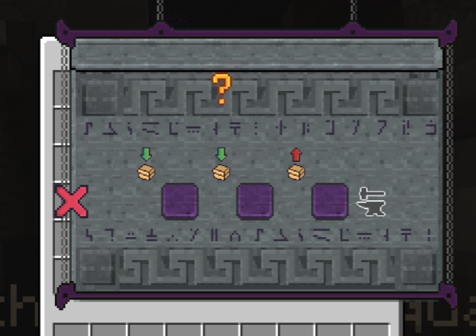
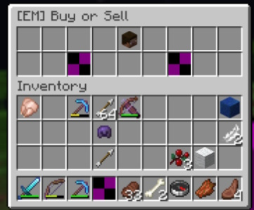

If you have a question that isn't listed here, ***take a look at the sidebar*** to see if it has a page dedicated to it
in the wiki!

## FAQ

### Why are my resource packs suddenly not displaying properly?  

<details>  
<summary>  
Info  
</summary>  

Sometimes issues can arise with resource pack merging, particularly after upgrading your server or plugins. For example, you may update your server from version 1.21 to 1.21.4 and notice that models for coins or swords in the EliteMobs resource pack are displayed as purple and black squares instead of the intended models.  

This issue can occur even if you haven’t made changes to Resource Pack Manager (RSPM) or other related resource pack settings.  

To resolve this, try the following:  

1. Stop your server.  
2. Delete the `ResourcePackManager` folder located in the `plugins` directory.  
3. Restart your server to allow RSPM to regenerate its configuration files and resource packs.  

This process often resolves display issues and restores proper functionality to your resource packs.  

</details>  

### How do I prevent conflicts between RSPM and ItemsAdder's auto-hosting feature?  

<details>  
<summary>  
Info  
</summary>  

ItemsAdder has its own auto-hosting feature, which can conflict with RSPM's auto-hosting if both are enabled. If you're using RSPM's auto-hosting and want it to handle all your resource packs—including those from ItemsAdder—you will need to disable ItemsAdder's auto-hosting.  

To do this, follow these steps:  

1. Open the `config.yml` file for ItemsAdder.  
2. Locate the `auto-external-host` setting and set it to `false`.  
3. Disable all other hosting methods by ensuring that no other hosting options are enabled in the configuration.  

Here’s an example of what the configuration should look like:  

```yaml
auto-external-host:
  enabled: false
```

</details>

### Why isn’t RSPM able to read and merge the ItemsAdder resource pack?  

<details>  
<summary>  
Info  
</summary>  

If you are using ItemsAdder, it is necessary to disable ItemsAdder's encryption to ensure that RSPM can read and merge the resource pack properly. ItemsAdder can encrypt its resource pack, which prevents RSPM from accessing and merging the files.  

To resolve this, follow these steps:  

1. Open the `config.yml` file for ItemsAdder.  
2. Set the following settings to `false`:  

```yaml
zip:
  protect-file-from-unzip:
    protection_1: false
    protection_2: false
```

</details>

### ViaVersion can lead to Resource Packs not displaying properly.  

<details>  
<summary>  
Info  
</summary>  

ViaVersion can cause issues with resource packs, particularly when running a server on a version lower than 1.21.4. Minecraft introduced changes in how resource packs are handled starting from 1.21.4. If you are running a server on a version like 1.21.3 and using ViaVersion to allow 1.21.4 clients to connect, these clients may experience issues displaying certain resource pack contents, such as custom models from FMM (FreeMinecraftModels).  

This happens because the resource pack system in Minecraft changed with the 1.21.4 update.

To resolve this, consider updating your server to 1.21.4 or higher, as this will ensure better compatibility with modern resource pack features, including FMM custom models.  

</details>

### Can I add my own resource packs to be merged?

<details>
<summary>
Info
</summary>

You can add your own custom resource packs by placing them in the `mixer` folder located inside the `ResourcePackManager` plugin directory.

Simply drop your `.zip` file into that folder. To ensure it’s merged correctly, update the `priorityOrder` section in the `config.yml` with the exact filename, including the `.zip` extension. For example:

```yaml
priorityOrder:
  - ResourcePackManager
  - EliteMobs
  - MyCustomPack.zip
```

This allows you to seamlessly merge EliteMobs, FreeMinecraftModels, and any custom textures into a single pack.

</details>


### How do I add a custom resource pack to the `priorityOrder` list?

<details>  
<summary>  
Info  
</summary>  

To add a custom resource pack to the `priorityOrder` in `ResourcePackManager`, simply include the **exact filename** of the `.zip` file you placed in the `mixer` folder.

For example, if you added a resource pack called `MyWeirdTextures.zip`, your config should look like this:

```yaml
priorityOrder:
  - ResourcePackManager
  - EliteMobs
  - MyWeirdTextures.zip
```

</details>

## Troubleshooting

### Client side issue: Failed to Load (404 Error)


<details>  
<summary>  
Info  
</summary>  

**What this means:**  
When a player connects, Minecraft tries to download the resource pack generated by RSPM from the auto-hosted link. A 404 error means the hosting server responded with “file not found,” so the resource pack cannot be downloaded.

**Important note:**  
This hosting service is internal to RSPM and not configurable by server admins. The download link is generated automatically.

**Common causes:**  
- The hosting service is temporarily down or unreachable.  
- The resource pack failed to upload correctly during generation.  
- The link is blocked by a firewall, ISP, or network restrictions (common in schools or workplaces).  

**How to fix:**  
1. Have the affected player copy the resource pack URL from their Minecraft chat or console and try to open it in a web browser.  
2. If it loads correctly in the browser but not in Minecraft, the player may have a caching issue; restarting Minecraft usually resolves this.  
3. If the link does not open in the browser, try regenerating the resource pack by running `/rspm reload` on the server and then rejoin.  
4. If all players experience this issue, it may indicate that the hosting service is temporarily unavailable, wait and try again later.  

</details>

### Client side issue: Failed to Load (Invalid Resource Pack)


<details>  
<summary>  
Info  
</summary>  

**What this means:**  
Minecraft successfully downloaded the resource pack, but rejected it because the pack is corrupted, incomplete, or missing essential files.

**Common causes:**  
- The merging process failed due to incompatible resource packs from different plugins.  
- One or more source packs contain malformed files, such as broken JSON files or invalid `mcmeta` files.  
- Asset file paths exceed Minecraft’s maximum allowed folder depth or include illegal characters.

**How to fix:**  
1. Run `/rspm reload` to force a clean regeneration of the merged resource pack.  
2. Temporarily remove any recently added plugins that add resource packs, then try again to see if the issue resolves.  
3. Add those plugins back one by one, testing after each, to identify which resource pack is causing the problem.  
4. Check the RSPM server logs for warnings about merge conflicts or missing files, which can help pinpoint the source of the issue.  

</details>

### Server side issue: Purple and Black Textures or Purple and Black Cube Models


<details>  
<summary>  
Info  
</summary>  

**What this means:**  
The purple-and-black checkerboard pattern in Minecraft indicates the game cannot find the required texture or model in the loaded resource pack. Seeing purple cubes instead of custom models means the model JSON exists but references a missing or invalid texture or model files.

**Common causes:**  
- The required texture was not included in the merged resource pack.  
- The model JSON file points to an incorrect or outdated texture path.  
- Conflicts between multiple plugin resource packs where one pack overwrites another’s assets.

**How to fix:**  
1. Use the `priorityOrder` list in `config.yml` to make sure the correct resource pack has precedence during merging.  
2. Verify the missing texture file is present in the original source resource pack.  
3. Check the model JSON file to confirm its texture path matches the actual file location in the pack.  
4. After making corrections, run `/rspm reload` to regenerate the merged pack and test again.

</details>

### Server side issue: GUI Textures for Menus are Offset


<details>  
<summary>  
Info  
</summary>  

**What this means:**  
When GUI textures appear misaligned—such as icons shifted or bars out of place—it is usually caused by conflicts in font files. Minecraft only supports one active font set at a time, so multiple packs overriding fonts can cause display issues.

**Common causes:**  
- Several plugin resource packs modify `font/default.json` or related font files.  
- RSPM merges these without a clear priority set for which font to use.

**How to fix:**  
1. Open `plugins/ResourcePackManager/config.yml` and find the `priorityOrder` section.  
2. Move the plugin pack whose fonts you want to preserve to the top of the list.  
3. Run `/rspm reload` to regenerate the merged resource pack.  

**Note:** It is not possible to fully merge multiple font files in Minecraft—only one font set will take effect, so priority must be chosen.

</details>

### Server side issue: Loaded but Some Elements Don’t Work


<details>  
<summary>  
Info  
</summary>  

**What this means:**  
Some items, textures, or models either load incorrectly or do not appear at all in the game.

**Common causes:**  
- Mismatch between the Minecraft client version and the server version. Usually between version 1.21.3 and 1.21.4.  
- Use of ViaVersion or similar plugins that allow clients with unsupported versions to connect.  
- Resource packs using newer model formats that older clients cannot handle, or vice versa.

**How to fix:**  
1. Make sure all players use the same Minecraft version as the server.  
2. If you have ViaVersion installed, know that some assets may not work properly until full compatibility is added.  
3. Keep both client and server resource pack features within the same supported Minecraft version range to avoid conflicts.

</details>

### Server side issue: Loaded but Assets from One Plugin Override Another


<details>  
<summary>  
Info  
</summary>  

**What this means:**  
Two or more plugin resource packs contain files with the same names and paths. When RSPM merges them, the pack lower in the priority order overwrites the assets from the one above it.

**How to fix:**  
1. Open `plugins/ResourcePackManager/config.yml`.  
2. In the `priorityOrder` list, move the plugin whose assets you want to keep higher up, above the conflicting ones.  
3. Run `/rspm reload` to regenerate the merged resource pack.

**Note:**  
On Minecraft versions before 1.21.4, some conflicts cannot be perfectly resolved by priority alone. In such cases, manual merging or editing of the source resource packs may be necessary.

</details>

### Server side issue: Slow Resource Pack Download


<details>  
<summary>  
Info  
</summary>  

**What this means:**  
Players may experience slow downloads or lag when the resource pack is being sent by the server. This is usually due to the resource pack being hosted on our remote servers, which means the download speed depends on the player's physical location and internet connection quality.

**Common causes:**  
- Player is located far from the hosting server geographically.  
- The player's internet connection is slow or unstable.  
- Temporary network congestion between the player and the hosting server.  

**How to fix or mitigate:**  
1. Encourage players to check their internet connection speed and stability.  
2. Players can try connecting from a different network or location to see if the speed improves.  
3. If slow downloads are a persistent problem, consider hosting the resource pack on an alternative hosting service closer to your player base. You can disable RSPM’s auto-hosting in the config and provide a direct resource pack URL in `server.properties`.  
4. Make sure the resource pack size is optimized and not larger than necessary to minimize download time.  

**Note:**  
Unfortunately, due to the nature of remote hosting, some players will experience slower downloads based on factors outside server control.


</details>
