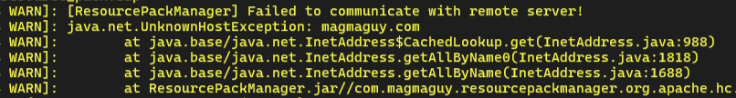
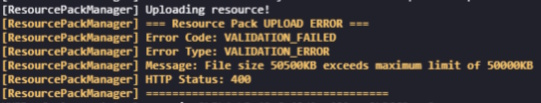
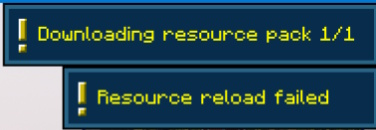
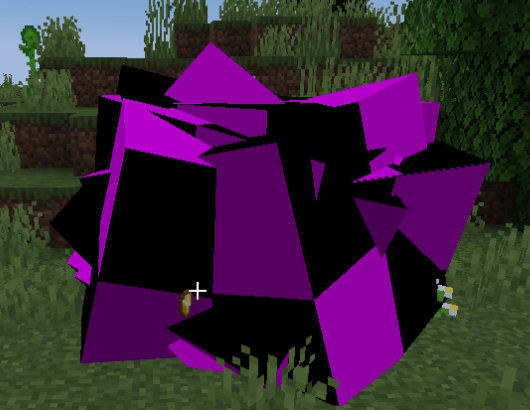
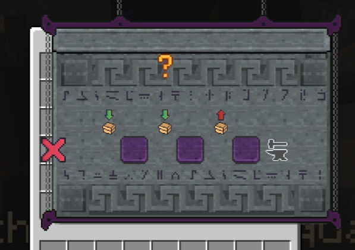
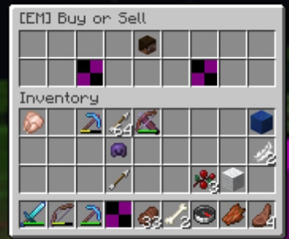
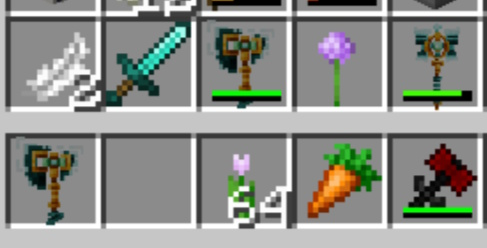
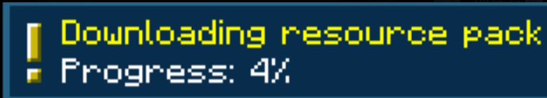

## Troubleshooting

---

### Server side issue: Failed to Load (404 Error)

When a player connects, Minecraft tries to download the resource pack generated by RSPM from the auto-hosted link. A 404 error means the hosting server responded with “file not found,” so the resource pack cannot be downloaded.

  

Expand for more Info
  

**Important note:**  
This hosting service is internal to RSPM and not configurable by server admins. The download link is generated automatically.

**Common causes:**  
- The hosting service is temporarily down or unreachable.  
- The resource pack failed to upload correctly during generation.  
- The link is blocked by a firewall, ISP, or network restrictions (common in schools or workplaces).  

**How to fix:**  
1. Have the affected player copy the resource pack URL from their Minecraft chat or console and try to open it in a web browser.  
2. If it loads correctly in the browser but not in Minecraft, the player may have a caching issue; restarting Minecraft usually resolves this.  
3. If the link does not open in the browser, try regenerating the resource pack by running `/rspm reload` on the server and then rejoin.  
4. If all players experience this issue, it may indicate that the hosting service is temporarily unavailable, wait and try again later.  

---

### Server side issue: Error in Console Resource Pack Size Exceeds Limit

The resource pack generated by RSPM exceeds the maximum allowed size for auto-hosting on the server, which is currently set to 50 MB.

  

Expand for more Info
  

**Common causes:**  
- Adding too many or very large resource packs to be merged.  
- Including high-resolution textures or large custom models that increase pack size.

**How to fix:**  
- Remove or reduce the size of some resource packs or assets.  
- Optimize textures and models to be smaller in file size.  
- Consider disabling auto-hosting in the `config.yml` and hosting the resource pack yourself using an external web host.

**Note:**  
The 50 MB size limit is set to ensure reliable and fast downloads for players and is subject to change based on hosting provider policies.

---

### Client side issue: Failed to Load (Invalid Resource Pack)

Minecraft successfully downloaded the resource pack, but rejected it because the pack is corrupted, incomplete, or missing essential files.

  

Expand for more Info
  

**Common causes:**  
- The merging process failed due to incompatible resource packs from different plugins.  
- One or more source packs contain malformed files, such as broken JSON files or invalid `mcmeta` files.  
- Asset file paths exceed Minecraft’s maximum allowed folder depth or include illegal characters.

**How to fix:**  
1. Run `/rspm reload` to force a clean regeneration of the merged resource pack.  
2. Temporarily remove any recently added plugins that add resource packs, then try again to see if the issue resolves.  
3. Add those plugins back one by one, testing after each, to identify which resource pack is causing the problem.  
4. Check the RSPM server logs for warnings about merge conflicts or missing files, which can help pinpoint the source of the issue.  

---

### Client side issue: Purple and Black Textures or Purple and Black Cube Models

The purple-and-black checkerboard pattern in Minecraft indicates the game cannot find the required texture or model in the loaded resource pack. Seeing purple cubes instead of custom models means the model JSON exists but references a missing or invalid texture or model files.

  

Expand for more Info
  

**Common causes:**  
- The required texture was not included in the merged resource pack.  
- The model JSON file points to an incorrect or outdated texture path.  
- Conflicts between multiple plugin resource packs where one pack overwrites another’s assets.

**How to fix:**  
1. Use the `priorityOrder` list in `config.yml` to make sure the correct resource pack has precedence during merging.  
2. Verify the missing texture file is present in the original source resource pack.  
3. Check the model JSON file to confirm its texture path matches the actual file location in the pack.  
4. After making corrections, run `/rspm reload` to regenerate the merged pack and test again.

---

### Client side issue: GUI Textures for Menus are Offset

When GUI textures appear misaligned—such as icons shifted or bars out of place—it is usually caused by conflicts in font files. Minecraft only supports one active font set at a time, so multiple packs overriding fonts can cause display issues.

  

Expand for more Info
  

**Common causes:**  
- Several plugin resource packs modify `font/default.json` or related font files.  
- RSPM merges these without a clear priority set for which font to use.

**How to fix:**  
1. Open `plugins/ResourcePackManager/config.yml` and find the `priorityOrder` section.  
2. Move the plugin pack whose fonts you want to preserve to the top of the list.  
3. Run `/rspm reload` to regenerate the merged resource pack.  

**Note:** It is not possible to fully merge multiple font files in Minecraft—only one font set will take effect, so priority must be chosen.

---

### Client side issue: Loaded but Some Elements Don’t Work

Some items, textures, or models either load incorrectly or do not appear at all in the game.

  

Expand for more Info
  

**Common causes:**  
- Mismatch between the Minecraft client version and the server version. Usually between version 1.21.3 and 1.21.4.  
- Use of ViaVersion or similar plugins that allow clients with unsupported versions to connect.  
- Resource packs using newer model formats that older clients cannot handle, or vice versa.

**How to fix:**  
1. Make sure all players use the same Minecraft version as the server.  
2. If you have ViaVersion installed, know that some assets may not work properly until full compatibility is added.  
3. Keep both client and server resource pack features within the same supported Minecraft version range to avoid conflicts.

---

### Client side issue: Loaded but Assets from One Plugin Override Another

Two or more plugin resource packs contain files with the same names and paths. When RSPM merges them, the pack lower in the priority order overwrites the assets from the one above it.

  

Expand for more Info
  

**How to fix:**  
1. Open `plugins/ResourcePackManager/config.yml`.  
2. In the `priorityOrder` list, move the plugin whose assets you want to keep higher up, above the conflicting ones.  
3. Run `/rspm reload` to regenerate the merged resource pack.

**Note:**  
On Minecraft versions before 1.21.4, some conflicts cannot be perfectly resolved by priority alone. In such cases, manual merging or editing of the source resource packs may be necessary.

---

### Client side issue: Slow Resource Pack Download

Players may experience slow downloads or lag when the resource pack is being sent by the server. This is usually due to the resource pack being hosted on remote servers, meaning download speed depends on the player's location and internet quality.

  

Expand for more Info
  

**Common causes:**  
- Player is located far from the hosting server geographically.  
- The player's internet connection is slow or unstable.  
- Temporary network congestion between the player and the hosting server.  

**How to fix or mitigate:**  
1. Encourage players to check their internet connection speed and stability.  
2. Players can try connecting from a different network or location to see if the speed improves.  
3. If slow downloads are a persistent problem, consider hosting the resource pack on an alternative hosting service closer to your player base. You can disable RSPM’s auto-hosting in the config and provide a direct resource pack URL in `server.properties`.  
4. Make sure the resource pack size is optimized and not larger than necessary to minimize download time.  

**Note:**  
Unfortunately, due to the nature of remote hosting, some players will experience slower downloads based on factors outside server control.

---
