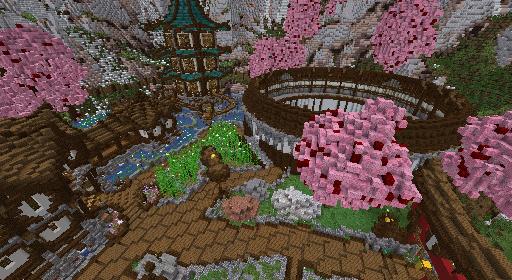

# Mundo del Gremio de Aventureros

### ¿Qué es el Mundo del Gremio de Aventureros?

El Mundo del Gremio de Aventureros es el nombre de un mundo predefinido creado para EliteMobs por el Reino de Lotheridon.

### ¿Para qué sirve el Mundo del Gremio de Aventureros?

El Mundo del Gremio de Aventureros actúa como un centro para EliteMobs. Al hospedar el centro, los jugadores ya no tienen que memorizar ningún comando (aparte de /em) para interactuar con las funciones de EliteMobs.

En el mundo, los siguientes NPCs se colocan con anticipación:

- Transportador (para regresar a su ubicación anterior)
- Guía (búsqueda introductoria para conocer a todos los NPC)
- Asistente del Gremio (para actualizar [Rangos del Gremio]($language$/elitemobs/understanding_the_basics_of_elitemobs.md&section=step-2:-discovering-the-economy))
- Teletransportadores de Mazmorras (NPCs especiales que teletransportarán a los jugadores a cualquier [Mazmorra]($language$/elitemobs/dungeons.md) instalada)
- Posadero (actualmente no implementado)
- Entregador de Misiones (para buscar y aceptar misiones generadas aleatoriamente)
- Herrero (para comprar objetos generados de forma procedural y vender las caídas de los mobs elite)
- Herrero Especial (para comprar objetos personalizados y vender las caídas de los mobs elite)
- Instructor de Combate (para dar consejos sobre el combate EliteMobs)
- Agujeros de Gusano (portales que teletransportarán a los jugadores a [Mazmorras]($language$elitemobs/dungeons.md) y cualquier otro contenido instalado)
- Maestro de Arena (este NPC permitirá a los jugadores participar en la [Arena de la Liga de Madera]($language$elitemobs/understanding_the_basics_of_elitemobs.md&section=arenas))
- Misiones del Modo Historia (permite a los jugadores tomar misiones para las [Mazmorras del Modo Historia](www.magmaguy.com))
- Desvinculador (permite a los jugadores [Desvincular]($language$/elitemobs/item_upgrade_system.md&section=unbinding-items) su botín de EliteMobs por un precio)
- Desguazador (permite a los jugadores convertir cualquier botín no deseado en [Chatarra]($language$/elitemobs/item_upgrade_system.md&section=scrapping-items))
- Reparador (los jugadores pueden interactuar con este NPC para [Reparar]($language$/elitemobs/item_upgrade_system.md&section=repairing-elite-items) sus artículos usando chatarra)
- Encantador (permite a los jugadores [Encantar]($language$/elitemobs/item_upgrade_system.md&section=enchanting-elite-items) sus objetos)

Además, cuenta con un edificio del gremio de aventureros para los NPCs, así como una Arena EliteMobs (actualmente no implementada, ¡próximamente!).

### Cómo configurar el Mundo del Gremio de Aventureros

Para instalar el Mundo del Gremio de Aventureros, haz lo siguiente:

1. Descarga los archivos. Puedes hacer clic en el vidrio rojo en `/em setup` para obtener enlaces a las descargas.

2. Sube/mueve los archivos a la carpeta `imports` del servidor en `/plugins/EliteMobs/`. Asegúrate de poner los archivos **ZIP** dentro de la carpeta `imports` sin modificarlos de ninguna manera, EliteMobs extraerá automáticamente los archivos y los moverá a las ubicaciones correctas.

3. Reinicia o haz `/em reload`. Después de unos segundos, cuando hagas `/em setup` los indicadores de las características que descargaste deberían ser amarillos.

   **IMPORTANTE: [WORLDGUARD](https://dev.bukkit.org/projects/worldguard) Y [WORLDEDIT](https://dev.bukkit.org/projects/worldedit) (o [FastAsyncWorldEdit](https://www.spigotmc.org/resources/fastasyncworldedit.13932/)) SON OBLIGATORIOS SI QUIERES INSTALAR ALGUNO DE LOS CONTENIDOS EN ELITEMOBS!**

4. Haz clic en el vidrio amarillo en el menú `/em setup` para instalar las características importadas. Si todo se instaló correctamente, deberías estar en el mundo del gremio de aventureros. Puedes teletransportarte al Gremio de Aventureros en cualquier momento haciendo `/ag`.

#### Configurando el Agujero de Gusano

Después de instalar el mundo del gremio de aventureros, notarás que hay un agujero de gusano ubicado donde los jugadores se teletransportan. Se supone que este agujero de gusano debe ser configurado por ti, para llevar de vuelta a tu spawn del mundo regular u otra ubicación central de tu servidor.

Para configurar el agujero de gusano, ve al directorio *~plugins\EliteMobs\wormholes* y abre *adventurers_guild_wormhole.yml*. Localiza el valor `location2` y reemplaza `your_world_here` con el nombre de tu mundo, seguido de las coordenadas correctas a las que los jugadores deberían ser teletransportados.