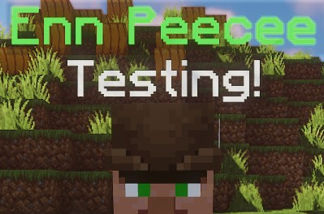
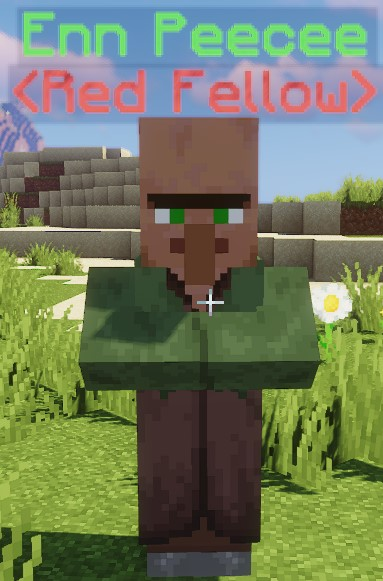
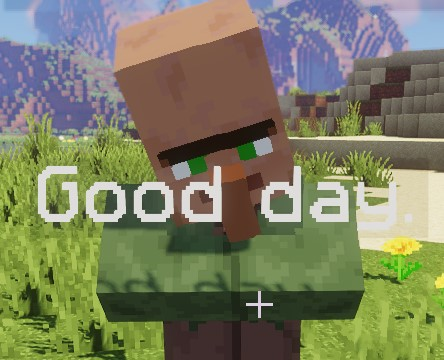
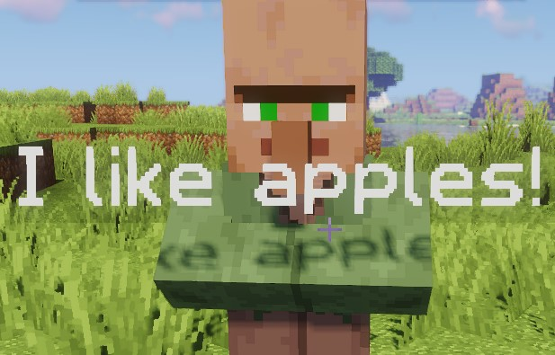
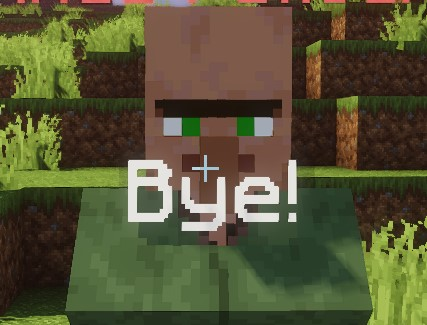
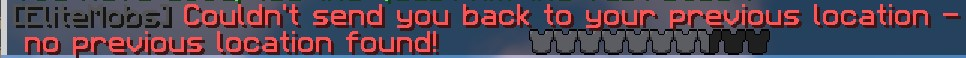
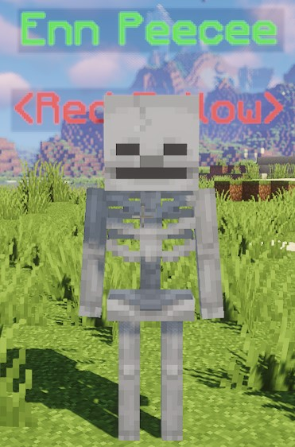
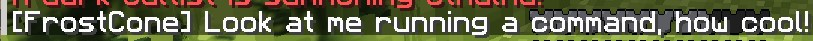
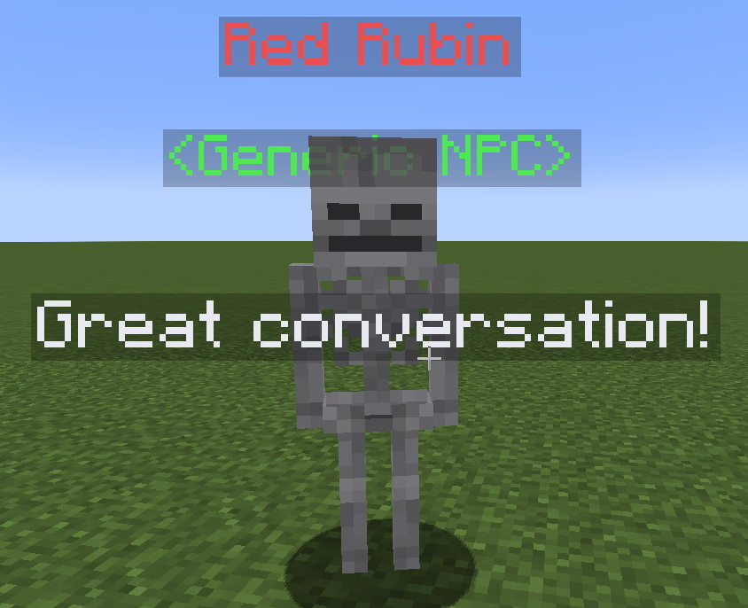

[](https://magmaguy.com/webapp/webapp.html)

# Configuraciones

<div align="center">

### isEnabled

Establece si un NPC está habilitado.

| Clave       |       Valores        | Predeterminado |
|-----------|:-------------------:|:-------:|
| `isEnabled` | [Booleano](#booleano) | `true`  |

<details>

<summary><b>Ejemplo</b></summary>

<div align="left">

```yml
isEnabled: true
```

</div>

</details>

***

### name

Establece el nombre para mostrar de un NPC. Admite [códigos de color](#color_codes).

| Clave       |       Valores        | Predeterminado |
|-----------|:-------------------:|:-------:|
| `name` | [Cadena](#string) |  ninguno   |

<details>

<summary><b>Ejemplo</b></summary>

<div align="left">

```yml
name: "&aEnn Peecee"
```

<div align="center">



</div>

</div>

</details>

***

### scale

Establece la escala (tamaño) del NPC.

| Clave       |       Valores        | Predeterminado |
|-----------|:-------------------:|:-------:|
| `scale` | [Multiplicador](#multiplier) | `1.0` |

Al escalar, `1.0` representa el tamaño predeterminado. Para hacer que la entidad sea más grande, aumente el valor (por ejemplo, `1.2`). Para hacer que la entidad sea más pequeña, disminuya el valor (por ejemplo, `0.8`).

<details>

<summary><b>Ejemplo</b></summary>

<div align="left">

```yml
scale: 1.2
```

</div>

</details>

***

### role

Establece el rol del NPC, debajo del nombre. Solo visual. Admite [códigos de color](#color_codes).

| Clave       |       Valores        | Predeterminado |
|-----------|:-------------------:|:-------:|
| `role` | [Cadena](#string) |  ninguno   |

<details>

<summary><b>Ejemplo</b></summary>

<div align="left">

```yml
role: "&c<Compañero Rojo>"
```

<div align="center">


</div>

</div>

</details>

***

### profession

Establece la profesión del NPC, que establece su skin cuando **no** se usa un disfraz.

| Clave       |       Valores        | Predeterminado |
|-----------|:-------------------:|:-------:|
| `profession` | [Profesión](https://hub.spigotmc.org/javadocs/spigot/org/bukkit/entity/Villager.Profession.html) |  `NITWIT`   |

<details>

<summary><b>Ejemplo</b></summary>

<div align="left">

```yml
profession: NITWIT
```

<div align="center">



</div>

</div>

</details>

***

### greetings

Establece la lista de saludos que dice el NPC cuando un jugador se acerca.

| Clave       |       Valores        | Predeterminado |
|-----------|:-------------------:|:-------:|
| `greetings` | [Lista de cadenas](#string_list) |  ninguno   |

<details>

<summary><b>Ejemplo</b></summary>

<div align="left">

```yml
greetings:
- ¡Hola!
- Buenos días.
```

<div align="center">



</div>

</div>

</details>

***

### dialog

Establece el diálogo que dirá el NPC mientras un jugador está cerca (en el caso de `interactionType` de `DIALOG`, este sería el diálogo).

| Clave       |       Valores        | Predeterminado |
|-----------|:-------------------:|:-------:|
| `dialog` | [Lista de cadenas](#string_list) |  ninguno   |

<details>

<summary><b>Ejemplo</b></summary>

<div align="left">

```yml
dialog:
- ¡Me gustan las manzanas!
- Hace mucho calor.
```

<div align="center">



</div>

</div>

</details>

***

### farewell

Establece el mensaje de despedida del NPC.

| Clave       |       Valores        | Predeterminado |
|-----------|:-------------------:|:-------:|
| `farewell` | [Lista de cadenas](#string_list) |  ninguno   |

<details>

<summary><b>Ejemplo</b></summary>

<div align="left">

```yml
farewell:
- ¡Hasta la próxima!
- ¡Adiós!
```

<div align="center">



</div>

</div>

</details>

***

### canTalk

Establece si el NPC puede hablar.

| Clave       |       Valores        | Predeterminado |
|-----------|:-------------------:|:-------:|
| `canTalk` | [Booleano](#booleano) | `true`  |

<details>

<summary><b>Ejemplo</b></summary>

<div align="left">

```yml
canTalk: true
```

</div>

</details>

***

### activationRadius

Establece el radio en el que un NPC puede detectar que un jugador se acerca.

| Clave       |       Valores        | Predeterminado |
|-----------|:-------------------:|:-------:|
| `activationRadius` | [Doble](#double) |  `3.0`  |

<details>

<summary><b>Ejemplo</b></summary>

<div align="left">

```yml
activationRadius: 3.0
```

</div>

</details>

***

### interactionType

Establece el tipo de interacción que hará el NPC.

| Clave       |      Valores       | Predeterminado |
|-----------|:-----------------:|:-------:|
| `interactionType` |    Especial [1]    |  ninguno   |

<details>

<summary><b>Ejemplo</b></summary>

<div align="left">

```yml
interactionType: TELEPORT_BACK
```

</div>

</details>

***

### noPreviousLocationMessage

Cuando un NPC teletransportador no tiene una ubicación anterior a la que puede teletransportar a un jugador, mostrará este mensaje. Acepta [códigos de color](#color_codes).

| Clave       |       Valores        | Predeterminado |
|-----------|:-------------------:|:-------:|
| `noPreviousLocationMessage` | [Cadena](#string) |  ninguno   |

<details>

<summary><b>Ejemplo</b></summary>

<div align="left">

```yml
noPreviousLocationMessage: '&8[EliteMobs] &cNo se pudo enviarte de vuelta a tu ubicación anterior: ¡no se encontró ninguna ubicación anterior!'
```

<div align="center">



</div>

</div>

</details>

***

### timeout

Establece la cantidad de tiempo, en minutos, antes de que un NPC desaparezca permanentemente.

| Clave       |       Valores        | Predeterminado |
|-----------|:-------------------:|:-------:|
| `timeout` | [Entero](#integer) |  `0` (nunca)   |

<details>

<summary><b>Ejemplo</b></summary>

<div align="left">

```yml
timeout: 0
```

</div>

</details>

***

### questFileName

Establece las misiones que ofrece el NPC.

| Clave       |       Valores        | Predeterminado |
|-----------|:-------------------:|:-------:|
| `questFileName` | [Lista de cadenas](#string_list) |  ninguno   |

<details>

<summary><b>Ejemplo</b></summary>

<div align="left">

```yml
questFileName:
- my_quest_one.yml
- my_quest_two.yml
```

</div>

</details>

***

### disguise

Establece el disfraz de LibsDisguises que tiene el NPC.

| Clave       |       Valores        | Predeterminado |
|-----------|:-------------------:|:-------:|
| `disguise` | [Formato de LibsDisguises]($language$/elitemobs/libsdisguises.md) |  ninguno   |

<details>

<summary><b>Ejemplo</b></summary>

<div align="left">

```yml
disguise: SKELETON
```

<div align="center">



</div>

</div>

</details>

***

### customDisguiseData

Establece los datos para un disfraz personalizado de LibsDisguises.

| Clave       |       Valores        | Predeterminado |
|-----------|:-------------------:|:-------:|
| `customDisguiseData` | [Formato de LibsDisguises]($language$/elitemobs/libsdisguises.md&section=how-can-i-disguise-an-entity-with-a-custom-disguise?) |  ninguno   |

<details>

<summary><b>Ejemplo</b></summary>

<div align="left">

```yml
disguise: custom:my_cool_disguise_name
customDisguiseData: player my_cool_disguise_name setskin {"id":"364acb6d-9050-46f7-b5fb-f8c3fd83a6fc","name":"Unknown","properties":[{"name":"textures","value":"ewogICJ0aW1lc3RhbXAiIDogMTYxMTk4ODA4Nzc1NSwKICAicHJvZmlsZUlkIiA6ICJkZGVkNTZlMWVmOGI0MGZlOGFkMTYyOTIwZjdhZWNkYSIsCiAgInByb2ZpbGVOYW1lIiA6ICJEaXNjb3JkQXBwIiwKICAic2lnbmF0dXJlUmVxdWlyZWQiIDogdHJ1ZSwKICAidGV4dHVyZXMiIDogewogICAgIlNLSU4iIDogewogICAgICAidXJsIiA6ICJodHRwOi8vdGV4dHVyZXMubWluZWNyYWZ0Lm5ldC90ZXh0dXJlLzliYmVkODQzNWY4YmYyNzhhZmUyNmU2NGZkOTI2YjhiMzc3MzJkODhlMzM0ODk3ZGJkNTI3ZDU2ZmY5MTk5MGUiCiAgICB9CiAgfQp9","signature":"ujLq1joYVktuQAp1xpFKlxQFUVinSePiDBiVCAxxix/mA5vP86i/eAOfb1mtGjaAZ6sO0l2olbzvycnGXNBtbAxgqprguROXY4tpWiePVTDmy3iD4GdOCxHAkYLoyMV5qTT4SNsldUFFuND8GSEgbNMltKDLmhNKwzm08iCigPfpeuYpwljgJPxu6ka54PKNaQu4doI0ZDZXKqq4hPhR3Bs2Sz9MI0SmdmQWwcCzUz3DFdVno27fmQ6LwqmT+eSoOv0EttVG/XMaTYQ5lhBY61mqf6WlJyYVUSfjJk1AbYsctu7dWM+sbY8jFq5ljvXJGGr5TyKi+fs8vHy06Z2go20QgTYOw+caFxFijAS6fgm3oY57VEO/+/9OLHdD+Z9BrWqQWcIIrVeIfxjue/yt4pyeVv9jX59hjNFjhcPEwotkxJ+vZ96WlTLWDG4BiqauDr2VeGyLlVaygO9ZU0wwsN65iSh91GI3tMIA5wbDR0Hts/9ABvt9eafHbowS+4SZXN0i9mYnKg7op1eiB8nMEAGsPJg3DwsmUrh3ACAapQ6eYHiJpo59RXDqKlRcXwo7wsEFp//5LgQWbPj0NP3nxnywdpozqSAeq6236qlhE9BT9eiyJ41V9sMelYFEWMlUAltR40NdbIrHB0J3nmfuLJz44/sTwWf6P1khOy//XX0="}],"legacy":false}
```

<div align="center">


</div>

</div>

</details>

***

### customModel

Establece el modelo personalizado de ModelEngine que usará el NPC.

| Clave       |       Valores        | Predeterminado |
|-----------|:-------------------:|:-------:|
| `customModel` | [Cadena](#string) |  ninguno   |

<details>

<summary><b>Ejemplo</b></summary>

<div align="left">

```yml
customModel: MY_MODEL_ONE
```

</div>

</details>

***

### arena

Establece el nombre de archivo de la arena para la que el NPC abrirá un menú (requiere el `interactionType` de `ARENA_MASTER`).

| Clave       |        Valores         | Predeterminado |
|-----------|:---------------------:|:-------:|
| `arena` | [Nombre de archivo](#filename) |  ninguno   |

<details>

<summary><b>Ejemplo</b></summary>

<div align="left">

```yml
arena: my_arena.yml
```

</div>

</details>

***

### command

Establece el comando que ejecutará el NPC (requiere `interactionType` de `COMMAND`).

| Clave       |        Valores         | Predeterminado |
|-----------|:---------------------:|:-------:|
| `command` | [Cadena](#string) |  ninguno   |

<details>

<summary><b>Ejemplo</b></summary>

<div align="left">

```yml
command: say ¡Mírame ejecutando un comando, qué genial!
```

<div align="center">



</div>

</div>

</details>

***

### spawnLocation

Establece la ubicación de generación de los NPC. Debe establecer esto a través del comando `/em spawnnpc <nombrearchivo_npc.yml>`.

| Clave       |        Valores         | Predeterminado |
|-----------|:---------------------:|:-------:|
| `spawnLocation` | [Cadena](#string) |  ninguno   |

<details>

<summary><b>Ejemplo</b></summary>

<div align="left">

```yml
spawnLocation: my_world,10,50,10,0,0
```

</div>

</details>

***

### spawnLocations

Establece las ubicaciones de generación de los NPC. Debe establecer esto a través del comando `/em spawnnpc <nombrearchivo_npc.yml>`.

| Clave              |           Valores            | Predeterminado |
|------------------|:---------------------------:|:-------:|
| `spawnLocations` | [Lista de cadenas](#string_list) |  ninguno   |

<details>

<summary><b>Ejemplo</b></summary>

<div align="left">

```yml
spawnLocations:
- my_world,10,50,10,0,0
- my_world,-10,50,-10,0,0
```

</div>

</details>

### instanced

Establece si el NPC debe ser de instancia (para usar en mazmorras de instancia).

| Clave              |           Valores            | Predeterminado |
|------------------|:---------------------------:|:-------:|
| `instanced` | [Booleano](#booleano) |  `false`   |

<details>

<summary><b>Ejemplo</b></summary>

<div align="left">

```yml
instanced: false
```

</div>

</details>

</div>

***

<details>

<summary align="center"><b>Ejemplo de configuración de NPC</b></summary>

<div align="left">

```yml
isEnabled: true
name: "&cRubin Rojo"
role: "&a<NPC genérico>"
profession: NITWIT
greetings:
- ¡Hola!
- ¡Hola!
dialog:
- ¡Gran conversación!
- ¡Un placer hablar con usted!
farewell:
- ¡Adiós!
- ¡Hasta luego!
canTalk: true
activationRadius: 4
interactionType: CHAT
timeout: 0
questFileName:
- my_quest.yml #el tipo de interacción npc debe estar establecido en CUSTOM_QUEST_GIVER
disguise: SKELETON
customDisguiseData: #se usa cuando se está estableciendo un libsdisguise personalizado
customModel: MODEL_ONE
arena: my_arena.yml #el tipo de interacción npc debe estar establecido en ARENA_MASTER
command: /say Hello World! #el tipo de interacción npc debe estar establecido en COMMAND
spawnLocation: my_world,584,55,127,90,10 #recuerde que los NPC usan el cabeceo y la guiñada para establecer hacia dónde están mirando. Esto también se establece automáticamente al ejecutar el comando /em spawnnpc <nombrearchivo_npc.yml>, así que asegúrese de posar donde quiere que mire el NPC al ejecutar el comando.
```

<div align="center">



</div>

</div>

</details>

***

## Especial [1]
La siguiente es la lista de tipos de interacción de NPC válidos:

| Tipo                          |                                Descripción                                |
|-------------------------------|:-------------------------------------------------------------------------:|
| `GUILD_GREETER`               |                     Abre el menú del gremio de aventureros                      |
| `CHAT`                        |                Hacer clic derecho cambia el ciclo a través del `diálogo`                 |
| `CUSTOM_SHOP`                 |                        Abre el menú de la tienda personalizada                         |
| `PROCEDURALLY_GENERATED_SHOP` |                   Abre la tienda generada por procedimientos                   |
| `BAR`                         |                            Abre el menú del bar                             |
| `ARENA`                       |                           Abre el menú de la arena                            |
| `QUEST_GIVER`                 |               Abre el menú de misiones generadas por procedimientos                |
| `CUSTOM_QUEST_GIVER`          |     Abre el menú de misiones para un conjunto de misiones específico en `questFileName`      |
| `NONE`                        |                              Sin interacciones                              |
| `SELL`                        |                            Abre el menú de venta                            |
| `TELEPORT_BACK`               | Teletransporta a los jugadores de vuelta a la última ubicación del mundo que no es de elitemobs en la que estaban |
| `SCRAPPER`                    |                           Abre el menú de desguace                            |
| `REPAIRMAN`                   |                           Abre el menú de reparación                           |
| `ENCHANTER`                   |                          Abre el menú de encantamiento                           |
| `REFINER`                     |                          Abre el menú de refinador                           |
| `UNBINDER`                    |                           Abre el menú de desvinculación                           |
| `ARENA_MASTER`                |         Abre el menú de la arena para la arena establecida en `arenaFilename`         |
| `COMMAND`                     |                     Ejecuta el comando establecido en `command`                     |

*Para obtener más información sobre lo que hacen SCRAPPER y tipos de interacción similares, haga clic [aquí]($language$/elitemobs/item_upgrade_system.md).*
