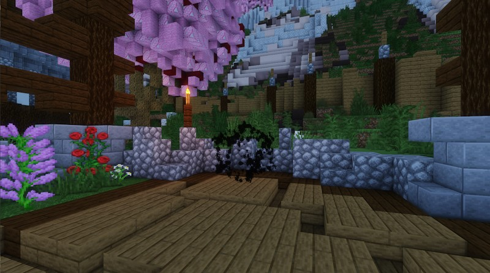

Si tienes una pregunta que no está en la lista aquí, ***¡echa un vistazo a la barra lateral*** para ver si tiene una página dedicada en la wiki!

# Preguntas frecuentes sobre configuración e instalación

### ¿Cómo configuro modelos personalizados?

Información

Hay dos complementos diferentes que manejan "Modelos personalizados".

- LibsDisguises (incluida la edición gratuita) te permite disfrazar turbas como otras turbas o como aspectos de jugador personalizados. Si ves un jefe personalizado con un disfraz de jugador, está usando LibsDisguises para el disfraz. Tendrás que descargar LibsDisguises para que esta función específica funcione.

- FreeMinecraftModels (y ModelEngine R3, aunque ModelEngine ya no se recomienda) te permite disfrazar turbas como cualquier modelo personalizado, con muy pocas limitaciones. FreeMinecraftModels te permite hacer esto de forma gratuita y se recomienda. Tendrás que usar FreeMinecraftModels o ModelEngine R3 (no R4) para que los modelos personalizados funcionen. FreeMinecraftModels se puede ejecutar junto con ModelEngine, por lo que también puedes ejecutar ambos.
 Si has instalado FreeMinecraftModels/ModelEngine y los modelos personalizados aún no funcionan, es posible que hayas instalado el contenido antes de instalar el complemento del modelo. Para asegurarte de que esto no sea un problema, vuelve a importar el contenido de EliteMobs con los disfraces personalizados e instálalo de nuevo.

### La consola/EliteMobs dice que estoy usando la versión incorrecta de WorldGuard.

Información

Si EliteMobs informa que WorldGuard no está instalado, es porque estás utilizando la versión incorrecta de WorldGuard para la plataforma de tu servidor. WorldGuard es muy sensible a la versión que estás utilizando y tiene diferentes versiones para el software del servidor.

- Puedes descargar la versión de WorldGuard para Spigot/Paper desde aquí: https://dev.bukkit.org/projects/worldguard. ¡Asegúrate de que diga que es compatible con tu versión de Minecraft!

### Los agujeros de gusano/arenas/NPC no parecen funcionar correctamente inmediatamente después de la instalación.

Información

Si los agujeros de gusano/arenas/NPC no parecen funcionar correctamente inmediatamente después de instalar el contenido, debes ejecutar `/em reload`. Siempre es bueno ejecutarlo después de instalar contenido de EliteMobs.

### Los jefes de mazmorras no reaparecen después de matarlos.

Información

La mayoría de las veces, esto se debe a que algunos jefes tienen tiempos de reaparición largos. La Sombra del Atador de mundos tiene el tiempo de reaparición más largo de 1 semana en la vida real. Los jefes de guarida suelen tener un tiempo de reaparición de 4 horas. Todo lo demás tiende a tener un tiempo de reaparición de 5 a 30 minutos. Puedes editar el temporizador de reaparición de un jefe personalizado en su archivo de configuración en la carpeta `~/plugins/EliteMobs/custombosses`.

### Los jefes de mazmorras nunca aparecieron después de la instalación.

Información

Esto es casi seguro debido a la interferencia de un complemento de terceros. Comprueba lo siguiente:
- ¿Tu mundo está en dificultad Pacífica? Las turbas no aparecen en dificultad Pacífica.

- ¿Tu región está protegida contra la generación? Las mazmorras de EliteMobs manejan su propia protección regional a través de WorldGuard, no necesitas proteger los mundos de mazmorras de EliteMobs, en realidad, hacerlo puede evitar la generación si se usan las banderas incorrectas.

- ¿Hay otro complemento que impida que aparezcan los jefes de EliteMobs o que los elimine? Estos conflictos a menudo aparecen en la consola, así que revisa los registros de tu consola.

### El complemento no está completando automáticamente los comandos para el contenido que acabo de instalar.

Información

Las sugerencias automáticas en los comandos son manejadas por CloudCommandFramework y solo actualizan las sugerencias de comandos **después de reiniciar el servidor**. Desafortunadamente, no hay nada que pueda hacer al respecto.

### ¿Cómo utilizo las traducciones de EliteMobs?

Información

Puedes cambiar el idioma de EliteMob ejecutando `/em language <nombredeidioma>.yml`. para usar la traducción predeterminada del complemento creada y administrada por la comunidad de EliteMobs.

Para agregar un idioma que no está en el complemento, o para personalizar el idioma existente, se recomienda que uses `custom_language.yml`.

¡Los archivos de idioma solo generan su contenido cuando cambias el idioma!

Si rompes el formato del archivo yml, lo que es muy fácil de hacer por error, ¡se restablecerá el archivo! ***¡Asegúrate de mantener una copia de seguridad local de tu traducción si estás traduciendo el contenido manualmente!***

¡Es más fácil traducir el archivo de idioma en el sitio web de traducción de la comunidad, ya que eso maneja el formato por ti! También sugiere automáticamente traducciones. Puedes encontrarlo aquí: https://crowdin.com/project/elitemobs.

Como recordatorio, si estás traduciendo, si usas caracteres especiales como `&` para iniciar un valor de configuración, ¡debes colocar ese valor entre comillas como "&cValor genial"! De lo contrario, el archivo se romperá y restablecerá tu progreso. Puedes usar un linter para verificar la validez del archivo yml; simplemente pega el contenido de tu yml aquí: <https://www.yamllint.com/>

# Preguntas frecuentes sobre compatibilidad de EliteMobs y BetterStructures

### ¿Puedo obtener estructuras en BetterStructure con jefes de EliteMobs en ellas?

Información

Sí, los paquetes de santuarios de BetterStructures son exactamente este tipo de contenido. Puedes descargar los paquetes de santuarios de [itch.io](https://magmaguy.itch.io/).

### ¿Por qué los santuarios están protegidos con WorldGuard y cómo puedo evitarlo?

Información

Las estructuras de santuarios de EliteMobs están protegidas con WorldGuard de forma predeterminada para garantizar que los jugadores no construyan artilugios para abusar del sistema de combate de Minecraft dentro del área de lucha.

Las protecciones se eliminan automáticamente una vez que el jefe es derrotado.

Cada santuario tiene puntos de entrada que los jugadores deben excavar para encontrar si están bajo tierra.

Si no deseas utilizar las protecciones de WorldGuard, puedes desactivarlas en el archivo de configuración config.yml de BetterStructures.

### ¿Por qué los santuarios aparecen sin élites en ellos?

Información

Esto puede suceder si instalas los santuarios de BetterStructures antes de instalar EliteMobs. Para solucionar esto, vuelve a importar y reinstala los santuarios en tu servidor **después** de que EliteMobs esté instalado.

### ¿Puedo usar los santuarios sin usar EliteMobs?

Información

Los santuarios se hicieron específicamente para combatir a los jefes que están en ellos, pero si solo quieres las arenas de combate por la estética, puedes ejecutar los paquetes de santuarios sin tener EliteMobs instalado.

# Preguntas frecuentes sobre compatibilidad de EliteMobs y FreeMinecraftModels

### ¿FreeMinecraftModels es compatible con EliteMobs?

Información

Sí. El complemento FreeMinecraftModels se creó específicamente en torno a EliteMobs y EternalTD.

### ¿Cómo instalo los modelos personalizados de EliteMobs?

Información

Puedes descargar los modelos personalizados para EliteMobs desde https://www.patreon.com/magmaguy y https://magmaguy.itch.io/. Una vez que los hayas instalado, **tendrás que fusionar el paquete de recursos** generado por FreeMinecraftModels en su carpeta de salida con el paquete de recursos oficial de EliteMobs si quieres usar el paquete de recursos oficial y distribuirlo a los jugadores alojándolo en línea.

### ¿Cómo instalo los modelos personalizados de EliteMobs?

Información

Puedes descargar los modelos personalizados para EliteMobs desde https://www.patreon.com/magmaguy y https://magmaguy.itch.io/. Una vez que los hayas instalado, **tendrás que fusionar el paquete de recursos** generado por FreeMinecraftModels en su carpeta de salida con el paquete de recursos oficial de EliteMobs si quieres usar el paquete de recursos oficial y distribuirlo a los jugadores alojándolo en línea.

# Preguntas frecuentes sobre compatibilidad de EliteMobs y ResurrectionChest

### ¿EliteMobs funciona con ResurrectionChest?

Información

Sí. ResurrectionChest se creó específicamente para contenido de EliteMobs y es totalmente compatible.

# Preguntas frecuentes sobre compatibilidad con otros complementos

### ¿Puedo usar EliteMobs con un complemento similar a MCMMO o AureliumSkills?

Información

Sí. Dicho esto, es posible que desees desactivar la bonificación de salud del sistema de prestigio de EliteMobs.

### ¿Puedo usar EliteMobs con otro complemento de objetos personalizados?

Información

Sí. Si quieres que los jefes suelten objetos específicos de ese complemento, configuras los comandos de muerte para que se ejecuten y les das objetos a los jugadores de esa manera. Sin embargo, no hay una forma real de equilibrar EliteMobs con cualquier sistema de objetos que estés utilizando. Las élites pasan de tener 7 puntos de salud a cientos de miles de puntos de salud y, como tal, otros complementos de objetos serán increíblemente poderosos o increíblemente débiles. EliteMobs ya tiene un sistema de objetos integrado y no requiere ningún complemento de objetos externo.

# Otras preguntas frecuentes

### ¿Ejecutar un comando al morir una mafia de élite o dar botín/recompensas de otros complementos al morir una mafia de élite?

[Información disponible aquí.]($language$/elitemobs/creating_bosses.md&section=ondeathcommands)

### ¿Compatibilidad con Vault?

[Información disponible aquí.]($language$/elitemobs/vault.md)

### ¿Marcadores de posición de PlaceholderAPI?

[Información disponible aquí.]($language$/elitemobs/placeholders.md)

### ¿Usar banderas de WorldGuard para permitir EliteMobs en algunos lugares pero no en otros?

[Información disponible aquí.]($language$/elitemobs/worldguard_flags.md)

### ¿Puedo hacer que el 100% de las turbas que aparecen sean turbas de élite?

Esta es una idea terrible, pero puedes acceder al archivo de configuración `MobCombatSettings.yml` y editar `eliteMobsSpawnPercentage` para establecer el porcentaje de generación de turbas de élite.

### ¿Puedo crear poderes personalizados?

[Información disponible aquí.]($language$/elitemobs/creating_powers.md)

### ¿Puedo crear encantamientos personalizados?

Esto está en nuestra lista de tareas pendientes y debería llegar pronto, pero actualmente no es posible.

### ¿Puedo crear efectos de poción personalizados?

La única forma de hacerlo es aprender Java y escribirlos tú mismo. En ese momento, también podrías modificar el código fuente de EliteMobs.

### ¿Cómo puedo desactivar las partículas del agujero de gusano?

Para desactivar las partículas del agujero de gusano, navega a *~plugins\EliteMobs\Wormholes.yml* y luego busca `noParticlesMode` y cambia el valor a `false`.

### ¿Cómo puedo editar el agujero de gusano en la generación de AG para teletransportar a los jugadores a donde quiero?

Puedes hacerlo abriendo *plugins\EliteMobs\wormholes\adventurers_guild_wormhole.yml*.

Luego encuentra la siguiente configuración
`location2: tu_mundo_aquí,0.5,64,0.5,0,0`
y cambia los valores a tu ubicación preferida.

### ¿Cómo puedo desvincular objetos?

La única forma de eliminar la vinculación del alma de los objetos es usar pergaminos de desvinculación. Lee más sobre eso [aquí]($language$/elitemobs/soulbind.md).

### ¿Cómo puedo fusionar paquetes de recursos?

Es posible fusionar paquetes de recursos manualmente, pero recomendamos usar una herramienta en línea como [merge.elmakers](https://merge.elmakers.com/) para fusionar tus paquetes de recursos.

### ¿Cuáles son los marcadores de posición de comando de EliteMobs?

| Marcador de posición |          Detalles           |
| --- |:--------------------------:|
| `$player` | Nombre para mostrar del jugador |
| `$bossName` |  Nombre para mostrar del jefe  |
| `$bossLevel` |     Nivel del jefe      |

### ¿Qué hago para desactivar el paquete de recursos forzado?

Esta configuración se encuentra en realidad en tu archivo `server.properties`. Por lo general, puedes encontrar este archivo en el directorio raíz de tus servidores. Después de abrir el archivo, busca la configuración `require-resource-pack` y cambia el valor a `false` para desactivar el paquete de recursos forzado.

### ¿Cómo puedo desactivar los eventos?

Si deseas desactivar eventos como el duende de las armas, el duende de los amuletos, etc., puedes abrir *~plugins\EliteMobs\events.yml* y luego buscar las configuraciones `actionEventsEnabled`, `timedEventsEnabled` y establecerlas en `false`.

