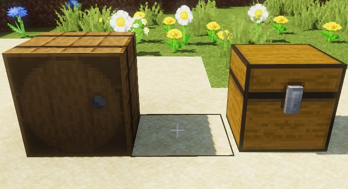
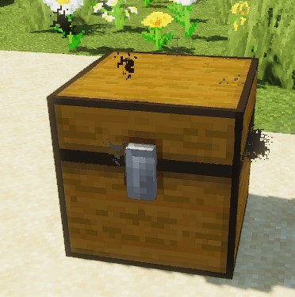
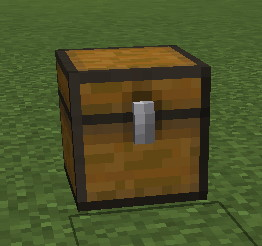

[](https://magmaguy.com/webapp/webapp.html)

Les coffres au trésor sont une fonctionnalité qui permet aux administrateurs de créer des coffres qui peuvent soit laisser tomber du butin, soit faire apparaître un boss imitateur (hostile).

<div align="center">

<div align="left">

## Valeurs

</div>

### isEnabled

Définit si un coffre au trésor est activé.

| Clé       |       Valeurs        | Par défaut |
|-----------|:-------------------:|:-------:|
| `isEnabled` | [Booléen](#boolean) | `true`  |

<details> 

<summary><b>Exemple</b></summary>

<div align="left">

```yml
isEnabled: true
```

</div>

</details>

***

### chestType

Définit le type de matériau du coffre.

| Clé       |        Valeurs         | Par défaut |
|-----------|:---------------------:|:-------:|
| `chestType` | [Matériau](#material) | `CHEST` |

<details> 

<summary><b>Exemple</b></summary>

<div align="left">

```yml
chestType: CHEST
```
*Il doit s’agir d’un matériau de coffre valide tel que `CHEST` ou `BARREL`*.

<div align="center">



</div>

</div>

</details>

***

### facing

Définit la direction à laquelle fait face le coffre.

| Clé       |   Valeurs    | Par défaut |
|-----------|:-----------:|:-------:|
| `facing` | Spécial [1] | `CHEST` |

<details> 

<summary><b>Exemple</b></summary>

<div align="left">

```yml
facing: CHEST
```
*Il doit s’agir d’un matériau de coffre valide tel que `CHEST` ou `BARREL`*.

</div>

</details>

**Spécial [1]**

<details> 

<summary><b>Développer le tableau</b></summary>

| Orientation |
|---------|
| `NORTH` |
| `SOUTH` |
| `WEST`  |
| `EAST`  |


</details>

***

### dropStyle

Définit si le coffre est destiné à être déposé pour un joueur ou plusieurs joueurs.

Les coffres `SINGLE` disparaissent après avoir été ouverts et réapparaissent lorsqu’ils sont réapprovisionnés. Les coffres `GROUP` restent en place et indiquent aux joueurs individuels qu’ils sont en période de recharge.

| Clé       |       Valeurs       | Par défaut |
|-----------|:------------------:|:-------:|
| `dropStyle` | `SINGLE` / `GROUP` | `SINGLE` |

<details> 

<summary><b>Exemple</b></summary>

<div align="left">

```yml
dropStyle: SINGLE
```

</div>

</details>

***

### lootList

Répertorie le butin que le coffre au trésor doit laisser tomber lorsqu’il est ouvert.

| Clé       |                        Valeurs                        | Par défaut |
|-----------|:----------------------------------------------------:|:-------:|
| `lootList` | [Table de butin EM]($language$/elitemobs/loot_tables.md) |  aucun   |

<details> 

<summary><b>Exemple</b></summary>

<div align="left">

```yml
lootList:
- filename=elite_scrap_tiny.yml:chance=0.90
- magmaguys_toothpick.yml
```

</div>

</details>

***

### mimicChance

Définit la probabilité de faire apparaître un boss hostile au lieu de laisser tomber du butin.

| Clé       |      Valeurs       | Par défaut |
|-----------|:-----------------:|:-------:|
| `mimicChance` | [Double](#double) |   `0`   |

<details> 

<summary><b>Exemple</b></summary>

<div align="left">

```yml
mimicChance: 0.5
```

</div>

</details>

***

### mimicCustomBossesList

Spécifie la liste des boss hostiles disponibles pour l’apparition. Un seul boss sera sélectionné au hasard dans cette liste pour l’apparition. 

La liste prend également en charge un système de pondération que vous pouvez mettre en œuvre pour vous assurer que certains boss sont choisis plus souvent que d’autres.

| Clé       |      Valeurs       | Par défaut |
|-----------|:-----------------:|:-------:|
| `mimicCustomBossesList` | [Liste de chaînes](#string_list) |  aucun   |

<details> 

<summary><b>Exemple</b></summary>

<div align="left">

```yml
mimicCustomBossesList:
- my_cool_mimic_boss.yml
- weak_mimic_boss.yml
```
*Si vous souhaitez attribuer des poids aux boss, la liste doit être formatée comme suit :*

```yml
mimicCustomBossesList:
- my_cool_mimic_boss.yml:60
- weak_mimic_boss.yml:40
```

*Dans cette configuration, `my_cool_mimic_boss.yml` est plus susceptible d’être choisi pour l’apparition que `weak_mimic_boss.yml`.*

</div>

</details>

***

### restockTimer

Définit le temps, en minutes, avant que le coffre ne se remplisse de butin.

| Clé       |      Valeurs       | Par défaut |
|-----------|:-----------------:|:-------:|
| `restockTimer` | [Entier](#integer) |   `0`   |

<details> 

<summary><b>Exemple</b></summary>

<div align="left">

```yml
restockTimer: 30
```

</div>

</details>

***

### effects

Définit les effets de particules que le coffre produira.

| Clé       |      Valeurs       | Par défaut |
|-----------|:-----------------:|:-------:|
| `effects` | [Particule](https://hub.spigotmc.org/javadocs/spigot/org/bukkit/Particle.html) |  aucun   |

<details> 

<summary><b>Exemple</b></summary>

<div align="left">

```yml
effects:
- DRIP_LAVA
- SMOKE_NORMAL
```

<div align="center">



</div>

</div>

</details>

***

### locations

Définit les emplacements où le coffre au trésor apparaîtra.

Les emplacements peuvent être définis plus facilement via `/em addTreasureChest <treasurechestfilename.yml>

| Clé       |           Valeurs            | Par défaut |
|-----------|:---------------------------:|:-------:|
| `locations` | [Liste de chaînes](#string_list) |  aucun   |

<details> 

<summary><b>Exemple</b></summary>

<div align="left">

```yml
locations:
- my_world,10,50,10,0,0
- my_nether_world,12,58,12,0,0
```

</div>

</details>

***

### chestTier

Définit le rang de guilde minimum requis pour ouvrir le coffre.

| Clé       |           Valeurs            | Par défaut |
|-----------|:---------------------------:|:-------:|
| `chestTier` | [Entier](#integer) |  aucun   |

<details> 

<summary><b>Exemple</b></summary>

<div align="left">

```yml
chestTier: 3
```

</div>

</details>


***

### instanced

Définit si le coffre doit être instancié (pour une utilisation dans des donjons instanciés).
Tous les minuteurs de réapprovisionnement sont désactivés lorsque les coffres sont placés dans des donjons.

**NE DÉFINISSEZ PAS CETTE VALEUR MANUELLEMENT**.

| Clé       |     Valeurs     | Par défaut |
|-----------|:--------------:|:-------:|
| `instanced` | [Booléen](#boolean) |  `false`   |

<details> 

<summary><b>Exemple</b></summary>

<div align="left">

```yml
instanced: true
```

</div>

</details>

</div>

***

### restockTime

Une fois qu’un coffre a été pillé, le plugin écrira cette clé pour suivre le temps de réapprovisionnement. 

**NE DÉFINISSEZ PAS CETTE VALEUR MANUELLEMENT**.

| Clé       |     Valeurs     | Par défaut |
|-----------|:--------------:|:-------:|
| `restockTime` | Timestamp Unix |  aucun   |

<details> 

<summary><b>Exemple</b></summary>

<div align="left">

```yml
restockTime: 1707394380
```

</div>

</details>

</div>

***

<details> 

<summary align="center"><b>Exemple de configuration de coffre au trésor</b></summary>

<div align="left">

```yml
isEnabled: true
chestType: CHEST
facing: NORTH
dropStyle: MULTIPLE
lootList:
- filename=elite_scrap_tiny.yml:chance=0.90
- magmaguys_toothpick.yml:chance=0.95
mimicChance: 0.50
mimicCustomBossesList:
- balrog.yml
- killer_rabbit_of_caerbannog.yml
restockTimer: 1
effects: SMOKE_NORMAL
locations:
- world,0.0,-60.0,-14.0,0.0,0.0
```

<div align="center">



</div>

</div>

</details>


