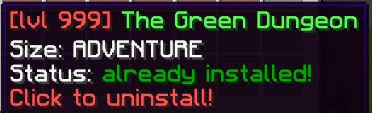
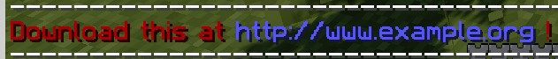
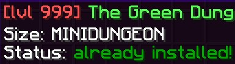
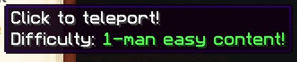
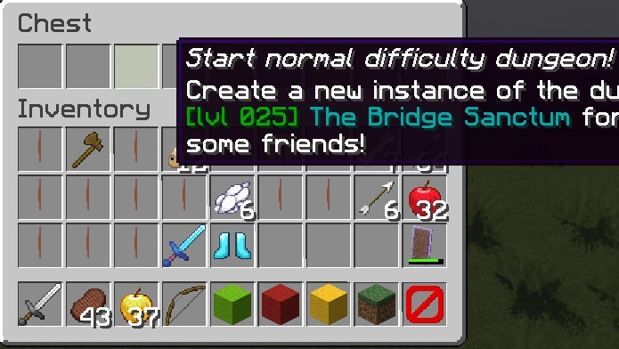
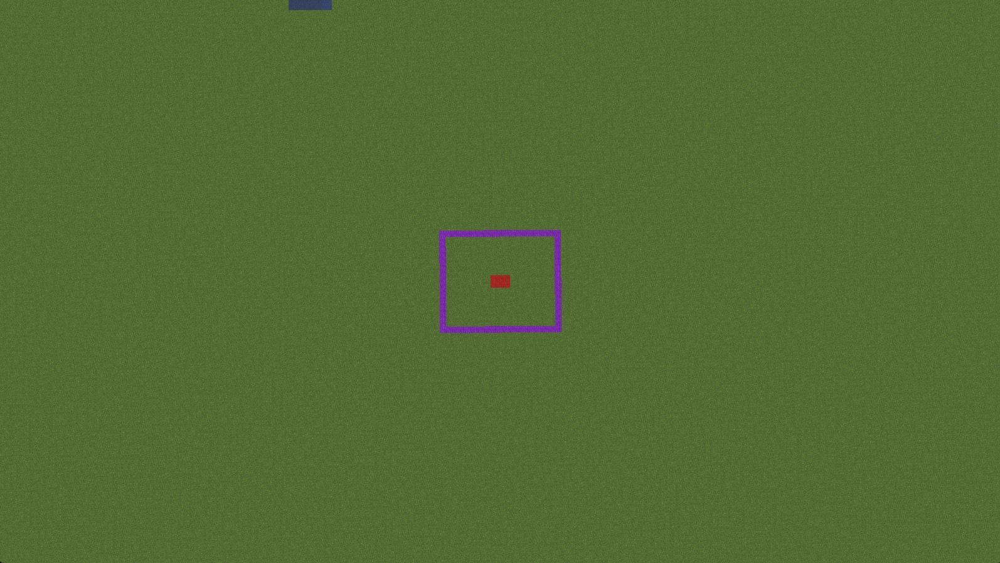

[](https://magmaguy.com/webapp/webapp.html)

# ダンジョンとは？

ダンジョンに関する情報や、既製のダンジョンに関する情報は[こちら]($language$/elitemobs/dungeons.md)で確認できます。

***

# ダンジョンパッカーとは？

ダンジョンパッカーを使用すると、管理者様はダンジョンを作成してパッケージ化できるだけでなく、あらゆる種類のEliteMobsコンテンツをパッケージ化できます。これには、イベントパック、モデルパック、アリーナ、NPCパック、アイテムパックなどが含まれます。

<details>

<summary>ダンジョンパッケージを使用する理由</summary>

- ***インスタンス化されたダンジョン！*** インスタンス化されたダンジョンは、ダンジョンパッケージシステムを通じてのみ作成できます。
- ***ミニダンジョンの安全なバックアップ！*** ダンジョンパッケージを作成すると、いつでも、どんな理由でも、任意のサーバーにデプロイおよび再デプロイできます。
- ***オンとオフの切り替えが簡単！*** `/em setup`を使用して、ダンジョンパッケージを一時的または永続的にオンとオフにすることができます。
- ***共有が簡単！*** 作品を共有したい場合は、ダンジョンパッケージをzip圧縮して他の人に送信できます。興味のある方は、コミュニティ作品専用のDiscordルームがあります！
- ***テレポート！*** ダンジョンパッケージは、`/em`メニューのテレポートページからアクセスできるテレポートロケーションを自動的に作成します。これは多くの設定で非常に役立ちます。

</details>

# ダンジョンの作成

以下の設定は、`content_packages`
フォルダーに入れる構成ファイルを作成するために使用されます。これらの設定は、特にダンジョンを作成するために使用されるものであり、ダンジョンパッカーを使用してアイテムやイベントのパックなどのダンジョン以外のコンテンツを配布したいだけの場合は必要ありません。

## 必須プラグイン

ダンジョンパッカーを使用するには、次のプラグインが必要です。

[WorldGuard](https://dev.bukkit.org/projects/worldguard) - ミニダンジョンを保護します

## ダンジョンの作成、ステップバイステップ

EliteMobsには、ワールドベースとシェーマティックベースの2種類の主要なダンジョンがありました。

シェーマティックベースのダンジョンは、シェーマティックビルドに関連付けられていました。これらは現在、段階的に廃止されており、サポートされていません。

すべてのEliteMobsダンジョンは、現在ワールドベースになっています。

## 必須のpack.metaファイル

ダンジョンパッケージには、`pack.meta`ファイルを含める必要があります。これは、`.meta`拡張子を持つ単に名前を変更した`.txt`
ファイルです。このファイルには、パッケージの対象となるプラグインを示す単語（例：小文字で「elitemobs」）が1つだけ含まれている必要があります。 `pack.meta`
ファイルは、他のすべてのフォルダーとともに、パッケージのルートディレクトリにある必要があります。

***

### グローバル値

以下の値は、すべてのダンジョンに適用されます。

<div align="center">

### isEnabled

ダンジョンパッケージが有効になっているかどうかを設定します。

| キー          |          値          |  デフォルト  | 必須 |
|-------------|:-------------------:|:-------:|:--:|
| `isEnabled` | [Boolean](#boolean) | `false` | ✅  |

<details> 

<summary><b>例</b></summary>

<div align="left">

```yml
isEnabled: true
```

</div>

</details>

***

### name

コンテンツの名前を設定します。[カラーコード](#color_codes)をサポートします。

| キー     |         値         |  デフォルト  | 必須 |
|--------|:-----------------:|:-------:|:--:|
| `name` | [String](#string) | `false` | ✅  |

<details> 

<summary><b>例</b></summary>

<div align="left">

```yml
name: '&c[lvl 999] &aThe Green Dungeon'
```

<div align="center">



</div>

</div>

</details>

***

### dungeonLocationType

ダンジョンが使用する場所の種類を設定します。

| キー                    |           値           | デフォルト | 必須 |
|-----------------------|:---------------------:|:-----:|:--:|
| `dungeonLocationType` | `WORLD` / `INSTANCED` | none  | ✅  |

<details> 

<summary><b>例</b></summary>

<div align="left">

```yml
dungeonLocationType: WORLD
```

</div>

</details>

***

### contentType

ダンジョンの種類を設定します。

| キー            |                      値                       | デフォルト | 必須 |
|---------------|:--------------------------------------------:|:-----:|:--:|
| `contentType` | `OPEN_DUNGEON` / `INSTANCED_DUNGEON` / `HUB` | none  | ✅  |

<details> 

<summary><b>例</b></summary>

<div align="left">

```yml
contentType: INSTANCED_DUNGEON
```

</div>

</details>

***

### customInfo

`/em setup`画面に表示される追加情報を設定します。情報提供のみを目的としています。[カラーコード](#color_codes)をサポートします。

| キー           |              値              | デフォルト | 必須 |
|--------------|:---------------------------:|:-----:|:--:|
| `customInfo` | [String List](#string_list) | none  | ✅  |

<details> 

<summary><b>例</b></summary>

<div align="left">

```yml
customInfo:
- '&aThe best dungeon.'
- '&aMade by: CoolPlayer'
```

<div align="center">


</div>

</div>

</details>

***

### downloadLink

コンテンツがダウンロードされていない場合のダウンロードリンクを設定します。情報提供のみを目的としています。

| キー             |         値         | デフォルト | 必須 |
|----------------|:-----------------:|:-----:|:--:|
| `downloadLink` | [String](#string) | none  | ❌  |

<details> 

<summary><b>例</b></summary>

<div align="left">

```yml
downloadLink: http://www.example.org
```

<div align="center">



</div>

</div>

</details>

***

### dungeonSizeCategory

ダンジョンパッケージのサイズカテゴリを設定します。情報提供のみを目的としています。

| キー                    |      値      | デフォルト | 必須 |
|-----------------------|:-----------:|:-----:|:--:|
| `dungeonSizeCategory` | Special [1] | none  | ✅  |

<details> 

<summary><b>例</b></summary>

<div align="left">

```yml
dungeonSizeCategory: MINIDUNGEON
```

<div align="center">



</div>

</div>

</details>

**Special [1]**

<details> 

<summary><b>表を展開</b></summary>

<div align="center">

| キー            | 説明                                                                                                          |
|---------------|-------------------------------------------------------------------------------------------------------------|
| `LAIR`        | 隠れ家は、1つの大きなボス戦に焦点を当てた、小型のダンジョンの一種です。                                                                        |
| `SANCTUM`     | 聖域は、インスタンス化された隠れ家に相当します。これは、1つの巨大なボス戦に焦点を当てていることを意味します。                                                     |
| `MINIDUNGEON` | ミニダンジョンは、通常3〜15体のミニボスと大きなボス、およびプレイヤーがコインやギアのために「ファーム」することを目的とした多くの「雑魚」モンスターを含む、中規模のダンジョンの一種です。              |
| `DUNGEON`     | ダンジョンは、インスタンス化されたミニダンジョンに相当します。これは、プレイヤーがパーティーを組み、雑魚モンスターやミニボスのガントレットを通過して最後のボスと戦う、最も伝統的なMMORPGタイプのダンジョンです。 |
| `RAID`        | 近日公開！                                                                                                       |
| `ADVENTURE`   | アドベンチャーは、完全なアドベンチャーマップです。クエストライン、NPC、多数のミニボスとボスが含まれており、内部に独自のアリーナやダンジョンを含めることもできます。                         |
| `ARENA`       | アリーナは、プレイヤーがウェーブを倒すことで報酬を得る、ウェーブベースのサバイバルエリアです。                                                             |
| `OTHER`       | 上記のカテゴリに該当しないその他のもの。                                                                                        |

詳細な説明については、[ダンジョン]($language$/elitemobs/dungeons.md)を参照してください

</div>

</details>

***

### protect

ダンジョンパッケージをWorldGuardで保護する必要があるかどうかを設定します。

| キー        |          値          | デフォルト  | 必須 |
|-----------|:-------------------:|:------:|:--:|
| `protect` | [Boolean](#boolean) | `true` | ❌  |

<details> 

<summary><b>例</b></summary>

<div align="left">

```yml
protect: true
```

</div>

</details>

***

### dungeonVersion

ダンジョンパッケージのバージョンを設定します。

| キー               |          値          | デフォルト | 必須 |
|------------------|:-------------------:|:-----:|:--:|
| `dungeonVersion` | [Integer](#integer) | none  | ✅  |

<details> 

<summary><b>例</b></summary>

<div align="left">

```yml
dungeonVersion: 1
```

</div>

</details>

***

### playerInfo

メニューに表示される情報を設定します。[カラーコード](#colorcodes)をサポートします。

*`/em`が`/em alt`を使用してブックモードに設定されている場合にのみ機能します。*

| キー           |         値         | デフォルト | 必須 |
|--------------|:-----------------:|:-----:|:--:|
| `playerInfo` | [String](#string) | none  | ✅  |

<details> 

<summary><b>例</b></summary>

<div align="left">

```yml
playerInfo: 'Difficulty: &a1-man easy content!'
```

<div align="center">



</div>

</div>

</details>

***

### regionEnterMessage

プレイヤーがダンジョンゾーンに入ったときに表示されるメッセージを設定します。[カラーコード](#colorcodes)をサポートします。

| キー                   |         値         | デフォルト | 必須 |
|----------------------|:-----------------:|:-----:|:--:|
| `regionEnterMessage` | [String](#string) | none  | ❌  |

<details> 

<summary><b>例</b></summary>

<div align="left">

```yml
regionEnterMessage: '&aYou have entered the dungeon!'
```

<div align="center">


</div>

</div>

</details>

***

### regionLeaveMessage

プレイヤーがダンジョンゾーンを離れたときに表示されるメッセージを設定します。[カラーコード](#colorcodes)をサポートします。

| キー                   |         値         | デフォルト | 必須 |
|----------------------|:-----------------:|:-----:|:--:|
| `regionLeaveMessage` | [String](#string) | none  | ❌  |

<details> 

<summary><b>例</b></summary>

<div align="left">

```yml
regionLeaveMessage: '&aYou have left the dungeon!'
```

<div align="center">


</div>

</div>

</details>

***

### hasCustomModels

ダンジョンパッケージにカスタムモデル（ModelEngineまたはFreeMinecraftModels用）があるかどうかを設定します。

| キー                |          値          | デフォルト | 必須 |
|-------------------|:-------------------:|:-----:|:--:|
| `hasCustomModels` | [Boolean](#boolean) | none  | ❌  |

<details> 

<summary><b>例</b></summary>

<div align="left">

```yml
hasCustomModels: false
```

</div>

</details>

***

### dungeonConfigFolderName

このダンジョンに関連付けられたファイルに使用されるフォルダーの名前を設定します。

**インスタンス化されたダンジョンでは必須です！**

| キー                        |         値         | デフォルト | 必須 |
|---------------------------|:-----------------:|:-----:|:--:|
| `dungeonConfigFolderName` | [String](#string) | none  | ❌  |

<details> 

<summary><b>例</b></summary>

<div align="left">

```yml
dungeonConfigFolderName: my_dungeon_folder
```

</div>

</details>

***

### contentLevel

EMメニューにダンジョンが表示されるコンテンツレベルを設定します。

| キー             |          値          | デフォルト | 必須 |
|----------------|:-------------------:|:-----:|:--:|
| `contentLevel` | [Integer](#integer) | none  | ❌  |

<details> 

<summary><b>例</b></summary>

<div align="left">

```yml
contentLevel: 20
```

</div>

</details>

***

### enchantmentChallenge

ダンジョンがエンチャントチャレンジダンジョンであるかどうかを設定します。

| キー                     |          値          |  デフォルト  | 必須 |
|------------------------|:-------------------:|:-------:|:--:|
| `enchantmentChallenge` | [Boolean](#boolean) | `false` | ❌  |

<details> 

<summary><b>例</b></summary>

<div align="left">

```yml
enchantmentChallenge: false
```

</div>

</details>

</div>

***

### ワールドベースのダンジョンパッケージ

以下の値は、ワールドベースのダンジョンにのみ適用されます。

<div align="center">

***

### worldName

パッケージ化する必要があるワールドの名前を設定します。

| キー          |         値         | デフォルト | 必須 |
|-------------|:-----------------:|:-----:|:--:|
| `worldName` | [String](#string) | none  | ✅  |

<details> 

<summary><b>例</b></summary>

<div align="left">

```yml
worldName: my_minecraft_world
```

</div>

</details>

***

### womholeWorldName

この機能は、メインのワールドにリンクされたセカンダリワールドとして機能するワームホールワールドの名前を設定します。これは、テレポートハブやユニークなボスチェンバーなどの機能に使用されます。

| キー                 |         値         | デフォルト | 必須 |
|--------------------|:-----------------:|:-----:|:--:|
| `womholeWorldName` | [String](#string) | none  | ❌  |

<details> 

<summary><b>例</b></summary>

<div align="left">

```yml
womholeWorldName: my_minecraft_world_wormhole
```

</div>

</details>

***

### environment

ワールドの環境を設定します。

| キー            |                                             値                                             | デフォルト | 必須 |
|---------------|:-----------------------------------------------------------------------------------------:|:-----:|:--:|
| `environment` | [Environment](https://hub.spigotmc.org/javadocs/spigot/org/bukkit/World.Environment.html) | none  | ✅  |

<details> 

<summary><b>例</b></summary>

<div align="left">

```yml
environment: NORMAL
```

</div>

</details>

***

### teleportLocation

ダンジョンパッケージのテレポート場所を設定します。これは、プレイヤーがダンジョンに入るときにテレポートされる場所です。

| キー                 |         値         | デフォルト | 必須 |
|--------------------|:-----------------:|:-----:|:--:|
| `teleportLocation` | [String](#string) | none  | ✅  |

<details> 

<summary><b>例</b></summary>

<div align="left">

```yml
teleportLocation: my_minecraft_world,-1.5,68,0.5,0.0,0.0
```

</div>

</details>

***

### allowExplosionBlockDamage

ダンジョン内で爆発によってブロックが損傷するかどうかを許可または防止します。爆発はエリート爆発と見なされるため、ブロックへの損傷は2分以内に再生されます。

| キー                          |          値          |  デフォルト  | 必須 |
|-----------------------------|:-------------------:|:-------:|:--:|
| `allowExplosionBlockDamage` | [Boolean](#boolean) | `false` | ❌  |

<details> 

<summary><b>例</b></summary>

<div align="left">

```yml
allowExplosionBlockDamage: true
```

</div>

</details>

</div>

#### インスタンス化されたダンジョン

*インスタンス化されたダンジョンは、プレイヤーのグループがダンジョンを完了するたびに新しいワールドを作成し、完了すると削除します。これが正しく機能するためには、`dungeonConfigFolderName`
に従うフォルダーをEliteMobsの`world_blueprints`構成フォルダーに入れる必要があります。*

*次に、作成したフォルダー内に使用するワールドを配置し、ワールドの`session.lock`ファイルが削除されていることを確認します。*

以下の値は、インスタンス化されたダンジョンにのみ適用されます。すべてのインスタンス化されたダンジョンはワールドダンジョンであるため、ワールドダンジョンの値も使用することに注意してください。

<div align="center">

***

### startLocation

インスタンス化されたダンジョンの開始ポイントのテレポート場所を設定します。これは、プレイヤーが`/em start`
でインスタンス化されたダンジョンを開始するときにテレポートされる場所です。

| キー              |         値         | デフォルト | 必須 |
|-----------------|:-----------------:|:-----:|:--:|
| `startLocation` | [String](#string) | none  | ✅  |

<details> 

<summary><b>例</b></summary>

<div align="left">

```yml
startLocation: my_minecraft_world,10.5,70,10.5,0.0,0.0
```

</div>

</details>

***

### permission

ダンジョンインスタンスに入るために必要な権限を設定します。

| キー           |         値         | デフォルト | 必須 |
|--------------|:-----------------:|:-----:|:--:|
| `permission` | [String](#string) | none  | ❌  |

<details> 

<summary><b>例</b></summary>

<div align="left">

```yml
permission: elitedungeon.mypermission
```

</div>

</details>

***

### minPlayerCount

ダンジョンを開始するために必要な最小プレイヤー数を設定します。

| キー               |          値          | デフォルト | 必須 |
|------------------|:-------------------:|:-----:|:--:|
| `minPlayerCount` | [Integer](#integer) |  `1`  | ❌  |

<details> 

<summary><b>例</b></summary>

<div align="left">

```yml
minPlayerCount: 1
```

</div>

</details>

***

### maxPlayerCount

ダンジョンを開始するために必要な最小プレイヤー数を設定します。

| キー               |          値          | デフォルト | 必須 |
|------------------|:-------------------:|:-----:|:--:|
| `maxPlayerCount` | [Integer](#integer) |  `5`  | ❌  |

<details> 

<summary><b>例</b></summary>

<div align="left">

```yml
maxPlayerCount: 5
```

</div>

</details>

***

### dungeonObjectives

ダンジョンが完了したと見なされるために必要なダンジョンの目標のリストを設定します。

| キー                  |              値              | デフォルト | 必須 |
|---------------------|:---------------------------:|:-----:|:--:|
| `dungeonObjectives` | [String List](#string_list) | none  | ✅  |

<details> 

<summary><b>例</b></summary>

<div align="left">

現在、ダンジョンの目標タイプは2つあります。

* ターゲットを倒す：`filename=boss.yml:amount=X`
* ダンジョンのパーセンテージを倒す：`clearpercentage=X.Y`

```yml
dungeonObjectives:
- filename=dungeon_final_boss.yml
- filename=dungeon_miniboss_one.yml
- filename=dungeon_miniboss_two.yml
```

```yml
dungeonObjectives: 
- clearpercentage=0.8
```

</div>

</details>

***

### difficulties

インスタンス化されたダンジョンの難易度のリストを設定します。

**インスタンス化されたダンジョンでは必須です！**

| キー             |      値      | デフォルト | 必須 |
|----------------|:-----------:|:-----:|:--:|
| `difficulties` | Special [1] | none  | ❌  |

<details> 

<summary><b>例</b></summary>

<div align="left">

```yml
difficulties:
- levelSync: 25
  id: 0
  name: normal
- levelSync: 20
  id: 1
  name: hard
- levelSync: 15
  id: 2
  name: mythic
```

<div align="center">



</div>

</div>

</details>

**Special [1]**

<details>

<summary><b>表を展開</b></summary>

<div align="center">

インスタンス化されたダンジョンの難易度を設定すると、ダンジョンに入るときに自動的に異なる難易度オプションが作成されます。

ここで設定された難易度名は、カスタムボスフォルダーで使用されるもので、難易度に基づいてボスが持つ力を設定できます。

難易度は、次のフィールドを持つリスト形式です。

|     キー      | 説明                                                                                                                                           | 値                   | 必須 |
|:-----------:|----------------------------------------------------------------------------------------------------------------------------------------------|---------------------|:--:|
|   `name`    | プレイヤー向けの難易度の名前。                                                                                                                              | [String](#string)   | ✅  |
|    `id`     | 難易度のID。カスタムボスとカスタムアイテムで、難易度ベースの機能に使用されます。                                                                                                    | [String](#string)   | ✅  |
| `levelSync` | レベル同期のレベルを設定します（ある場合）。レベル同期により、すべてのプレイヤーのギアが設定された値で最大になり、プレイヤーがダンジョンに対して過剰レベルになることを不可能にし、後の実行との関連性を維持します。Final Fantasy 14のレベル同期システムに基づいています。 | [Integer](#integer) | ❌  |


</div>

</details>

</div>

***

## 大規模ダンジョンにmeta_pack.ymlダンジョンパッケージファイルを使用する。

時には、プレイヤーがメインダンジョンワールドを通って移動できる、他のより小さなダンジョンを内部に含む大規模なダンジョンに取り組んでいる場合があります。この素晴らしい例が、EliteMobsアドベンチャーダンジョンプリミスです。

プリミスは、プレイヤーが探索してクエストを完了できる広大な世界を備えていますが、その世界内には2つのインスタンス化されたダンジョンが含まれており、そのうちの1つは最後のボス戦として機能します。このような場合、すべてが同じ包括的なダンジョンに属している場合でも、複数のダンジョンパッケージファイルが存在します。

これを管理するために、メタダンジョンパッケージファイルを使用します。このファイルは中央ディレクトリとして機能し、プライマリダンジョンを指定し、それに関連付けられたすべての追加ダンジョンコンテンツを一覧表示します。

プリミスのメタダンジョンパッケージがどのように構成されているかを詳しく見てみましょう。

```yaml
isEnabled: true
name: '&2[000-020] The Primis Adventure!'
customInfo:
- The tutorial adventure for players
- new to EliteMobs!
downloadLinkV2: https://discord.gg/9f5QSka
dungeonSizeCategory: LAIR
environment: NORMAL
protect: true
contentType: META_PACKAGE
containedPackages:
- primis_adventure.yml
- primis_blood_temple_sanctum.yml
- primis_gladius_invasion_dungeon.yml
setupMenuDescription:
- '&2A soft tutorial adventure for players between levels 0-20!'
- '&2Adventures are massive maps with quests,'
- '&2many bosses and npcs, among other things!'
- '&2Also has custom models!'
dungeonVersion: 21 #added dungeon meta package file
```

ご覧のとおり、メタダンジョンパッケージファイルは、いくつかの重要な違いを除いて、通常のダンジョンパッケージと非常によく似ています。 `contentType:`
は`META_PACKAGE`に設定されており、`containedPackages:`という追加の設定があります。この設定は、より大きなダンジョンの一部である他のすべてのダンジョンパッケージを一覧表示します。

メタパッケージを作成する場合は、`containedPackages:`
設定を含め、より大きなダンジョンの一部であるすべてのダンジョンパッケージを一覧表示してください。これにより、すべてが包括的な構造内で適切にリンクおよび整理されます。

ダンジョンのバージョン管理を行う場合、すべてのバージョン管理はメタパッケージを通じて管理する必要があります。これは、メタパッケージがダンジョン全体のバージョンを決定するプライマリパッケージとして機能し、`/em setup`
メニューに情報を表示するために使用されるパッケージでもあるためです。

メタパッケージにリストされている個々のダンジョンは、`/em teleport`
メニューに引き続き表示される可能性があることに注意してください。これを防ぐには、それぞれの構成ファイルで、それらのダンジョンごとにテレポートオプションを手動で無効にする必要があります。

たとえば、プリミスダンジョンの場合：

`primis_blood_temple_sanctum.yml`および`primis_gladius_invasion_dungeon.yml`のメニューのテレポートエントリを無効にします。
`primis_adventure.yml`はプレイヤーが旅を始め、他のダンジョンにアクセスするためのメインハブとして機能するため、テレポートオプションは有効にしたままにします。
この設定により、プレイヤーはスムーズなエクスペリエンスを享受しながら、ダンジョンシステムの適切な構造と機能性を維持できます。

ファイルに名前を付ける際は、次の命名規則をお勧めします。

`your_dungeon_name_meta_pack.yml`

***

# 推奨されるボス値

## 平均的なダンジョンモンスターの作成

`normalizedCombat`設定をtrueのままにすることをお勧めします。この設定により、エンティティの種類に関係なく、すべてのモンスターが体力とダメージで均等にスケールするように正規化されます。

```yaml
normalizedCombat: true
healthMultiplier: 1.0 #倒すまでに4回ヒット
damageMultiplier: 1.0 #1.5ハートのダメージ
```

確かに、明確さと書式設定を保持した改訂版はこちらです。

**注意：`1.0`は体力とダメージのデフォルト値であるため、`healthMultiplier`または`damageMultiplier`
の定義を省略し、`normalizedCombat`を`true`に設定するだけで済みます。**

## 雑魚パックの作成

雑魚パックは多数ですが、それほど危険ではありません。

```yaml
normalizedCombat: true
healthMultiplier: 0.7 #倒すまでに3回ヒット
damageMultiplier: 0.5 #0.5ハートのダメージ
```

## 増援の作成

増援は非常に簡単に倒れる必要がありますが、ダメージの点で危険性があります（これらの値は4つ以上の近接エンティティに推奨されます。実際の使用は異なる場合があります）。

```yaml
normalizedCombat: true
healthMultiplier: 0.25 #倒すまでに1回ヒット
damageMultiplier: 0.6 #1ハートのダメージ
```

## ミニボスの作成

ミニボスは陣地を維持し、プレイヤーにメカニズム的な挑戦を提示する必要があります。それはしばらく続くスキルのテストである必要がありますが、極度に致命的なものであってはなりません。

```yaml
normalizedCombat: true
healthMultiplier: 3.0 #倒すまでに10回ヒット
damageMultiplier: 1.2 #2ハートのダメージ
```

## ボスの作成

ボスは本当の挑戦であり、ダンジョンでの積み重ねの結論であり、すべてが危機に瀕した状態でのスキルの本当のテストです。エンカウンターは長く、死は差し迫った脅威である必要があります。

```yaml
normalizedCombat: true
healthMultiplier: 7.0 #倒すまでに23回ヒット
damageMultiplier: 1.4 #2.5ハートのダメージ
```

**これらの推奨値は単なる概算値であり、最終的な値は特定のエンカウンターに応じて調整する必要があります。**

**これは、ダンジョンの最後のボスにとって特に重要です。最後の戦いに壮大な印象を与えるために、`healthMultiplier`
の推奨値7.0を大幅に超えることをお勧めします。**

***

# 配布用のEliteMobsコンテンツのパッケージング

最後に、ストレージまたは配布のいずれかのためにダンジョンをパッケージ化する必要があるでしょう。

EliteMobsには、管理者様がコンテンツをすばやくインポート、インストール、およびアンインストールできるインポートシステムがあります。[その仕組みについてはこちらをご覧ください。]($language$/elitemobs/setup.md)

## ワールドのトリミング

場合によっては、Minecraftワールドのサイズを小さくして軽量化し、結果として配布しやすくする必要がある場合があります。これは、[WorldBorderプラグイン](https://www.spigotmc.org/resources/worldborder-1-15.80466/)
を使用することで実現できます。プラグインはバージョン1.19までのMineCraftのみをサポートしていると記載されていますが、2024年1月25日現在、最新のMineCraftバージョンでシームレスに機能します。

<details>
<summary>ヒント</summary>
初めてこれを行う場合は、何らかの問題が発生した場合に備えて、ワールドのバックアップを作成することをお勧めします。
</details>

プラグインをインストールしたら、ワールドの中央またはトリミングする特定の領域に移動します。次に、`x`
がエリアに必要な概算半径サイズを表すコマンド`/wb set x`を実行します。

<details>
<summary>ヒント</summary>
<code>/wb</code>が機能しない場合は、<code>/worldborder:wb</code>を試してください。
</details>

このコマンドを実行した後、ワールドの端まで飛んで、ワールドボーダーが適切に設定されており、意図したサイズをカバーしていることを確認します。チャットにメッセージが表示され、押し戻されたときにワールドボーダーの端に到達したことを認識できます。



上の画像では、紫色のブロックの周りのワールドをトリミングし、その周りに数チャンクだけ残すことを目指しています。これを実現するために、赤い正方形の紫色のエリアの中央に立ち、`/wb set 50`
を実行して、紫色のエリアのすぐ外にワールドボーダーを設定します。

次に、`/wb trim [freq] [pad]`
コマンドを使用します。周波数を200に、パッドを20に設定します。パッドは、ワールドボーダー（紫色の領域）の周囲に残す必要があるチャンクの数を決定し、頻度は1秒あたりに処理する必要があるチャンクの数を決定します。`/wb trim 200 20`
を実行した後、`/wb trim confirm`を実行して確認するよう求められます。アクションを確認すると、しばらくして、ワールドがトリミングされ、サイズが縮小され、配布がより便利になります。

`/wb clear all`を使用してワールドボーダーを削除するか、必要に応じてそのままにしておくことができます。

## ワールドフォルダーのトリミング

プラグインはすべてを使用しないため、破棄できるワールドフォルダー内にあるファイルとフォルダーがいくつかあります。これにより、ワールドのサイズが削減され、配布が容易になります。

NORMALワールド環境の場合：

ワールドを準備するには、次のファイルとフォルダーを保持します。

1. **region**フォルダー
2. **data**フォルダー内の**raids.dat**（コピーするときは**data**フォルダー内にあることを確認してください）
3. **level.dat**ファイル

ワールドフォルダーにある他のすべてのファイルとフォルダーは、安全に削除できます。これにより、NORMAL環境用にワールドが正しく設定されます。

NETHERおよびTHE_ENDワールド環境の場合：

ワールドを準備するには、次のファイルとフォルダーを保持します。

1. **DIM-1**フォルダー内の**region**フォルダー（コピーするときは**DIM-1**フォルダー内にあることを確認してください）
2. **data**フォルダー内の**raids.dat**（コピーするときは**data**フォルダー内にあることを確認してください）
3. **level.dat**ファイル

ワールドフォルダーにある他のすべてのファイルとフォルダーは、安全に削除できます。これにより、NETHERおよびTHE_END環境用にワールドが正しく設定されます。

## パッケージコマンドの実行

EliteMobsには、**`/em package <dungeonName> <version>`**
コマンドがあります。このコマンドは、EliteMobsのすべての構成フォルダーを調べて、`dungeonName`
と一致するフォルダー内のすべてのコンテンツを自動的に、EliteMobsの`exports`フォルダー内のzipファイルと通常のフォルダーにパッケージ化します。

***このため、パッケージ化するコンテンツをパッケージの名前と同じ名前のフォルダーに保持することを強くお勧めします。***
そうでない場合は、ファイルを手動で収集し、配布用のファイル構造にパッケージ化する必要があります。

## ダンジョンパッケージファイルの追加

ダンジョンを作成する場合は、エクスポートフォルダーに新しく生成されたフォルダーにダンジョンパッケージファイルを手動で追加する必要があります。ダンジョンパッケージ構成ファイルは上記で説明した形式に従い、`content_packages`
というフォルダーに配置する必要があります。[詳細については、ファイル構造を確認してください。](#file-structure)。

**完了したら、必ずダンジョンをzip圧縮してください！**

## ファイル構造

すべてが正しく行われた場合、ファイル構造は、ダンジョンを`my_cool_dungeon`と呼んだ次の例のようになります。

<details>
<summary>my_cool_dungeonファイル構造の例</summary>

- my_cool_dungeon.zip
    * content_packages
        * my_cool_dungeon.yml <- ここにダンジョンパッケージ構成ファイルが配置されます
    * worldcontainer
        * [ここにワールドフォルダーが配置されます]
    * wormholes
        * my_cool_dungeon
            * [ここにワームホールが配置されます]
    * npcs
        * my_cool_dungeon
            * [ここにNPCが配置されます]
    * customtreasurechests
        * my_cool_dungeon
            * [ここに宝箱が配置されます]
    * customquests
        * my_cool_dungeon
            * [ここにクエストが配置されます]
    * customitems
        * my_cool_dungeon
            * [ここにカスタムアイテムが配置されます]
    * custombosses
        * my_cool_dungeon
            * [ここにカスタムボスが配置されます]
    * customarenas
        * my_cool_dungeon
            * [ここにカスタムアリーナが配置されます]
    * powers
        * my_cool_dungeon
            * [ここにカスタムパワーが配置されます]
    * world_blueprints
        * my_cool_dungeon
            * [ここにワールドフォルダーが配置されます（インスタンス化されたダンジョン用）]
    * customevents
        * my_cool_dungeon
            * [ここにカスタムイベントが配置されます]
    * customspawns
        * my_cool_dungeon
            * [ここにカスタムスポーンが配置されます]
    * models
        * [ここにModelEngine bbmodel形式のモデルが配置されます（フォルダーを受け入れます）]

</details>

これにより、ほとんどのユーザーがファイルをサーバーに直接ドラッグアンドドロップして、すぐに機能させることができます。

***重要：配布用にパッケージ化する場合は、まずミニダンジョンをアンインストールしてください！インストール済みのミニダンジョンを配布するのではなく、管理者様が自分のサーバーに設定できるようにする必要があります。
***

# 作成したダンジョンパッケージをコミュニティと共有する

Discordには、人々が自分のミニダンジョンの作品を共有できる[#community_dungeons](https://discord.gg/7Pnd7EjdZq "#community_dungeons")
セクションがあります。お気軽に貢献してください！
