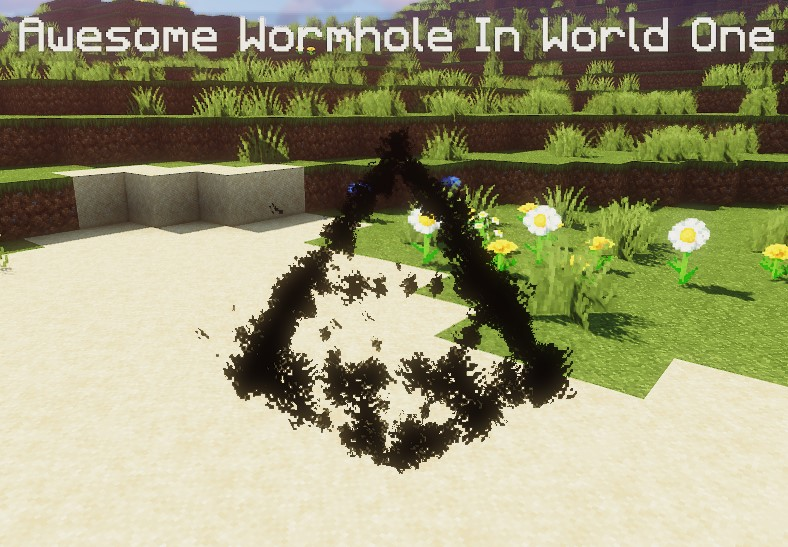
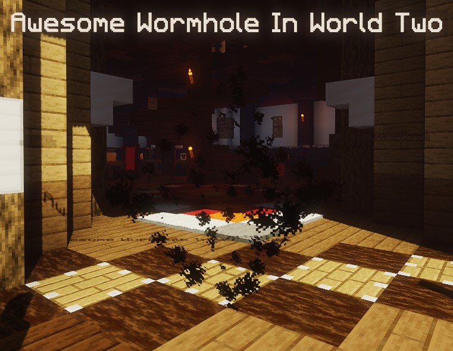
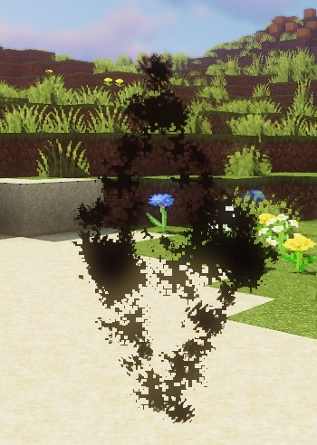
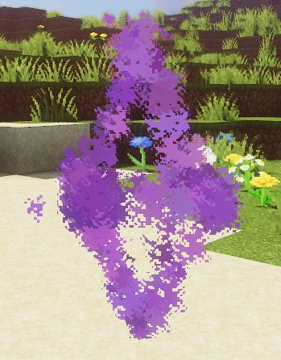
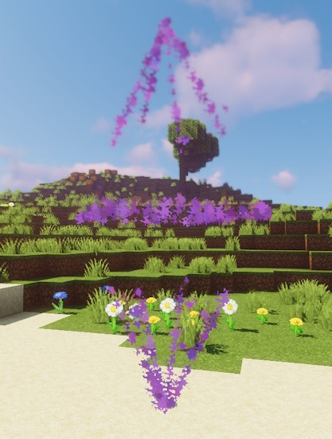

[](https://magmaguy.com/webapp/webapp.html)

# O que são Buracos de Minhoca?

Buracos de minhoca são um tipo de sistema de teletransporte portal-a-portal altamente eficiente. Os portais são marcados com efeitos visuais.

# Mecânicas dos Buracos de Minhoca

Os buracos de minhoca podem fazer o seguinte:

* Atravessar um portal para chegar ao portal de destino e ir do portal de destino de volta ao primeiro.
*   Reproduzir um som quando os jogadores os atravessam
*   Cegar temporariamente os jogadores enquanto os atravessam para suavizar a transição
* Empurrar os jogadores para fora para evitar que fiquem presos num ciclo de teletransporte
* Bloquear os jogadores do teletransporte por 5 segundos para evitar que fiquem presos num ciclo de teletransporte
*   Reproduzir efeitos visuais elaborados
*   Exigir permissões para usar o buraco de minhoca
*   Exigir o uso de moeda para usar o buraco de minhoca
* Notificar jogadores e administradores quando o portal de destino não está disponível

# Criar um Buraco de Minhoca

Os buracos de minhoca são adicionados como ficheiros de configuração à pasta dos buracos de minhoca. É possível criar
subpastas, e é recomendado fazê-lo se estiver a adicionar buracos de minhoca para masmorras específicas, sob o
formato \` ~/plugins/EliteMobs/wormholes/nomeDaMasmorra/nomeDaMasmorra\_identificador.yml\`.

### Ejeção

O *Yaw* e o *Pitch* (os dois últimos dígitos nas coordenadas) em `location1` e `location2` vão definir de onde os
jogadores serão ejetados do buraco de minhoca quando viajam por ele. Vejamos este exemplo:

`location1: meu_mundo,20,10,20,180,20`

Com o *Yaw* definido como `180`, o jogador seria ejetado virado para Norte, e com o *Pitch* definido como `20` também
seria ejetado ligeiramente para cima. Se quiser que o jogador permaneça no mesmo bloco que o buraco de minhoca ao ser
ejetado, então é uma boa ideia definir o *Pitch* como negativo para garantir que os jogadores não escorreguem do bloco.

## Configuração do Buraco de Minhoca

O seguinte é um exemplo de uma configuração válida de Buraco de Minhoca:

```yaml
isEnabled: true
location1: em_primis,1288.5,19,452.5,135,-23
location2: em_primis,1288.5,-39,451.5,180,-1
```

***

<div align="center">

### isEnabled

Define se o buraco de minhoca está ativado.

| Chave       |        Valores        | Padrão |
|-------------|:---------------------:|:------:|
| `isEnabled` | [Booleano](#booleano) | `true` |

<details> 

<summary><b>Exemplo</b></summary>

<div align="left">

```yml
isEnabled: true
```

</div>

</details>

***

### location1

Especifica a primeira localização para o buraco de minhoca.

| Chave       |      Valores      | Padrão |
|-------------|:-----------------:|:------:|
| `location1` | [String](#string) | nenhum |

<details> 

<summary><b>Exemplo</b></summary>

<div align="left">

```yml
location1: mundo_um,50,100,50,0,0
```

</div>

</details>

***

### location2

Especifica a segunda localização para o buraco de minhoca.

| Chave       |      Valores      | Padrão |
|-------------|:-----------------:|:------:|
| `location2` | [String](#string) | nenhum |

<details> 

<summary><b>Exemplo</b></summary>

<div align="left">

```yml
location2: mundo_dois,100,33,100,0,0
```

</div>

</details>

***

### location1Text

Define o texto de exibição da primeira localização.

| Chave           |      Valores      | Padrão |
|-----------------|:-----------------:|:------:|
| `location1Text` | [String](#string) | nenhum |

<details> 

<summary><b>Exemplo</b></summary>

<div align="left">

```yml
location1Text: Buraco de Minhoca Incrível no Mundo Um
```

<div align="center">



</div>

</div>

</details>

***

### location2Text

Define o texto de exibição da segunda localização.

| Chave           |      Valores      | Padrão |
|-----------------|:-----------------:|:------:|
| `location2Text` | [String](#string) | nenhum |

<details> 

<summary><b>Exemplo</b></summary>

<div align="left">

```yml
location2Text: Buraco de Minhoca Incrível no Mundo Dois
```

<div align="center">



</div>

</div>

</details>

***

### permission

Define a permissão necessária para usar o buraco de minhoca.

| Chave        |      Valores      | Padrão |
|--------------|:-----------------:|:------:|
| `permission` | [String](#string) | nenhum |

<details> 

<summary><b>Exemplo</b></summary>

<div align="left">

```yml
permission: elitemobs.minhapermissão
```

</div>

</details>

***

### coinCost

Define o custo, em moedas elite, para usar o buraco de minhoca.

| Chave      |      Valores      | Padrão |
|------------|:-----------------:|:------:|
| `coinCost` | [Double](#double) | nenhum |

<details> 

<summary><b>Exemplo</b></summary>

<div align="left">

```yml
coinCost: 2.5
```

</div>

</details>

***

### style

Define a forma visual do buraco de minhoca.

*As partículas que compõem estas formas podem causar lentidão em certos clientes. Para desligar as partículas, vá
a **Wormholes.yml** e defina `noParticlesMode` como `true`.*

| Chave   |                   Valores                   | Padrão |
|---------|:-------------------------------------------:|:------:|
| `style` | `NONE` / `CRYSTAL` / `ISOCAHEDRON` / `CUBE` | `CUBE` |

<details> 

<summary><b>Exemplo</b></summary>

<div align="left">

```yml
style: CRYSTAL
```

<div align="center">



</div>

</div>

</details>

***

### particleColor

Define a cor das partículas usadas na definição `style`.

| Chave           |                                              Valores                                              |   Padrão   |
|-----------------|:-------------------------------------------------------------------------------------------------:|:----------:|
| `particleColor` | [`0x` seguido por um código hexadecimal](https://www.w3schools.com/colors/colors_hexadecimal.asp) | `0x800080` |

<details> 

<summary><b>Exemplo</b></summary>

<div align="left">

```yml
particleColor: 0x9f5cdd
```

<div align="center">



</div>

</div>

</details>

***

### blindPlayer

Define se o portal cega o jogador para um teletransporte mais suave.

| Chave         |        Valores        | Padrão  |
|---------------|:---------------------:|:-------:|
| `blindPlayer` | [Booleano](#booleano) | `false` |

<details> 

<summary><b>Exemplo</b></summary>

<div align="left">

```yml
blindPlayer: true
```

<div align="center">


</div>

</div>

</details>

***

### sizeMultiplier

Multiplica o tamanho do portal e a forma definida por `style`.

| Chave            |             Valores             | Padrão |
|------------------|:-------------------------------:|:------:|
| `sizeMultiplier` | [Multiplicador](#multiplicador) |  `1`   |

<details> 

<summary><b>Exemplo</b></summary>

<div align="left">

```yml
sizeMultiplier: 3
```

*Tenha em mente que terá de ajustar as coordenadas Y do buraco de minhoca após aplicar o multiplicador de tamanho.*

<div align="center">



</div>

</div>

</details>

</div>

***

<details>

<summary align="center"><b>Exemplo de Configuração de Buraco de Minhoca</b></summary>

<div align="left">

Neste exemplo, vamos criar um buraco de minhoca simples que nos leva de um mundo para outro. Não se esqueça que os
buracos de minhoca também podem apenas teletransportar jogadores para um local diferente no mesmo mundo.

```yml
isEnabled: true #Ativamos o verme definindo este valor como verdadeiro
location1: meu_mundo,1.5,11.0,1.5,108.0,5.0 #é aqui que o buraco de minhoca irá aparecer em meu_mundo
location2: meu_outro_mundo,766.5,29.0,517.5,-136.0,5.0 #é aqui que o buraco de minhoca irá aparecer em meu_outro_mundo
location1Text: "&aIr para o Meu Mundo" #cria um texto de exibição agradável acima da localização1 do buraco de minhoca
location2Text: "&aIr para o Meu Outro Mundo" #cria um texto de exibição agradável acima da localização2 do buraco de minhoca
permission: eliteperm.jogadoreslegais #apenas os jogadores com esta permissão poderão usar o buraco de minhoca, tanto para a localização1 como para a localização2
coinCost: 2 #os jogadores terão de pagar 12 moedas elite para poderem usar o buraco de minhoca
style: CRYSTAL #este buraco de minhoca terá a forma de um cristal
particleColor: 0x00ff00 #isto irá definir as partículas do buraco de minhoca como verdes
blindPlayer: true #o teletransporte do buraco de minhoca irá cegar o jogador durante um curto período de tempo para tornar a transição menos chocante
sizeMultiplier: 1.0 #define o tamanho da forma do buraco de minhoca
```

</div>

</details>

#### Problemas de Desempenho

As partículas do buraco de minhoca podem causar problemas de desempenho do cliente para jogadores que estão a executar o
*bedrock*. Se quiser desligar as partículas do buraco de minhoca, pode ir para `~plugins\EliteMobs\Wormholes.yml` e
alterar a definição `noParticlesMode` para `true`.
