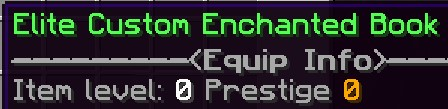
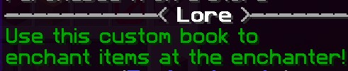
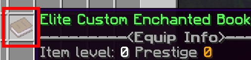
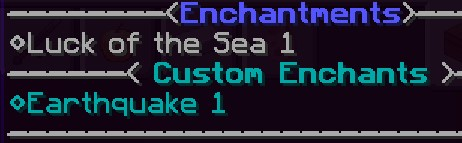

# Sistema de Itens do EliteMobs

A partir do EliteMobs 7.3.0, os jogadores podem interagir com Itens Elite de várias maneiras exclusivas. Esta página destina-se a ajudar jogadores e administradores a entender como os sistemas funcionam e, posteriormente, explicar o equilíbrio do sistema para os administradores.


***

# Desvinculando Itens

Se você tiver um pergaminho de desvinculação de itens, poderá usar o NPC Desvinculador para combinar 1 pergaminho com 1 item para desvinculá-lo.

***Observação: no momento da escrita deste artigo, não há como os jogadores obterem o pergaminho sem que ele seja dado a eles ou adicionado a um chefe específico. O pergaminho será deixado cair da luta contra o Dragão Ender, que será lançada este mês.***

O pergaminho só pode ser usado uma vez. Uma vez desvinculado, os itens podem ser vendidos ou dados a outros jogadores, ou podem ser usados após um prestígio.

***

# Descartando Itens

Itens Elite podem ser descartados no NPC Descartador. Ao descartar itens, dependendo do nível do item, você receberá o seguinte sucata:

- Nível 0-50: Sucata Pequena.
- Nível 50-100: Sucata Média.
- Nível 100-150: Sucata Grande.
- Nível 150-200: Sucata Enorme.

A sucata é a base para o resto do Sistema de Itens.

***

# Reparando Itens Elite

Itens Elite podem ser reparados no NPC Reparador usando sucata. A extensão do dano ao seu item determina a quantidade e o tamanho da sucata necessária para consertá-lo.

***

# Encantando Itens Elite

Antes de prosseguirmos com a descrição de como encantar itens, é aconselhável familiarizar-se com os itens necessários para encantar e entender suas funções.

**Item Elite**
</br>Um item elite abrange qualquer loot disponível nas lojas do EliteMobs, deixado cair por Mobs Elite, ou recebido como recompensa por concluir uma missão, entre outras fontes.

**Livros Encantados**
</br>Os livros encantados geralmente são deixados cair por Mobs Elite ou concedidos aos jogadores como recompensas em Arenas ou Missões. Eles contêm encantamentos que os jogadores podem transferir para os itens desejados.

**Bilhetes da Sorte**
</br>Os bilhetes da sorte, geralmente obtidos de Mobs Elite ou como recompensas em Arenas ou Missões, permitem que os jogadores dobrem suas chances de sucesso ao encantar itens.

Os jogadores podem acessar o menu de encantamento visitando o NPC Encantador na [Guilda de Aventureiros]($language$/elitemobs/adventurers_guild_world.md) ou usando o menu `/em`.
 
Com um Item Elite e um Livro Encantado, os jogadores podem tentar adicionar o encantamento armazenado no livro ao seu item. Cada tentativa custará aos jogadores algumas Moedas Elite. Eles também podem dobrar suas chances usando um Bilhete da Sorte, se tiverem um.

Para começar o encantamento, os jogadores colocariam um Item Elite, um Livro Encantado e um Bilhete da Sorte (se tiverem um) na janela de Encantamento e, em seguida, tentariam encantar seu item. Depois disso, eles seriam recebidos com um dos seguintes resultados: 

- **Sucesso:** O encantamento é adicionado com sucesso ao item.
- **Falha:** Tentativa malsucedida, resultando na perda do Livro Encantado e das Moedas Elite.
- **Falha Crítica:** Uma falha mais grave, levando à perda do Livro Encantado, Moedas Elite e do próprio Item Elite.
- **Desafio:** Enfrente uma Batalha de Chefe com 10% de chance de falha crítica ao perder. O item é encantado se os jogadores vencerem.

<details>

<summary><b>Exemplo Visual</b></summary>

<div align="center">

<video autoplay loop muted>
  <source src="../../../img/wiki/enchant_example.webm" type="video/webm">
  Your browser does not support the video tag.
</video>

</div>

</details>

***

<details>
  <summary>Vídeo do MagmaGuy explicando alguns dos sistemas.</summary>

  <div style="text-align: center;">
    <iframe width="560" height="315" src="https://www.youtube.com/embed/MtfeS6fq0Pw" frameborder="0" allowfullscreen></iframe>
  </div>

</details>

## Crie seus próprios Livros Encantados

Aqui está um breve guia que explica como você pode criar seus próprios Livros Encantados.

<div align="center">

***

### isEnabled

Define se o item está habilitado.

| Chave         |      Valores       | Padrão |
|-------------|:-----------------:|:-------:|
| `isEnabled` | [Booleano](#boolean) | `true`  |

<details> 

<summary><b>Exemplo</b></summary>

<div align="left">

```yml
isEnabled: true
```

</div>

</details>

***

### name

Define o nome do item. Suporta [Códigos de Cor](#color_codes).

| Chave         |      Valores       | Padrão |
|-------------|:-----------------:|:-------:|
| `name` | [String](#string) |  nenhum   |

<details> 

<summary><b>Exemplo</b></summary>

<div align="left">

```yml
name: '&aElite Custom Enchanted Book'
```

<div align="center">



</div>

</div>

</details>

***

### lore

Define a descrição do item. Suporta [Códigos de Cor](#color_codes).

| Chave         |           Valores            | Padrão |
|-------------|:---------------------------:|:-------:|
| `lore` | [Lista de Strings](#string_list) |  nenhum   |

<details> 

<summary><b>Exemplo</b></summary>

<div align="left">

```yml
lore:
- '&2Use this custom book to'
- '&2enchant items at the enchanter!'
```

<div align="center">



</div>

</div>

</details>

***

### material

Define qual material do MineCraft o item deve ser.

| Chave         |      Valores       | Padrão |
|-------------|:-----------------:|:-------:|
| `material` | [Material](#material) | `BOOK`  |

<details> 

<summary><b>Exemplo</b></summary>

<div align="left">

```yml
material: BOOK
```

<div align="center">



</div>

</div>

</details>

***

### enchantments

Define quais encantamentos o item deve conter.

| Chave         |    Valores    | Padrão |
|-------------|:------------:|:-------:|
| `enchantments` | [Encantamentos do MineCraft](https://hub.spigotmc.org/javadocs/spigot/org/bukkit/enchantments/Enchantment.html) ou [Encantamentos do EliteMobs]($language$/elitemobs/custom_enchantments_list.md) |  nenhum   |

<details> 

<summary><b>Exemplo</b></summary>

<div align="left">

```yml
enchantments:
- EARTHQUAKE,1
- LUCK,1
```

<div align="center">



</div>

</div>

</details>

***

### itemType

Define de onde você pode obter o item. Você pode definir isso como `custom` se quiser que seu livro seja deixado cair por elites aleatórias e vendido em lojas. 

Caso contrário, você pode defini-lo como `unique` para que ele só caia de tabelas de loot configuradas.

| Chave         |    Valores    | Padrão |
|-------------|:------------:|:-------:|
| `itemType` | [Valores]($language$/elitemobs/creating_items.md&section=itemtype) |  nenhum   |

<details> 

<summary><b>Exemplo</b></summary>

<div align="left">

```yml
itemType: custom
```

</div>

</details>

***

### soulbound

Define se eles podem ser negociados com outros jogadores.

| Chave         |    Valores    | Padrão |
|-------------|:------------:|:-------:|
| `soulbound` | [Booleano](#boolean) | `true`  |

<details> 

<summary><b>Exemplo</b></summary>

<div align="left">

```yml
soulbound: true
```

</div>

</details>

</div>

## Exemplo de Livro Encantado

<div align="center">

<details> 

<summary><b>Exemplo de Configuração do Livro Encantado</b></summary>

<div align="left">

```yml
isEnabled: true
material: BOOK
name: '&5Excellent Mining Enchanted Book'
lore:
- '&2Used to enchant items at the enchanter!'
enchantments:
- MENDING,1
- DRILLING,1
itemType: UNIQUE
soulbound: false
```

Como você pode ver, criar seus Livros Encantados não é tão complicado. A maioria das configurações são configurações regulares que você usaria ao criar um [item]($language$/elitemobs/creating_items.md).

Exceto que, é claro, nosso foco principal seria a seção `enchantments`. Nosso livro de exemplo possui um encantamento do MineCraft `MENDING` e um encantamento do EliteMobs `DRILLING`.

Isso faria com que nosso livro de exemplo fosse um livro excelente que você gostaria de usar em uma picareta.

</div>

</details>

</div>

