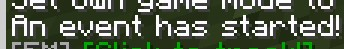
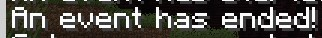
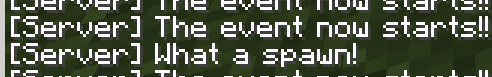
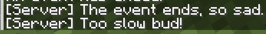

[](https://magmaguy.com/webapp/webapp.html)

Это руководство предназначено для EliteMobs 7.3.4 и более поздних версий.

# Что такое Пользовательские События?

Под Пользовательскими Событиями здесь подразумеваются события, которые происходят случайным образом в игре, будь то на основе действий игрока или по таймеру. Плагин поставляется с предустановленным набором Пользовательских Событий, таких как событие с Балрогом, событие с Кракеном и события с Сокровищами Гоблинов, и это лишь некоторые из них.

Эта система называется **Пользовательскими** Событиями, потому что события можно не только настраивать, но и создавать с нуля. Далее следует руководство по созданию и настройке ваших собственных событий.

# Общие настройки конфигурации

<div align="center">

Следующие настройки могут/должны использоваться как для событий, основанных на действиях, так и для событий по таймеру.

***

### isEnabled

Включает или отключает событие.

| Ключ        |       Значения        | По умолчанию |
|-------------|:-------------------:|:------------:|
| `isEnabled` | [Булево](#boolean)  |    `true`    |

<details>

<summary><b>Пример</b></summary>

<div align="left">

```yml
isEnabled: true
```

</div>

</details>

***

### eventType

Устанавливает тип события.

| Ключ        |       Значения        | По умолчанию |
|-------------|:-------------------:|:------------:|
| `eventType` | `BREAK_BLOCK` / `FISH` / `TILL_SOIL` / `TIMED` |     нет      |

*Обратите внимание, что `BREAK_BLOCK`, `FISH` и `TILL_SOIL` являются [Событиями по Действию](#action-events), а `TIMED` — [Событиями по Таймеру](#timed-events)*

<details>

<summary><b>Пример</b></summary>

<div align="left">

```yml
eventType: BREAK_BLOCK
```

</div>

</details>

***

### bossFilenames

Устанавливает список файлов боссов, которые будут призваны. **Обязательно!**

| Ключ          |       Значения        | По умолчанию |
|---------------|:-------------------:|:------------:|
| `bossFilenames` | [Список строк](#string_list) |     нет      |

<details>

<summary><b>Пример</b></summary>

<div align="left">

```yml
bossFilenames:
- balrog.yml
- my_event_boss.yml
```

</div>

</details>

***

### announcementPriority

Устанавливает [приоритет объявления](ru/elitemobs/creating_bosses.md&section=announcementpriority).

| Ключ               |       Значения        | По умолчанию |
|--------------------|:-------------------:|:------------:|
| `announcementPriority` | [Целое число](#integer) |     нет      |

<details>

<summary><b>Пример</b></summary>

<div align="left">

```yml
announcementPriority: 1
```

</div>

</details>

***

### startMessage

Устанавливает сообщение, отправляемое в начале события.

| Ключ         |       Значения        | По умолчанию |
|--------------|:-------------------:|:------------:|
| `startMessage` |    [Строка](#string)    |     нет      |

<details>

<summary><b>Пример</b></summary>

<div align="left">

```yml
startMessage: An event has started!
```

<div align="center">



</div>

</div>

</details>

***

### endMessage

Устанавливает сообщение, отправляемое в конце события.

| Ключ       |       Значения        | По умолчанию |
|------------|:-------------------:|:------------:|
| `endMessage` |    [Строка](#string)    |     нет      |

<details>

<summary><b>Пример</b></summary>

<div align="left">

```yml
endMessage: An event has ended!
```

<div align="center">



</div>

</div>

</details>

***

### eventStartCommands

Устанавливает команды, которые выполняются в начале события.

| Ключ               |       Значения        | По умолчанию |
|--------------------|:-------------------:|:------------:|
| `eventStartCommands` | [Список строк](#string_list) |     нет      |

<details>

<summary><b>Пример</b></summary>

<div align="left">

```yml
eventStartCommands:
- say The event now starts!!
- "$chance=0.5$ say What a spawn!"
```

<div align="center">



</div>

</div>

</details>

***

### eventEndCommands

Устанавливает команды, которые выполняются в конце события.

| Ключ             |       Значения        | По умолчанию |
|------------------|:-------------------:|:------------:|
| `eventEndCommands` | [Список строк](#string_list) |     нет      |

<details>

<summary><b>Пример</b></summary>

<div align="left">

```yml
eventEndCommands:
- say The event ends, so sad.
- "$chance=0.5$ say Too slow bud!"
```

<div align="center">



</div>

</div>

</details>

</div>

***

<details>

<summary align="center"><b>Пример конфигурации события</b></summary>

<div align="left">

```yml
isEnabled: true
bossFilenames:
- "cool_boss.yml"
- "other_cool_boss.yml"
announcementPriority: 3
startMessage: "Cool event is starting!"
endMessage: "Cool event is ending!"
eventStartCommands:
- say The event started!
eventEndCommands:
- say The event ended!
```

</div>

</details>


</div>

## События по Действию

<div align="center">

События, которые имеют шанс произойти при выполнении определенного действия, такого как разрушение блока или рыбалка.

### chance

Устанавливает шанс срабатывания события при выполнении действия.

| Ключ     |       Значения        | По умолчанию |
|----------|:-------------------:|:------------:|
| `chance` | Значение между `0.0` и `1.0` |     `0`      |

<details>

<summary><b>Пример</b></summary>

<div align="left">

```yml
chance: 0.001
```

</div>

</details>

***

### breakableMaterials

Устанавливает список материалов для проверки, если действие установлено как `BREAK_BLOCK`.

| Ключ               |       Значения        | По умолчанию |
|--------------------|:-------------------:|:------------:|
| `breakableMaterials` | Список [материалов](https://hub.spigotmc.org/javadocs/spigot/org/bukkit/Material.html) |     нет      |

<details>

<summary><b>Пример</b></summary>

<div align="left">

```yml
breakableMaterials:
- BEEHIVE
- BIRCH_WOOD
```

</div>

</details>

</div>

***

<details>

<summary align="center"><b>Пример конфигурации</b></summary>

<div align="left">

```yml
chance: 0.001
breakableMaterials:
- COAL_ORE
```

</div>

Устанавливает шанс 0.1% на запуск события при разрушении блока угольной руды, при условии, что тип события — `BREAK_BLOCK`.

</details>

</div>

## События по Таймеру

<div align="center">

События по Таймеру — это события, которые происходят через настраиваемые временные интервалы. Как только кулдаун для события по таймеру истекает, из списка событий по таймеру выбирается случайное событие на основе его веса.

### spawnType

Устанавливает [Пользовательское Место Призыва](ru/elitemobs/creating_spawns.md), используемое событием, которое определяет, где может появиться босс.

| Ключ      |        Значения         | По умолчанию |
|-----------|:---------------------:|:------------:|
| `spawnType` | [Имя файла](#filename) |     нет      |

<details>

<summary><b>Пример</b></summary>

<div align="left">

```yml
spawnType: nether_spawn.yml
```

</div>

</details>

***

### localCooldown

Устанавливает количество времени в минутах, прежде чем это событие сможет быть выбрано снова.

| Ключ          |        Значения         | По умолчанию |
|---------------|:---------------------:|:------------:|
| `localCooldown` | [Целое число](#integer) |     `0`      |

<details>

<summary><b>Пример</b></summary>

<div align="left">

```yml
localCooldown: 120
```

</div>

</details>

***

### globalCooldown

Устанавливает количество времени в минутах, прежде чем будет выбрано следующее событие.

| Ключ           |        Значения         | По умолчанию |
|----------------|:---------------------:|:------------:|
| `globalCooldown` | [Целое число](#integer) |     `0`      |

<details>

<summary><b>Пример</b></summary>

<div align="left">

```yml
globalCooldown: 60
```

</div>

</details>

***

### weight

Устанавливает вес события, влияющий на шанс его выбора по сравнению с другими событиями. **Рекомендуется: 100**.

| Ключ   |        Значения         | По умолчанию |
|--------|:---------------------:|:------------:|
| `weight` | [Двойное число](#double) |     `0`      |

<details>

<summary><b>Пример</b></summary>

<div align="left">

```yml
weight: 60.5
```

</div>

</details>

***

### eventDuration

Устанавливает максимальную продолжительность события в минутах.

| Ключ          |        Значения         | По умолчанию |
|---------------|:---------------------:|:------------:|
| `eventDuration` | [Целое число](#integer) |     `0`      |

<details>

<summary><b>Пример</b></summary>

<div align="left">

```yml
eventDuration: 30
```

</div>

</details>

***

### eventEndsWithBossDeath

Устанавливает, завершается ли событие смертью босса.

| Ключ                     |       Значения        | По умолчанию |
|--------------------------|:-------------------:|:------------:|
| `eventEndsWithBossDeath` | [Булево](#boolean)  |    `true`    |

<details>

<summary><b>Пример</b></summary>

<div align="left">

```yml
eventEndsWithBossDeath: true
```

</div>

</details>

***

### eventEndTime

Устанавливает внутриигровое время, в которое событие завершится.

| Ключ         |       Значения        | По умолчанию |
|--------------|:-------------------:|:------------:|
| `eventEndTime` | [Булево](#boolean)  |    `true`    |

<details>

<summary><b>Пример</b></summary>

<div align="left">

```yml
eventEndTime: true
```

</div>

</details>

***

### minimumPlayerCount

Устанавливает минимальное количество онлайн-игроков, прежде чем событие начнется.

| Ключ               |       Значения        | По умолчанию |
|--------------------|:-------------------:|:------------:|
| `minimumPlayerCount` | [Целое число](#integer) |     `1`      |

<details>

<summary><b>Пример</b></summary>

<div align="left">

```yml
minimumPlayerCount: true
```

</div>

</details>

</div>

***

*Обратите внимание, что события ставятся в очередь, то есть они начнутся только после выполнения условий, определенных в `customSpawn`.*

<details>

<summary align="center"><b>Пример конфигурации событий</b></summary>

<div align="left">

```yml
isEnabled: true
bossFilenames:
- "cool_boss.yml"
- "other_cool_boss.yml"
announcementPriority: 3
startMessage: "Cool event is starting!"
endMessage: "Cool event is ending!"
eventStartCommands:
- say The event started!
eventEndCommands:
- say The event ended!
customSpawn: "myCoolSpawn.yml"
localCooldown: 30
globalCooldown: 15
weight: 100
eventDuration: 20
eventEndsWithBossDeath: true
eventEndTime: 10000
minimumPlayerCount: 5
```

</div>

</details>

</div>