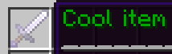
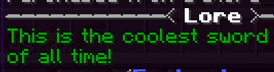
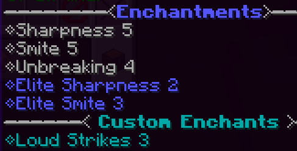
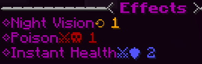

[](https://magmaguy.com/webapp/webapp.html)

# Создание пользовательских предметов

## Что такое пользовательские предметы?

Пользовательские предметы - это предметы, определяемые EliteMobs через файлы конфигурации. Вы можете настроить несколько
аспектов этих предметов, таких как уровень предмета, чары, название, описание, текстуру и многое другое!

## Веб-приложение

Вы можете легко и быстро создать пользовательский лут [здесь](https://magmaguy.com/webapp/webapp.html)!

## Перед началом

### Где хранятся пользовательские предметы?

Файлы пользовательских предметов помещаются в папку конфигурации `~/plugins/EliteMobs/customitems`.

Можно создавать подпапки, например `~/plugins/EliteMobs/customitems/myitems`. Это рекомендуется для поддержания порядка.

Файлы хранятся в формате `.yml`, а [Notepad++](https://notepad-plus-plus.org/) является рекомендуемым программным
обеспечением для редактирования файлов конфигурации. Один файл определяет одного босса, хотя можно несколько раз вызвать
одного и того же босса и даже установить несколько мест появления для одного и того же файла босса.

Можно использовать [веб-приложение](https://magmaguy.com/webapp/webapp.html) для быстрого и легкого создания пользовательских боссов и многого другого.

<div align="center">

### Минимальная возможная конфигурация

**Обратите внимание, что минимальным файлом конфигурации для пользовательского предмета является:**

```yml
```

Обратите внимание, что это просто пустой файл. По умолчанию будет использоваться деревянный меч с названием "Название по
умолчанию". **Все на этой странице является необязательным!**

### Пример предмета

Давайте посмотрим на пример того, как выглядит файл предмета.

<details> 
<summary><b>Пример</b></summary>

<div align="left">

```yml
isEnabled: true
material: WOODEN_AXE
name: '&4Тестовый предмет'
lore:
- Это крутой предмет
- У него крутое описание
enchantments:
- DAMAGE_ALL,4
- FLAMETHROWER,1
potionEffects:
- FAST_DIGGING,0,self,onHit
- POISON,0,target,onHit
- GLOWING,0,self,continuous
dropWeight: dynamic
scalability: scalable
itemType: custom
```

</div>

</details>

</div>

## Настройки пользовательского предмета

Ниже приведен список всего, что вы можете настроить для пользовательских предметов:

<div align="center">

***

### isEnabled

Определяет, включен ли предмет. Не влияет на уже сгенерированные предметы.

| Ключ | Значения | По умолчанию |
|---|---|---|
| `isEnabled` | `true` / `false` | `true` |

<details> 

<summary><b>Пример</b></summary>

<div align="left">

```yml
isEnabled: true
```

</div>

</details>

***

### material

Устанавливает материал предмета.

| Ключ | Значения | По умолчанию |
|---|---|---|
| `material` | [Выберите из этого списка!](https://hub.spigotmc.org/javadocs/spigot/org/bukkit/Material.html) | `WOODEN_SWORD` |

<details> 

<summary><b>Пример</b></summary>

<div align="left">

```yml
material: DIAMOND_SWORD
```

</div>

</details>


***

### level

Устанавливает уровень предмета.

| Ключ | Значения | По умолчанию |
|---|---|---|
| `level` | [Целое число](#integer) | `0` |

Обратите внимание, что эта настройка не имеет значения, если вы установите для предмета [`scalability`](#scalability)
значение `scalable`. Если вы установите для нее значение `limited`, это будет максимально возможный уровень предмета.

Кроме того, материалы имеют минимальный уровень. Железные материалы имеют уровень 6, алмазные материалы - уровень 7. Вы
не можете заставить предметы быть уровнем ниже, чем уровень материала.

<details> 

<summary><b>Пример</b></summary>

<div align="left">

```yml
level: 100
```

</div>

</details>


***

### name

Устанавливает отображаемое имя предмета.

| Ключ       | Значения                                          | По умолчанию            |
|------------|---------------------------------------------------|-------------------------|
| `material` | [Строка](#string) с [кодами цветов](#color-codes) | "Название по умолчанию" |

<details> 

<summary><b>Пример</b></summary>

<div align="left">

```yml
name: "&2Крутой предмет"
```

<div align="center">



</div>

</div>

</details>

***

### lore

Устанавливает описание предмета.

| Ключ   | Значения                                        | По умолчанию |
|--------|-------------------------------------------------|--------------|
| `lore` | [Список](#list) с [кодами цветов](#color-codes) | нет          |

<details> 

<summary><b>Пример</b></summary>

<div align="left">

```yml
lore:
- "&2Это самый крутой меч"
- "&2всех времен!"
```

<div align="center">



</div>

</div>

</details>

***

### enchantments

Устанавливает чары на предмет.

| Ключ           |                                                                                                      Значения                                                                                                      | По умолчанию |
|----------------|:------------------------------------------------------------------------------------------------------------------------------------------------------------------------------------------------------------------:|--------------|
| `enchantments` | [Список](#list) с [чарами Minecraft](https://hub.spigotmc.org/javadocs/spigot/org/bukkit/enchantments/Enchantment.html) или [пользовательскими чарами EliteMobs]($language$/elitemobs/custom_enchantments_list.md) | нет          |

Обратите внимание, что эти записи соответствуют формату `названиеЧары:уровеньЧар`. Посмотрите пример ниже!

<details>

<summary><b>Пример</b></summary>

<div align="left">

```yml
enchantments: 
- "DAMAGE_UNDEAD,8"
- "DURABILITY,4"
- "DAMAGE_ALL,7"
- "LOUD_STRIKES,3"
```

<div align="center">



</div>

</div>

</details>

Также обратите внимание, что такие чары, как острота, по умолчанию становятся элитными, если уровень начинает превышать
ограничения Minecraft.

***

### potionEffects

Устанавливает эффекты зелий, которые будут иметь предмет. Они могут быть применены к игроку или к сущности, поврежденной
игроком.

| Ключ | Значения | По умолчанию |
|---|---|---|
| `potionEffects` | [Список](#list) с [эффектами зелий Minecraft](https://hub.spigotmc.org/javadocs/spigot/org/bukkit/potion/PotionEffectType.html)| нет |

Кроме того, эффекты зелий используют определенный формат, который позволяет администраторам выбирать, кто подвергается
воздействию и когда:

| Настройка             | Описание                                                                      | Значения                                                          | По умолчанию |
|-----------------------|-------------------------------------------------------------------------------|-------------------------------------------------------------------|--------------|
| Уровень эффекта зелья | Устанавливает уровень эффекта зелья. **Эффекты зелья начинаются с уровня 0**! | [Целое число](#integer)                                           | нет          |
| Затронутая сущность   | Определяет, кто подвергается воздействию эффекта зелья.                       | `self` (игрок) / `target` (сущность, по которой был нанесен удар) | нет          |
| Метод применения      | Устанавливает, когда применяется эффект зелья.                                | `onHit` / `continuous` (постоянно применяется)                    | нет          |

Формат для эффектов зелий: `названиеЭффектаЗелья,уровеньЭффектаЗелья,затронутаяСущность,методПрименения`. Посмотрите
пример ниже!

EliteMobs также предлагает пользовательские предметы, которые функционируют как талисманы. Эти предметы не делают
ничего, кроме как дают эффекты зелья игроку, когда предмет находится в руках или экипирован в слот.

ВНИМАНИЕ: Использование эффекта зелья МГНОВЕННЫЙ УРОН будет исцелять нежить при ударе, так как это стандартная механика
в ванильном Minecraft.

<details>

<summary><b>Пример</b></summary>

<div align="left">

```yml
potionEffects: 
- "POISON,0,target,onHit"
- "HEAL,1,self,onHit"
- "NIGHT_VISION,0,self,continuous"
```

<div align="center">



</div>

</div>

При этом наборе эффектов зелья произойдет следующее:

При ударе эффект зелья яда (уровень 1) будет применен к сущности, по которой ударил игрок. Кроме того, на игрока
подействует эффект зелья мгновенного исцеления 2-го уровня.

Постоянно игроку будет дано ночное видение. Это означает, что у игрока будет ночное видение до тех пор, пока он носит
или держит предмет.

</details>

***

### scalability

Устанавливает, как уровень предмета увеличивается с уровнем босса, который его выпадает.

| Ключ          | Значения                                            | По умолчанию |
|---------------|-----------------------------------------------------|--------------|
| `scalability` | `fixed`, `limited` или `scalable`. Посмотрите ниже! | scalable     |

Ознакомьтесь с этим списком, чтобы понять, что делают разные параметры!

| Настройка  | Описание                                                                                                                                                |
|------------|---------------------------------------------------------------------------------------------------------------------------------------------------------|
| `fixed`    | Уровень предмета всегда будет равен уровню, установленному в файле конфигурации.                                                                        |
| `limited`  | Максимальный уровень предмета будет ограничен уровнем, установленным в файле конфигурации, или уровнем босса, в зависимости от того, какой из них ниже. |
| `scalable` | Уровень предмета будет полностью зависеть от уровня босса, который его выпадает.                                                                        |

Обратите внимание, что предметы с `dropWeight` всегда будут иметь `fixed` scalability.

<details>

<summary><b>Пример</b></summary>

<div align="left">

```yml
scalability: "scalable"
```

</div>

</details>

***

### itemType

Устанавливает, где вы можете получить предмет.

| Ключ       | Значения                                | По умолчанию |
|------------|-----------------------------------------|--------------|
| `itemType` | `custom` или `unique`. Посмотрите ниже! | `custom`     |

Есть два типа предметов:

| Настройка | Описание                                                                                                                                                                                                    |
|-----------|-------------------------------------------------------------------------------------------------------------------------------------------------------------------------------------------------------------|
| `custom`  | Предмет сможет выпасть из любого моба EliteMobs, способного выпадать добычу, и будет в пользовательском магазине.                                                                                           |
| `unique`  | Предмет не будет выпадать ни с одного босса и не будет в пользовательском магазине. Единственный способ получить его - настроить Пользовательского босса так, чтобы он выпадал через его `uniqueLootTable`! |

<details>

<summary><b>Пример</b></summary>

<div align="left">

```yml
itemType: "unique"
```

</div>

</details>

***

### dropWeight

Устанавливает таблицу добычи, в которую помещается предмет.

| Ключ         |                 Значения                  | По умолчанию |
|--------------|:-----------------------------------------:|--------------|
| `dropWeight` | `dynamic` или значение [Double](#double). | `dynamic`    |

У EliteMobs есть 5 различных таблиц добычи для пользовательских предметов, за исключением тех, которые настроены
непосредственно, как `uniqueLootList` у Пользовательских боссов.

Вот они:

| Таблица добычи                      | Описание                                                                      | Вес по умолчанию |
|-------------------------------------|-------------------------------------------------------------------------------|------------------|
| Процедурно сгенерированные предметы | Предметы, которые случайно генерируются на основе файлов конфигурации сервера | `90.0`           |
| Предметы с весом                    | Предметы, вес которых отличается от `dynamic`                                 | `1.0`            |
| Фиксированные предметы              | Предметы с фиксированной масштабируемостью                                    | `10.0`           |
| Ограниченные предметы               | Предметы с ограниченной масштабируемостью                                     | `3.0`            |
| Масштабируемые предметы             | Предметы, которые масштабируются                                              | `6.0`            |

Когда босс умирает, один предмет из этих таблиц выбирается на основе файла конфигурации ItemSettings.yml. Значения по
умолчанию для весов указаны выше в разделе `Вес по умолчанию`. Чем выше вес, тем больше вероятность выпадения предмета.

`Предметы с весом` имеют небольшой `Вес по умолчанию`, что означает, что они не будут выпадать очень часто. Предметы
с `dropWeight`, отличным от `dynamic`, предназначены для редкости и используются только в настройках по умолчанию для
талисманов, которые выпадают у боссов - предметов, которые используются не непосредственно для боя, а для усиления
игроков с помощью эффектов зелий.

Значение `dropWeight`, которое вы здесь устанавливаете, определяет вероятность выпадения
определенного `Предмета с весом` из списка `Предметов с весом`. Это не увеличивает вероятность
выпадения `Предметов с весом`.

**Если вы запутались и просто хотите создавать оружие и броню, пропустите эту настройку, так как по умолчанию она имеет
значение `dynamic`.**

`Предметы с весом` обычно имеют вес 1,0.

<details>

<summary><b>Пример</b></summary>

<div align="left">

```yml
dropWeight: "dynamic"
```

</div>

</details>


***

### customModelID

Устанавливает текстуру предмета. Требуется использование допустимой текстуры из пакета ресурсов!

| Ключ | Значения | По умолчанию |
|---|---|---|
| `customModelID` | [Целое число](#integer) | нет |

<details>

<summary><b>Пример</b></summary>

<div align="left">

```yml
material: DIAMOND_SWORD
customModelID: 1
```

</div>

Это будет использовать пользовательскую текстуру 1 алмазных мечей из пакета ресурсов, который использует игрок.
Рекомендуется настроить ваш сервер так, чтобы он выдавал игрокам пакеты ресурсов при входе в систему, если вы хотите
правильно использовать эту функцию.

</details>

***

### customModelV2

Начиная с версии Minecraft 1.21.4 (EM 9.1.13), это новая обязательная настройка для настройки пользовательских идентификаторов моделей предметов.
Устанавливает текстуру предмета. Требуется использование допустимой текстуры из пакета ресурсов!

| Ключ | Значения | По умолчанию |
|---|---|---|
| `customModelV2` | [Строка](#string) | нет |

<details>

<summary><b>Пример</b></summary>

<div align="left">

```yml
customModelV2: elitemobs:equipment/magmaguys_toothpick
```

Эта настройка присваивает определенную текстуру предмету. Вот как это работает:

- `elitemobs:` - это основной каталог в папке `assets` пакета ресурсов.
- `equipment` - это подкаталог внутри `assets/elitemobs/models`.
- `magmaguys_toothpick` - это файл модели, расположенный в `assets/elitemobs/models/equipment` в пакете ресурсов.

Полный путь к файлу модели в этом примере будет:
`\.minecraft\resourcepacks\elitemobs_resource_pack\assets\elitemobs\models\equipment\magmaguys_toothpick.json`

</div>

Это будет использовать пользовательскую текстуру `magmaguys_toothpick` из пакета ресурсов EliteMobs, который использует
игрок. Рекомендуется настроить ваш сервер так, чтобы он выдавал игрокам пакеты ресурсов при входе в систему, если вы
хотите правильно использовать эту функцию.

</details>

***

### permission

Устанавливает разрешение, необходимое для получения предмета.

| Ключ | Значения | По умолчанию |
|---|---|---|
| `permission` | [Строка](#string) | нет |

Вам понадобится плагин управления разрешениями, чтобы давать игрокам разрешения. Это будет работать правильно только в
том случае, если вы не отключили чары привязки души.

<details>

<summary><b>Пример</b></summary>

<div align="left">

```yml
permission: "elitemobs.cool.permission"
```

</div>

При такой настройке только игроки с разрешением `elitemobs.cool.permission` смогут получить этот предмет.

</details>

***

### soulbound

Устанавливает, должен ли предмет быть привязан к душе при выпадении.

| Ключ |       Значения        | По умолчанию |
|---|:-------------------:|---------|
| `soulbound` | [Логическое значение](#boolean) | `true`  |

<details>

<summary><b>Пример</b></summary>

<div align="left">

```yml
soulbound: true
```

</div>

</details>


</div>
