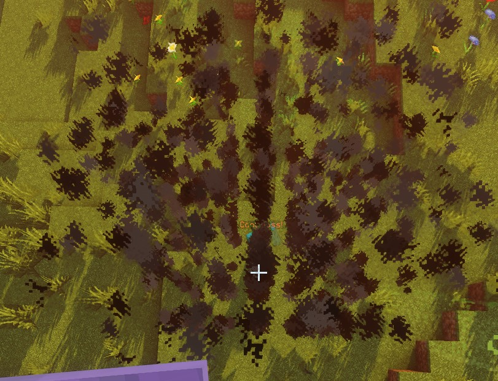
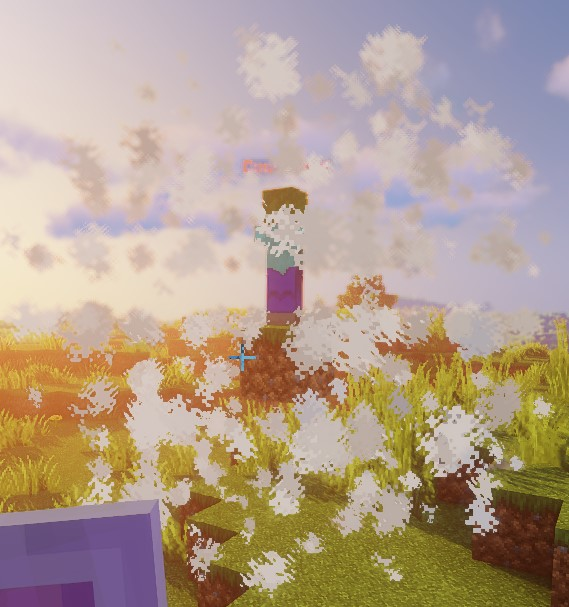
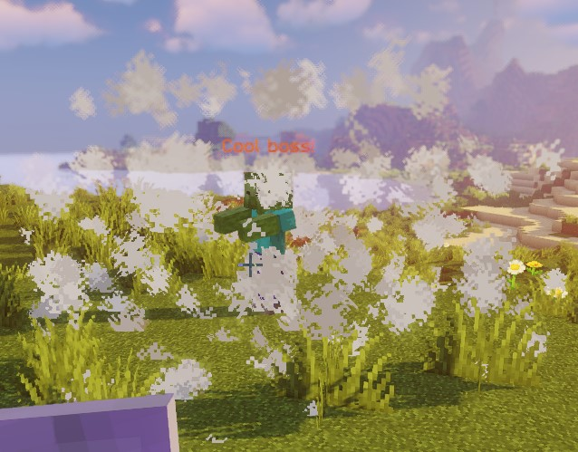
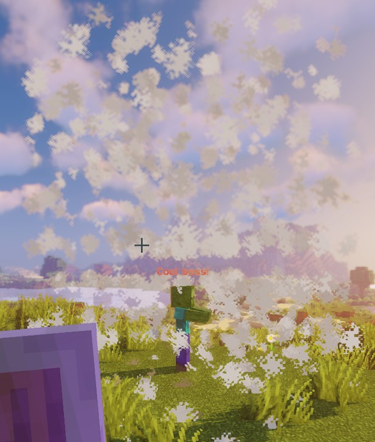
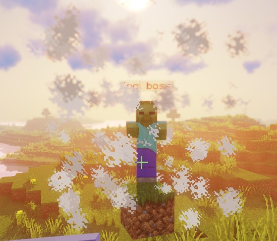
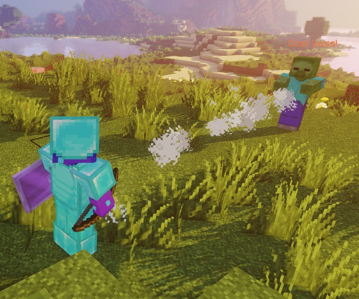
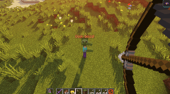
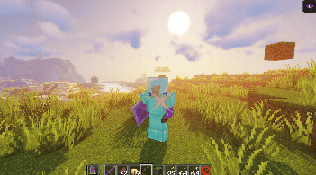
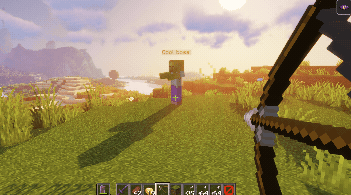

# Зоны элитных скриптов

Зоны - это области, определяемые формой, которые могут использоваться скриптерами в качестве целей для выполнения
каких-либо действий.

На скрипт может быть установлена только одна зона.

Для нацеливания на зоны можно использовать тип цели `ZONE_FULL` или `ZONE_BORDER`.

Сами зоны также используют [Цели скриптов]($language$/elitemobs/elitescript_targets.md) для определения того, где
появится зона.

## Форма

Устанавливает форму зоны. Допустимые формы:

| Тип формы                                                                              |                                      Детали                                       | Анимируется | Граница |
|----------------------------------------------------------------------------------------|:---------------------------------------------------------------------------------:|:-----------:|:-------:|
| [`CYLINDER`]($language$/elitemobs/elitescript_zones.md&section=cylinder)               |                               Цилиндрическая форма                                |      ❌      |    ✅    |
| [`SPHERE`]($language$/elitemobs/elitescript_zones.md&section=sphere)                   |                                 Сферическая форма                                 |      ❌      |    ✅    |
| [`DOME`]($language$/elitemobs/elitescript_zones.md&section=dome)                       |                             Форма купола (полусфера)                              |      ❌      |    ✅    |
| [`CUBOID`]($language$/elitemobs/elitescript_zones.md&section=cuboid)                   |                          Форма кубоида (похожая на куб)                           |      ❌      |    ✅    |
| [`STATIC_RAY`]($language$/elitemobs/elitescript_zones.md&section=static_ray)           |                      Фиксированная линия между двумя точками                      |      ❌      |    ❌    |
| [`ROTATING_RAY`]($language$/elitemobs/elitescript_zones.md&section=rotating_ray)       |                       Вращающаяся линия между двумя точками                       |      ✅      |    ❌    |
| [`TRANSLATING_RAY`]($language$/elitemobs/elitescript_zones.md&section=translating_ray) | Линия, которая перемещается между двумя начальными точками к двум конечным точкам |      ✅      |    ❌    |

---

#### Анимируется

Зоны с анимацией запускают анимацию зоны при первом вызове скрипта.

Это означает, что если у действия есть время ожидания, то когда действие начнется, зона уже будет перемещаться, пока
действие ожидало.

Анимация зон всегда выполняется на каждом тике. Это означает, что если вы используете действие `SPAWN_PARTICLES`, вы
можете настроить его на выполнение на каждом тике, поскольку зона будет перемещаться на каждом тике. Если вы запустите
его каждую секунду, вы увидите, как частицы будут прыгать, поскольку зона продолжала перемещаться даже на тиках, где
частицы не появлялись.

Если вы хотите создать действие с вращающейся зоной, но хотите подождать заданное количество тиков перед началом
действия, сделайте это в отдельном скрипте и вызовите этот скрипт через `RUN_SCRIPT`. Убедитесь, что `RUN_SCRIPT` имеет
нужное вам время ожидания.

Зоны останутся в конечном местоположении после завершения анимации.

Все анимируемые зоны настроены на то, чтобы не отслеживать цели скрипта, поскольку дополнительные перемещения затруднят
понимание для скриптеров и игроков. Это означает, что эти зоны не будут следовать за боссами или игроками и всегда будут
перемещаться относительно своих начальных точек появления.

---

#### Граница

Определенные зоны могут иметь границы. Границы означают, что `ZONE_BORDER` можно использовать в качестве цели зоны.
Границы определяются путем создания второй, меньшей формы внутри первой, большей формы. Область между меньшей и большей
зонами является границей.

<div align="center">

<details> 

<summary><b>Пример</b></summary>

<div align="left">

```yaml
eliteScript:
  Example:
    Events:
      - EliteMobDamagedByPlayerEvent
    Zone:
      shape: CYLINDER
      radius: 4
      borderRadius: 3
      height: 8
      Target:
        targetType: SELF
    Actions:
      - action: SPAWN_PARTICLE
        particles:
          - particle: SMOKE_LARGE
        Target:
          targetType: ZONE_BORDER
        repeatEvery: 5
        times: 20
```

<div align="center">


</div>

Этот скрипт создает частицы дыма, которые появляются **только** на границе зоны в течение 5 секунд (повторять каждые 5 x
20 раз = 100 тиков).

Если бы вы не использовали параметр `ZONE_BORDER`, а вместо него параметр `ZONE_FULL`, то вся зона была бы покрыта
частицами дыма, как здесь:

<div align="center">



</div>

</div>

</details>

</div>

---

### SPHERE

| Ключ                                                                 |                          Детали                          | Обязательный |
|----------------------------------------------------------------------|:--------------------------------------------------------:|:------------:|
| `shape`                                                              |      Устанавливает форму зоны. Должна быть `SPHERE`      |      ✅       |
| [`target`]($language$/elitemobs/elitescript_targets.md)              |        Устанавливает местоположение центра сферы         |      ✅       |
| [`filter`]($language$/elitemobs/elitescript_zones.md&section=filter) | Устанавливает, какие типы сущностей будут являться целью |      ❌       |
| `radius`                                                             |                       Радиус сферы                       |      ✅       |
| `borderRadius`                                                       |                 Радиус внутренней сферы                  |      ❌       |

<div align="center">

<details> 

<summary><b>Пример</b></summary>

<div align="left">

```yaml
eliteScript:
  Example:
    Events:
      - EliteMobDamagedByPlayerEvent
    Zone:
      shape: SPHERE
      radius: 4
      borderRadius: 3
      Target:
        targetType: SELF
    Actions:
      - action: SPAWN_PARTICLE
        particles:
          - particle: CLOUD
        Target:
          targetType: ZONE_FULL
        repeatEvery: 5
        times: 20
```

<div align="center">



</div>

Этот скрипт демонстрирует форму сферы с использованием частиц облака.

</div>

</details>

</div>

---

### DOME

| Ключ                                                                 |                          Детали                          | Обязательный |
|----------------------------------------------------------------------|:--------------------------------------------------------:|:------------:|
| `shape`                                                              |       Устанавливает форму зоны. Должна быть `DOME`       |      ✅       |
| [`target`]($language$/elitemobs/elitescript_targets.md)              |        Устанавливает местоположение центра купола        |      ✅       |
| [`filter`]($language$/elitemobs/elitescript_zones.md&section=filter) | Устанавливает, какие типы сущностей будут являться целью |      ❌       |
| `radius`                                                             |                      Радиус купола                       |      ✅       |
| `borderRadius`                                                       |                Радиус внутреннего купола                 |      ❌       |

<div align="center">

<details> 

<summary><b>Пример</b></summary>

<div align="left">

```yaml
eliteScript:
  Example:
    Events:
      - EliteMobDamagedByPlayerEvent
    Zone:
      shape: DOME
      radius: 4
      borderRadius: 3
      Target:
        targetType: SELF
    Actions:
      - action: SPAWN_PARTICLE
        particles:
          - particle: CLOUD
        Target:
          targetType: ZONE_FULL
        repeatEvery: 5
        times: 20
```

<div align="center">



</div>

Этот скрипт демонстрирует форму купола с использованием частиц облака.

</div>

</details>

</div>

---

### CYLINDER

| Ключ                                                                 |                          Детали                          | Обязательный |
|----------------------------------------------------------------------|:--------------------------------------------------------:|:------------:|
| `shape`                                                              |     Устанавливает форму зоны. Должна быть `CYLINDER`     |      ✅       |
| [`target`]($language$/elitemobs/elitescript_targets.md)              |       Устанавливает местоположение центра цилиндра       |      ✅       |
| [`filter`]($language$/elitemobs/elitescript_zones.md&section=filter) | Устанавливает, какие типы сущностей будут являться целью |      ❌       |
| `radius`                                                             |                     Радиус цилиндра                      |      ✅       |
| `borderRadius`                                                       |               Радиус внутреннего цилиндра                |      ❌       |
| `height`                                                             |                     Высота цилиндра                      |      ❌       |

<div align="center">

<details> 

<summary><b>Пример</b></summary>

<div align="left">

```yaml
eliteScript:
  Example:
    Events:
      - EliteMobDamagedByPlayerEvent
    Zone:
      shape: CYLINDER
      radius: 4
      borderRadius: 3
      height: 8
      Target:
        targetType: SELF
    Actions:
      - action: SPAWN_PARTICLE
        particles:
          - particle: CLOUD
        Target:
          targetType: ZONE_FULL
        repeatEvery: 5
        times: 20
```

<div align="center">



</div>

Этот скрипт демонстрирует форму цилиндра с использованием частиц облака.

</div>

</details>

</div>

---

### CUBOID

| Ключ                                                                 |                              Детали                              | Обязательный |
|----------------------------------------------------------------------|:----------------------------------------------------------------:|:------------:|
| `shape`                                                              |          Устанавливает форму зоны. Должна быть `CUBOID`          |      ✅       |
| [`target`]($language$/elitemobs/elitescript_targets.md)              |           Устанавливает местоположение центра кубоида            |      ✅       |
| [`filter`]($language$/elitemobs/elitescript_zones.md&section=filter) |     Устанавливает, какие типы сущностей будут являться целью     |      ❌       |
| `x`                                                                  |                   Устанавливает длину кубоида                    |      ✅       |
| `y`                                                                  |                   Устанавливает высоту кубоида                   |      ✅       |
| `z`                                                                  |       Устанавливает ширину кубоида, по умолчанию равна `x`       |      ❌       |
| `xBorder`                                                            |             Устанавливает длину внутреннего кубоида              |      ❌       |
| `yBorder`                                                            |             Устанавливает высоту внутреннего кубоида             |      ❌       |
| `zBorder`                                                            | Устанавливает ширину внутреннего кубоида, по умолчанию равна `x` |      ❌       |

<div align="center">

<details> 

<summary><b>Пример</b></summary>

<div align="left">

```yaml
eliteScript:
  Example:
    Events:
      - EliteMobDamagedByPlayerEvent
    Zone:
      shape: CUBOID
      x: 4
      y: 4
      z: 4
      xBorder: 3
      yBorder: 3
      zBorder: 3
      Target:
        targetType: SELF
    Actions:
      - action: SPAWN_PARTICLE
        particles:
          - particle: CLOUD
        Target:
          targetType: ZONE_FULL
        repeatEvery: 5
        times: 20
```

<div align="center">



</div>

Этот скрипт демонстрирует форму кубоида с использованием частиц облака.

</div>

</details>

</div>

---

### STATIC_RAY

| Ключ                                                                 |                           Детали                           | Обязательный |
|----------------------------------------------------------------------|:----------------------------------------------------------:|:------------:|
| `shape`                                                              |     Устанавливает форму зоны. Должна быть `STATIC_RAY`     |      ✅       |
| [`target`]($language$/elitemobs/elitescript_targets.md)              |      Устанавливает местоположение первой точки линии       |      ✅       |
| [`target2`]($language$/elitemobs/elitescript_targets.md)             |     Устанавливает местоположение последней точки линии     |      ✅       |
| [`filter`]($language$/elitemobs/elitescript_zones.md&section=filter) |  Устанавливает, какие типы сущностей будут являться целью  |      ❌       |
| `ignoresSolidBlocks`                                                 | Устанавливает, будет ли луч проходить сквозь твердые блоки |      ❌       |
| `pointRadius`                                                        |    Устанавливает толщину луча. По умолчанию 0,5 блоков.    |      ❌       |

<div align="center">

<details> 

<summary><b>Пример</b></summary>

<div align="left">

```yaml
eliteScript:
  Example:
    Events:
      - EliteMobDamagedByPlayerEvent
    Zone:
      shape: STATIC_RAY
      Target2:
        targetType: DIRECT_TARGET
        offset: 0,1,0
      Target:
        targetType: SELF
        offset: 0,1,0
    Actions:
      - action: SPAWN_PARTICLE
        particles:
          - particle: CLOUD
        Target:
          targetType: ZONE_FULL
        repeatEvery: 5
        times: 20
```

<div align="center">



</div>

Этот скрипт демонстрирует форму статического луча с использованием частиц облака.

Мы скорректировали высоту зоны, используя параметр `offset` на обоих концах зоны, чтобы луч появлялся из середины игрока
и босса, в противном случае луч появлялся бы у их ног.

</div>

</details>

</div>

---

### ROTATING_RAY

| Ключ                                                                 |                           Детали                           | Обязательный |
|----------------------------------------------------------------------|:----------------------------------------------------------:|:------------:|
| `shape`                                                              |    Устанавливает форму зоны. Должна быть `ROTATING_RAY`    |      ✅       |
| [`filter`]($language$/elitemobs/elitescript_zones.md&section=filter) |  Устанавливает, какие типы сущностей будут являться целью  |      ❌       |
| [`target`]($language$/elitemobs/elitescript_targets.md)              |      Устанавливает местоположение первой точки линии       |      ✅       |
| [`target2`]($language$/elitemobs/elitescript_targets.md)             |     Устанавливает местоположение последней точки линии     |      ✅       |
| `animationDuration`                                                  |      Устанавливает в тиках продолжительность вращения      |      ✅       |
| `pitchPreRotation`                                                   |   Применяет начальное вращение к тангажу перед анимацией   |      ❌       |
| `yawPreRotation`                                                     |  Применяет начальное вращение к рысканью перед анимацией   |      ❌       |
| `pitchRotation`                                                      |       Устанавливает вращение по тангажу для анимации       |      ❌       |
| `yawRotation`                                                        |      Устанавливает вращение по рысканью для анимации       |      ❌       |
| `ignoresSolidBlocks`                                                 | Устанавливает, будет ли луч проходить сквозь твердые блоки |      ❌       |
| `pointRadius`                                                        |    Устанавливает толщину луча. По умолчанию 0,5 блоков.    |      ❌       |

<div align="center">

<details> 

<summary><b>Пример</b></summary>

<div align="left">

```yaml
eliteScript:
  Example:
    Events:
      - EliteMobDamagedByPlayerEvent
    Zone:
      shape: ROTATING_RAY
      animationDuration: 100
      pitchPrerotation: 0
      yawPrerotation: 0
      pitchRotation: 0
      yawRotation: 360
      ignoresSolidBlocks: true
      Target:
        targetType: SELF
        offset: 0,1,0
      Target2:
        targetType: DIRECT_TARGET
        offset: 0,1,0
    Actions:
      - action: SPAWN_PARTICLE
        particles:
          - particle: CLOUD
        Target:
          targetType: ZONE_FULL
        repeatEvery: 1
        times: 100
```

<div align="center">



</div>

Этот скрипт показывает, как выглядит вращающийся луч, с использованием частиц облака.

Сначала он создает луч от босса к игроку, который нанес ему урон, с помощью частиц облака. Затем он немного корректирует
положения вверх на один блок, используя `offset`.

Далее он вращает луч по полному кругу вокруг игрока, который был целью. Это вращение длится 5 секунд (100 тиков) до
завершения, с целевым игроком в качестве центра.

</div>

</details>

</div>

---

### TRANSLATING_RAY

| Ключ                                                                 |                             Детали                             | Обязательный |
|----------------------------------------------------------------------|:--------------------------------------------------------------:|:------------:|
| `shape`                                                              |    Устанавливает форму зоны. Должна быть `TRANSLATING_RAY`     |      ✅       |
| [`filter`]($language$/elitemobs/elitescript_zones.md&section=filter) |    Устанавливает, какие типы сущностей будут являться целью    |      ❌       |
| `animationDuration`                                                  |      Устанавливает в тиках продолжительность перемещения       |      ✅       |
| [`target`]($language$/elitemobs/elitescript_targets.md)              |        Устанавливает местоположение первой точки линии         |      ✅       |
| [`finalTarget`]($language$/elitemobs/elitescript_targets.md)         | Устанавливает местоположение назначения для первой точки линии |      ✅       |
| [`target2`]($language$/elitemobs/elitescript_targets.md)             |        Устанавливает местоположение второй точки линии         |      ✅       |
| [`finalTarget2`]($language$/elitemobs/elitescript_targets.md)        | Устанавливает местоположение назначения для второй точки линии |      ✅       |
| `ignoresSolidBlocks`                                                 |   Устанавливает, будет ли луч проходить сквозь твердые блоки   |      ❌       |
| `pointRadius`                                                        |      Устанавливает толщину луча. По умолчанию 0,5 блоков.      |      ❌       |

<div align="center">

<details> 

<summary><b>Пример</b></summary>

<div align="left">

```yaml
eliteScript:
  Example:
    Events:
      - EliteMobDamagedByPlayerEvent
    Zone:
      shape: TRANSLATING_RAY
      Target:
        targetType: SELF
      FinalTarget:
        targetType: SELF
        offset: 0,10,0
      Target2:
        targetType: DIRECT_TARGET
      FinalTarget2:
        targetType: DIRECT_TARGET
        offset: 0,10,0
      animationDuration: 100
      ignoresSolidBlocks: true
    Actions:
      - action: SPAWN_PARTICLE
        particles:
          - particle: CLOUD
        Target:
          targetType: ZONE_FULL
        repeatEvery: 1
        times: 100
```

<div align="center">



</div>

Этот скрипт показывает, как выглядит перемещающийся луч с использованием частиц облака.

Сначала он создает луч от босса к игроку, который нанес ему урон, с помощью частиц облака.

Затем он анимирует луч, чтобы тот поднялся на 10 блоков от обеих целей, используя `offset` на `FinalTarget1`
и `FinalTarget2`.

Анимация занимает 5 секунд (100 тиков) для завершения.

Мы можем легко переместить луч в сторону, скорректировав `offset` по оси Z до чего-то вроде `offset: 0,0,10`:

<div align="center">



</div>

Это поведение может меняться в зависимости от того, куда вы смотрите в игре.
<br>Если мы изменим `offset` по оси X в скрипте, показанном на изображении GIF, то луч будет перемещаться от нас по
прямой линии с нашей точки зрения.

</div>

</details>

---

## Фильтр

Свойство filter можно использовать для нацеливания только на определенные сущности внутри зоны. Эти сущности могут быть:

| Значение | Детали                                             |
|:---------|:---------------------------------------------------|
| `PLAYER` | Нацеливает только на игроков в зоне (по умолчанию) |
| `ELITE`  | Нацеливает только на элиту в зоне                  |
| `LIVING` | Нацеливает на все живые сущности в зоне            |

<div align="center">

<details> 

<summary><b>Пример</b></summary>

<div align="left">

```yaml
eliteScript:
  FilterExample:
    Events:
    - PlayerDamagedByEliteMobEvent
    Zone:
      shape: SPHERE
      radius: 12
      borderRadius: 11
      filter: ELITE
      Target:
        targetType: SELF
        track: false
```

В этом примере скрипта показано, как использовать фильтр, чтобы зона нацеливалась только на элиту.

</div>
